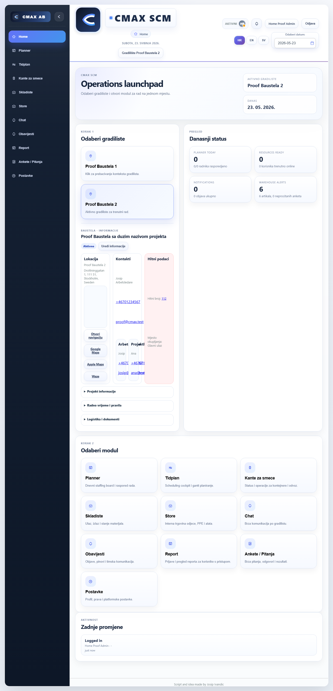
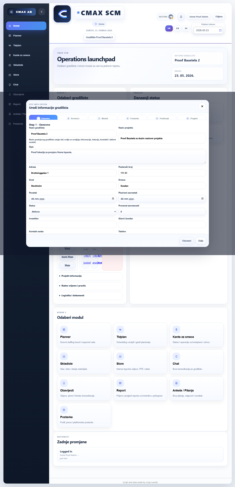
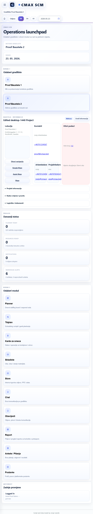
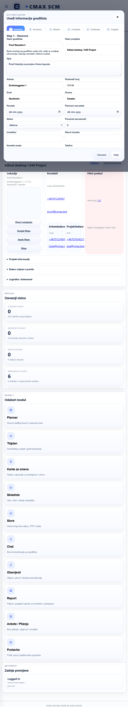
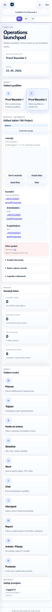
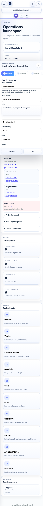

# Home Site Info Proof

Run: home-site-info-proof-1779554358926

## GOOD - desktop-1440

Home:



Edit wizard:



```json
{
  "home": {
    "viewport": "1440x1000",
    "currentSite": "Proof Baustela 2",
    "actionCount": 4,
    "overlaps": [],
    "offscreen": [],
    "outsidePanel": [],
    "storeProducts": [
      "proof-all-sites-product"
    ],
    "hasAllSitesProduct": true,
    "editButtonVisible": true,
    "horizontalOverflow": false
  },
  "editWizard": {
    "title": "Uredi informacije gradilista",
    "createButton": "Spremi",
    "nameReadonly": true,
    "overlayOpen": true,
    "shellInsideViewport": true,
    "horizontalOverflow": false
  },
  "editSave": {
    "expected": "Edited desktop-1440 Project",
    "renderedTitle": "Edited desktop-1440 Project",
    "persistedTitle": "Edited desktop-1440 Project"
  }
}
```

## GOOD - tablet-768

Home:



Edit wizard:



```json
{
  "home": {
    "viewport": "768x1024",
    "currentSite": "Proof Baustela 2",
    "actionCount": 4,
    "overlaps": [],
    "offscreen": [],
    "outsidePanel": [],
    "storeProducts": [
      "proof-all-sites-product"
    ],
    "hasAllSitesProduct": true,
    "editButtonVisible": true,
    "horizontalOverflow": false
  },
  "editWizard": {
    "title": "Uredi informacije gradilista",
    "createButton": "Spremi",
    "nameReadonly": true,
    "overlayOpen": true,
    "shellInsideViewport": true,
    "horizontalOverflow": false
  },
  "editSave": {
    "expected": "Edited tablet-768 Project",
    "renderedTitle": "Edited tablet-768 Project",
    "persistedTitle": "Edited tablet-768 Project"
  }
}
```

## GOOD - mobile-390

Home:



Edit wizard:



```json
{
  "home": {
    "viewport": "390x844",
    "currentSite": "Proof Baustela 2",
    "actionCount": 4,
    "overlaps": [],
    "offscreen": [],
    "outsidePanel": [],
    "storeProducts": [
      "proof-all-sites-product"
    ],
    "hasAllSitesProduct": true,
    "editButtonVisible": true,
    "horizontalOverflow": false
  },
  "editWizard": {
    "title": "Uredi informacije gradilista",
    "createButton": "Spremi",
    "nameReadonly": true,
    "overlayOpen": true,
    "shellInsideViewport": true,
    "horizontalOverflow": false
  },
  "editSave": {
    "expected": "Edited mobile-390 Project",
    "renderedTitle": "Edited mobile-390 Project",
    "persistedTitle": "Edited mobile-390 Project"
  }
}
```
