# Map Picker + Store Wizard Focused Proof

Generated: 2026-05-23T08:46:12.122Z

### PASS - desktop-1440x1000 - new-site-location-empty

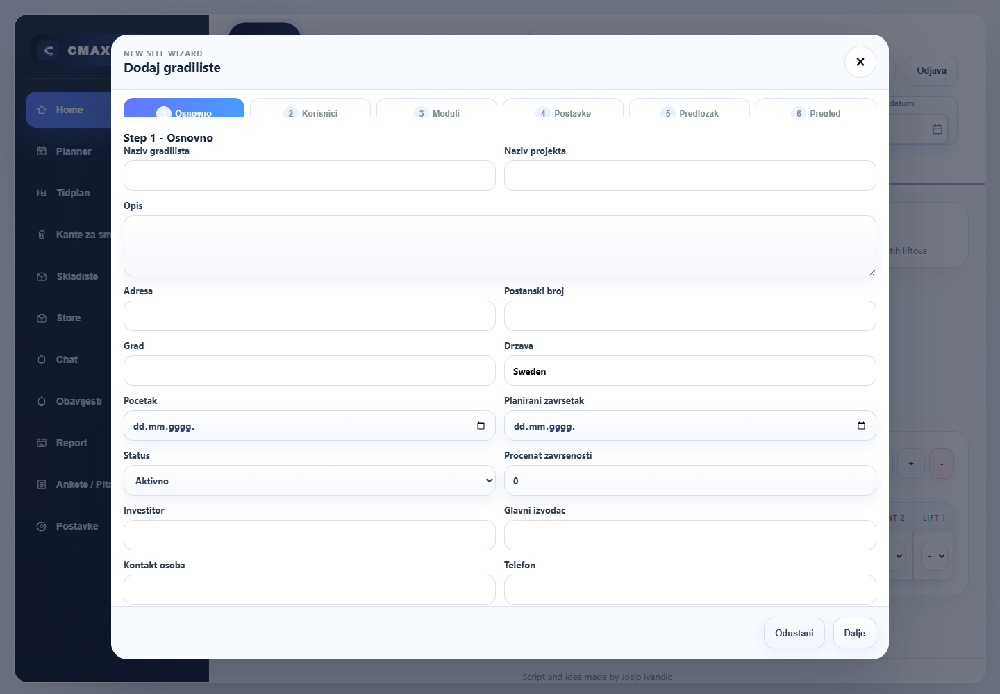

- Sta je prije bilo lose: Prije je lokacija bila rucni latitude/longitude ili tekstualni Google query koji je znao otvoriti samo Sweden.
- Sta je promijenjeno: Location step sada ima address search, map picker, hidden koordinatne vrijednosti i warning da pin jos nije postavljen.
- Zasto: da korisnik dobije siguran, vidljiv i touch-friendly workflow bez tehnickog unosa.
- Kompromis: Nema funkcionalnog kompromisa; screenshot je focused proof za ovaj scenario.
- Guard: horizontal overflow NO, visible buttons 38.

### PASS - desktop-1440x1000 - new-site-address-entered

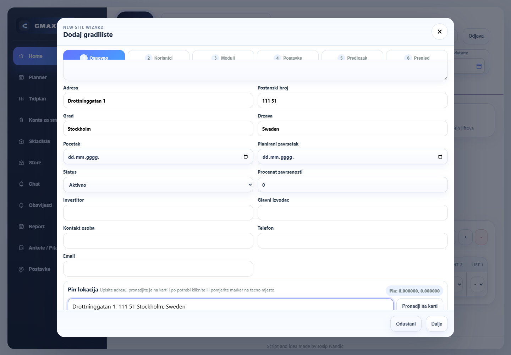

- Sta je prije bilo lose: Prije upisana adresa nije bila vezana za stabilan pin.
- Sta je promijenjeno: Adresa je unesena u search polje; korisnik sada ima jasan gumb Pronadji na karti i picker ispod.
- Zasto: da korisnik dobije siguran, vidljiv i touch-friendly workflow bez tehnickog unosa.
- Kompromis: Nema funkcionalnog kompromisa; screenshot je focused proof za ovaj scenario.
- Guard: horizontal overflow NO, visible buttons 39.

### PASS - desktop-1440x1000 - new-site-map-with-pin

- Sta je prije bilo lose: Prije se mogao spremiti neprecizan tekstualni query.
- Sta je promijenjeno: Pin je postavljen na stvarne Stockholm koordinate i prikazan kao potvrdiva lokacija.
- Zasto: da korisnik dobije siguran, vidljiv i touch-friendly workflow bez tehnickog unosa.
- Kompromis: Nema funkcionalnog kompromisa; screenshot je focused proof za ovaj scenario.
- Guard: horizontal overflow NO, visible buttons 39.

### PASS - desktop-1440x1000 - new-site-pin-moved

- Sta je prije bilo lose: Prije nije bilo sigurnog nacina da se pin pomjeri ako geocode nije tacan.
- Sta je promijenjeno: Pin se moze klikom/dragom promijeniti; proof ga pomjera na drugu koordinatu.
- Zasto: da korisnik dobije siguran, vidljiv i touch-friendly workflow bez tehnickog unosa.
- Kompromis: Nema funkcionalnog kompromisa; screenshot je focused proof za ovaj scenario.
- Guard: horizontal overflow NO, visible buttons 39.

### PASS - desktop-1440x1000 - new-site-review-map-preview

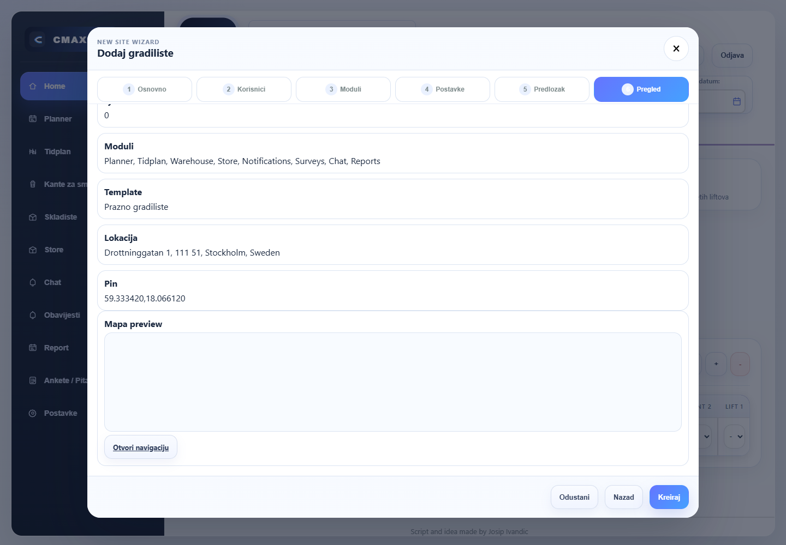

- Sta je prije bilo lose: Prije review nije dokazivao da ce se spremiti stvarni pin.
- Sta je promijenjeno: Review sada prikazuje Pin i map preview sa Google Maps queryjem koji koristi koordinate.
- Zasto: da korisnik dobije siguran, vidljiv i touch-friendly workflow bez tehnickog unosa.
- Kompromis: Nema funkcionalnog kompromisa; screenshot je focused proof za ovaj scenario.
- Guard: horizontal overflow NO, visible buttons 40.

### PASS - desktop-1440x1000 - home-site-info-exact-pin

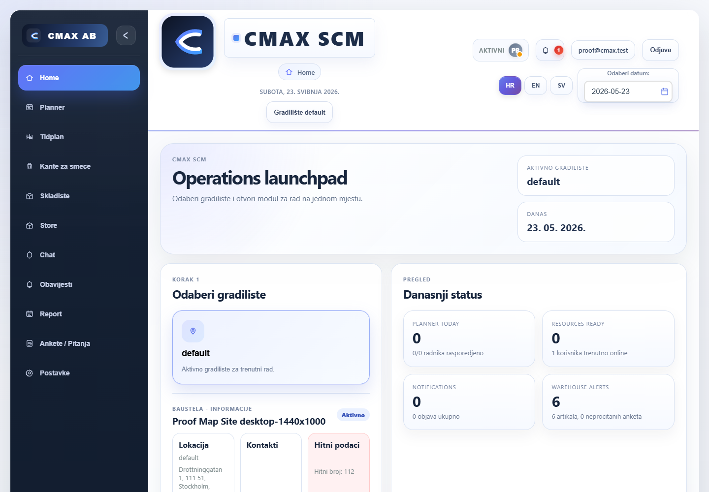

- Sta je prije bilo lose: Prije Info Baustele mogla je otvoriti adresu ili Sweden umjesto tacnog pina.
- Sta je promijenjeno: Info Baustele koristi spremljene brojevne koordinate i navigation link ide na tacan LAT,LNG.
- Zasto: da korisnik dobije siguran, vidljiv i touch-friendly workflow bez tehnickog unosa.
- Kompromis: Nema funkcionalnog kompromisa; screenshot je focused proof za ovaj scenario.
- Guard: horizontal overflow NO, visible buttons 19.

### PASS - desktop-1440x1000 - store-wizard-step-1

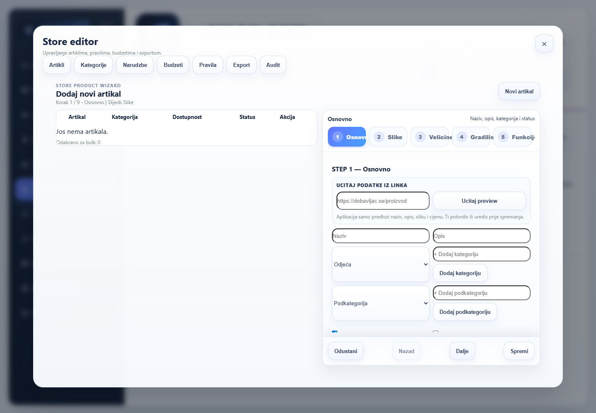

- Sta je prije bilo lose: Prije Store wizard nije bio vizualno uskladjen sa Backup/New Site wizardima i napredak nije bio jasan.
- Sta je promijenjeno: Step 1 sada ima vidljiv moderni stepper, aktivni/done state, header meta i sticky footer akcije.
- Zasto: da korisnik dobije siguran, vidljiv i touch-friendly workflow bez tehnickog unosa.
- Kompromis: Na manjim ekranima stepper horizontalno scrolla unutar wizard panela, ne kroz cijelu stranicu.
- Guard: horizontal overflow NO, visible buttons 47.

### PASS - desktop-1440x1000 - store-wizard-step-2

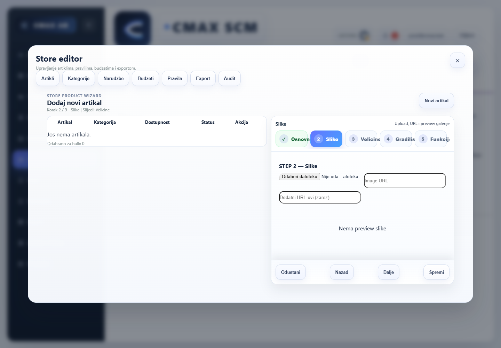

- Sta je prije bilo lose: Prije Store wizard nije bio vizualno uskladjen sa Backup/New Site wizardima i napredak nije bio jasan.
- Sta je promijenjeno: Step 2 sada ima vidljiv moderni stepper, aktivni/done state, header meta i sticky footer akcije.
- Zasto: da korisnik dobije siguran, vidljiv i touch-friendly workflow bez tehnickog unosa.
- Kompromis: Na manjim ekranima stepper horizontalno scrolla unutar wizard panela, ne kroz cijelu stranicu.
- Guard: horizontal overflow NO, visible buttons 44.

### PASS - desktop-1440x1000 - store-wizard-step-3

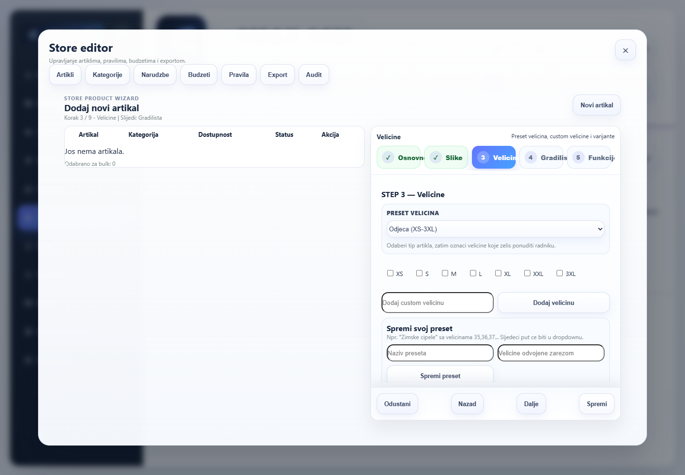

- Sta je prije bilo lose: Prije Store wizard nije bio vizualno uskladjen sa Backup/New Site wizardima i napredak nije bio jasan.
- Sta je promijenjeno: Step 3 sada ima vidljiv moderni stepper, aktivni/done state, header meta i sticky footer akcije.
- Zasto: da korisnik dobije siguran, vidljiv i touch-friendly workflow bez tehnickog unosa.
- Kompromis: Na manjim ekranima stepper horizontalno scrolla unutar wizard panela, ne kroz cijelu stranicu.
- Guard: horizontal overflow NO, visible buttons 47.

### PASS - desktop-1440x1000 - store-wizard-step-4

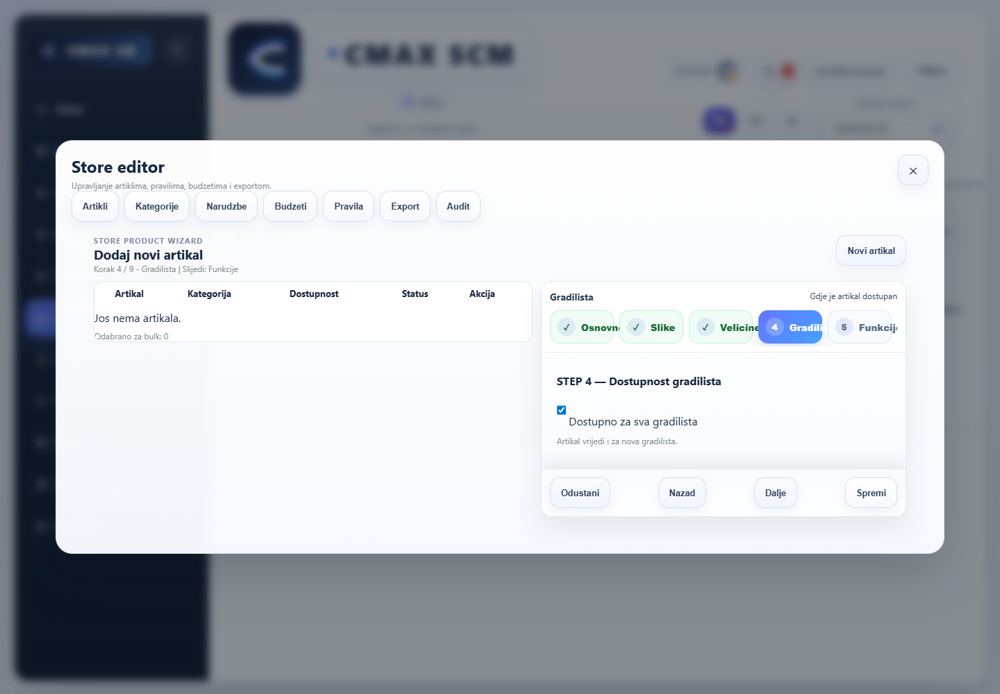

- Sta je prije bilo lose: Prije Store wizard nije bio vizualno uskladjen sa Backup/New Site wizardima i napredak nije bio jasan.
- Sta je promijenjeno: Step 4 sada ima vidljiv moderni stepper, aktivni/done state, header meta i sticky footer akcije.
- Zasto: da korisnik dobije siguran, vidljiv i touch-friendly workflow bez tehnickog unosa.
- Kompromis: Na manjim ekranima stepper horizontalno scrolla unutar wizard panela, ne kroz cijelu stranicu.
- Guard: horizontal overflow NO, visible buttons 44.

### PASS - desktop-1440x1000 - store-wizard-step-5

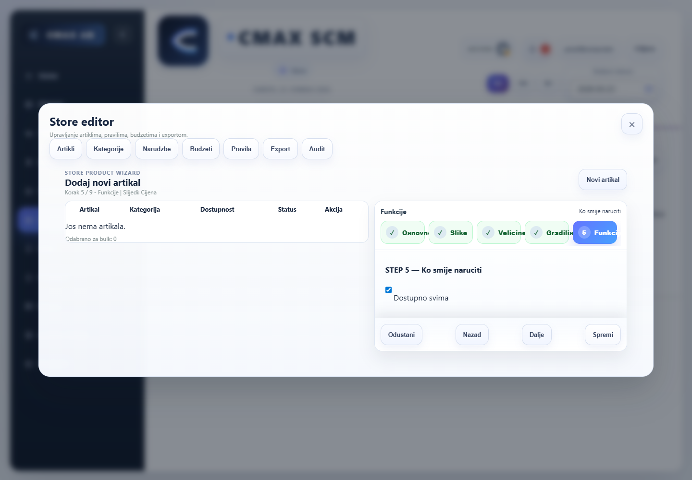

- Sta je prije bilo lose: Prije Store wizard nije bio vizualno uskladjen sa Backup/New Site wizardima i napredak nije bio jasan.
- Sta je promijenjeno: Step 5 sada ima vidljiv moderni stepper, aktivni/done state, header meta i sticky footer akcije.
- Zasto: da korisnik dobije siguran, vidljiv i touch-friendly workflow bez tehnickog unosa.
- Kompromis: Na manjim ekranima stepper horizontalno scrolla unutar wizard panela, ne kroz cijelu stranicu.
- Guard: horizontal overflow NO, visible buttons 44.

### PASS - desktop-1440x1000 - store-wizard-step-6

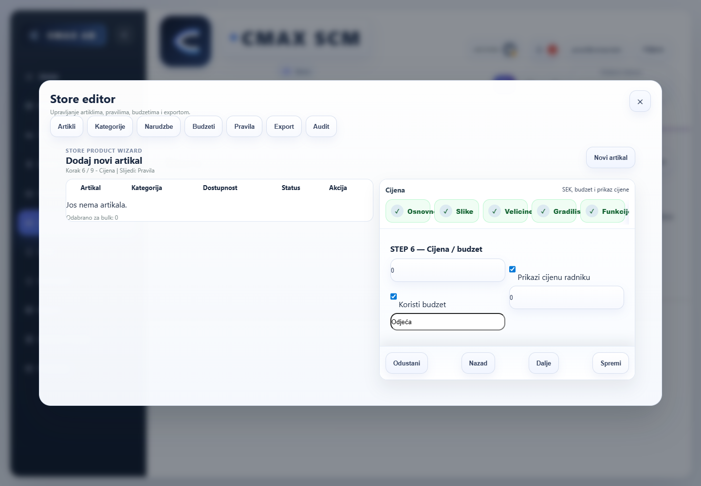

- Sta je prije bilo lose: Prije Store wizard nije bio vizualno uskladjen sa Backup/New Site wizardima i napredak nije bio jasan.
- Sta je promijenjeno: Step 6 sada ima vidljiv moderni stepper, aktivni/done state, header meta i sticky footer akcije.
- Zasto: da korisnik dobije siguran, vidljiv i touch-friendly workflow bez tehnickog unosa.
- Kompromis: Na manjim ekranima stepper horizontalno scrolla unutar wizard panela, ne kroz cijelu stranicu.
- Guard: horizontal overflow NO, visible buttons 44.

### PASS - desktop-1440x1000 - store-wizard-step-7

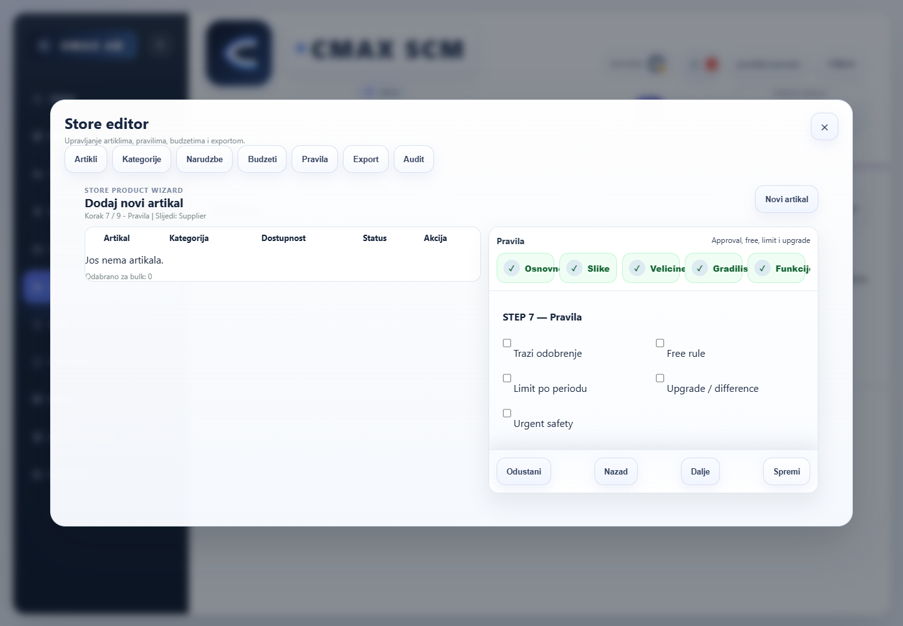

- Sta je prije bilo lose: Prije Store wizard nije bio vizualno uskladjen sa Backup/New Site wizardima i napredak nije bio jasan.
- Sta je promijenjeno: Step 7 sada ima vidljiv moderni stepper, aktivni/done state, header meta i sticky footer akcije.
- Zasto: da korisnik dobije siguran, vidljiv i touch-friendly workflow bez tehnickog unosa.
- Kompromis: Na manjim ekranima stepper horizontalno scrolla unutar wizard panela, ne kroz cijelu stranicu.
- Guard: horizontal overflow NO, visible buttons 44.

### PASS - desktop-1440x1000 - store-wizard-step-8

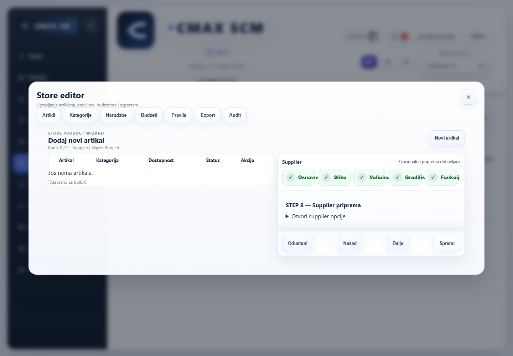

- Sta je prije bilo lose: Prije Store wizard nije bio vizualno uskladjen sa Backup/New Site wizardima i napredak nije bio jasan.
- Sta je promijenjeno: Step 8 sada ima vidljiv moderni stepper, aktivni/done state, header meta i sticky footer akcije.
- Zasto: da korisnik dobije siguran, vidljiv i touch-friendly workflow bez tehnickog unosa.
- Kompromis: Na manjim ekranima stepper horizontalno scrolla unutar wizard panela, ne kroz cijelu stranicu.
- Guard: horizontal overflow NO, visible buttons 44.

### PASS - desktop-1440x1000 - store-wizard-step-9

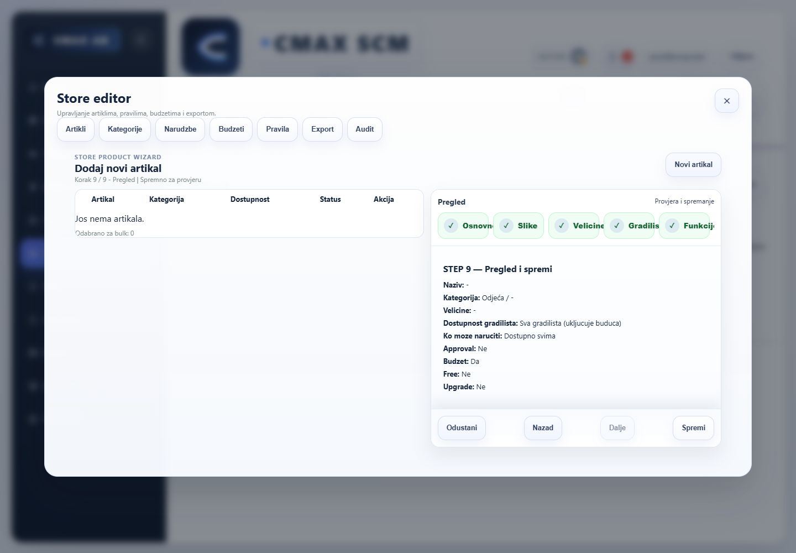

- Sta je prije bilo lose: Prije Store wizard nije bio vizualno uskladjen sa Backup/New Site wizardima i napredak nije bio jasan.
- Sta je promijenjeno: Step 9 sada ima vidljiv moderni stepper, aktivni/done state, header meta i sticky footer akcije.
- Zasto: da korisnik dobije siguran, vidljiv i touch-friendly workflow bez tehnickog unosa.
- Kompromis: Na manjim ekranima stepper horizontalno scrolla unutar wizard panela, ne kroz cijelu stranicu.
- Guard: horizontal overflow NO, visible buttons 44.

### PASS - tablet-768x1024 - new-site-location-empty

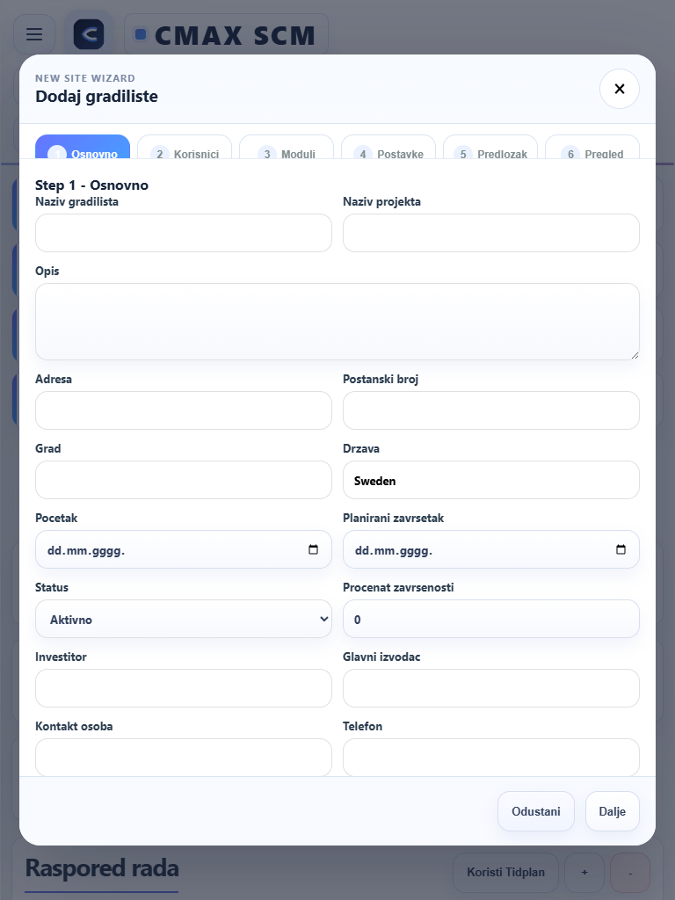

- Sta je prije bilo lose: Prije je lokacija bila rucni latitude/longitude ili tekstualni Google query koji je znao otvoriti samo Sweden.
- Sta je promijenjeno: Location step sada ima address search, map picker, hidden koordinatne vrijednosti i warning da pin jos nije postavljen.
- Zasto: da korisnik dobije siguran, vidljiv i touch-friendly workflow bez tehnickog unosa.
- Kompromis: Nema funkcionalnog kompromisa; screenshot je focused proof za ovaj scenario.
- Guard: horizontal overflow NO, visible buttons 27.

### PASS - tablet-768x1024 - new-site-address-entered

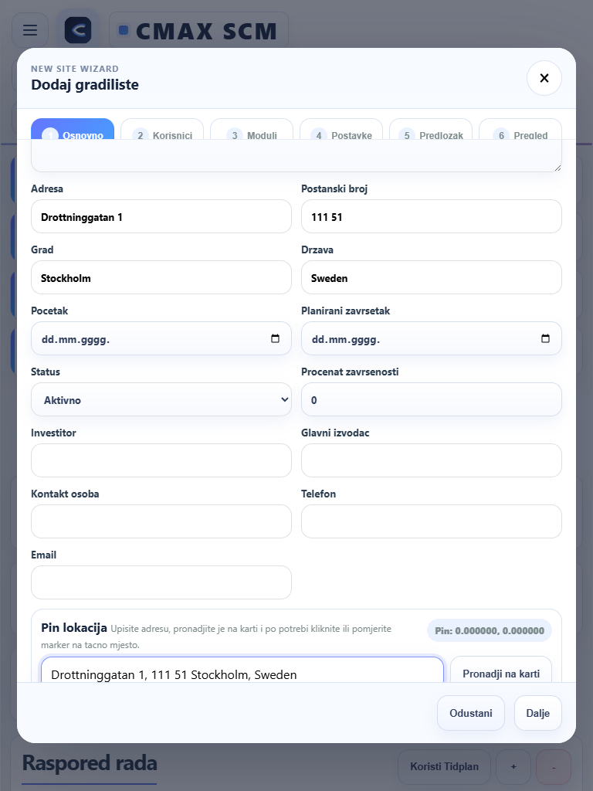

- Sta je prije bilo lose: Prije upisana adresa nije bila vezana za stabilan pin.
- Sta je promijenjeno: Adresa je unesena u search polje; korisnik sada ima jasan gumb Pronadji na karti i picker ispod.
- Zasto: da korisnik dobije siguran, vidljiv i touch-friendly workflow bez tehnickog unosa.
- Kompromis: Nema funkcionalnog kompromisa; screenshot je focused proof za ovaj scenario.
- Guard: horizontal overflow NO, visible buttons 28.

### PASS - tablet-768x1024 - new-site-map-with-pin

- Sta je prije bilo lose: Prije se mogao spremiti neprecizan tekstualni query.
- Sta je promijenjeno: Pin je postavljen na stvarne Stockholm koordinate i prikazan kao potvrdiva lokacija.
- Zasto: da korisnik dobije siguran, vidljiv i touch-friendly workflow bez tehnickog unosa.
- Kompromis: Nema funkcionalnog kompromisa; screenshot je focused proof za ovaj scenario.
- Guard: horizontal overflow NO, visible buttons 28.

### PASS - tablet-768x1024 - new-site-pin-moved

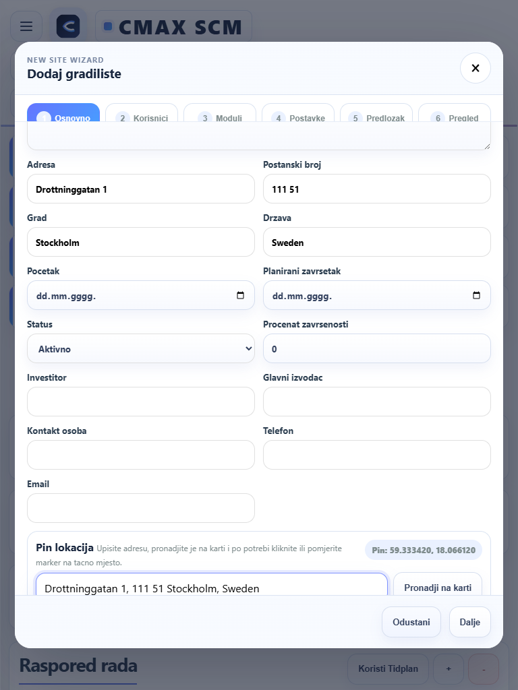

- Sta je prije bilo lose: Prije nije bilo sigurnog nacina da se pin pomjeri ako geocode nije tacan.
- Sta je promijenjeno: Pin se moze klikom/dragom promijeniti; proof ga pomjera na drugu koordinatu.
- Zasto: da korisnik dobije siguran, vidljiv i touch-friendly workflow bez tehnickog unosa.
- Kompromis: Nema funkcionalnog kompromisa; screenshot je focused proof za ovaj scenario.
- Guard: horizontal overflow NO, visible buttons 28.

### PASS - tablet-768x1024 - new-site-review-map-preview

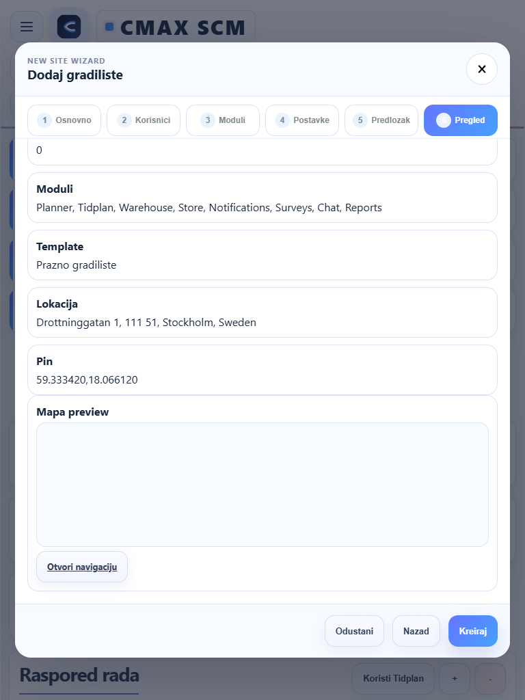

- Sta je prije bilo lose: Prije review nije dokazivao da ce se spremiti stvarni pin.
- Sta je promijenjeno: Review sada prikazuje Pin i map preview sa Google Maps queryjem koji koristi koordinate.
- Zasto: da korisnik dobije siguran, vidljiv i touch-friendly workflow bez tehnickog unosa.
- Kompromis: Nema funkcionalnog kompromisa; screenshot je focused proof za ovaj scenario.
- Guard: horizontal overflow NO, visible buttons 29.

### PASS - tablet-768x1024 - home-site-info-exact-pin

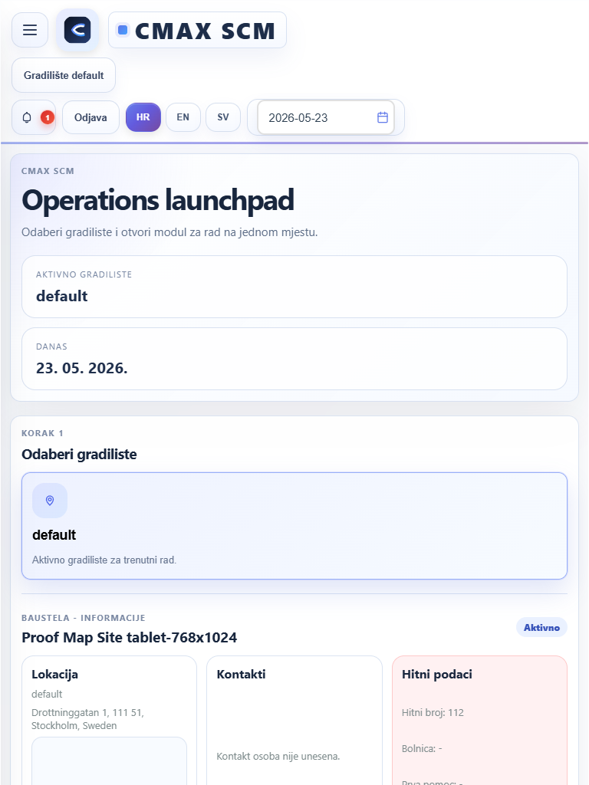

- Sta je prije bilo lose: Prije Info Baustele mogla je otvoriti adresu ili Sweden umjesto tacnog pina.
- Sta je promijenjeno: Info Baustele koristi spremljene brojevne koordinate i navigation link ide na tacan LAT,LNG.
- Zasto: da korisnik dobije siguran, vidljiv i touch-friendly workflow bez tehnickog unosa.
- Kompromis: Nema funkcionalnog kompromisa; screenshot je focused proof za ovaj scenario.
- Guard: horizontal overflow NO, visible buttons 8.

### PASS - tablet-768x1024 - store-wizard-step-1

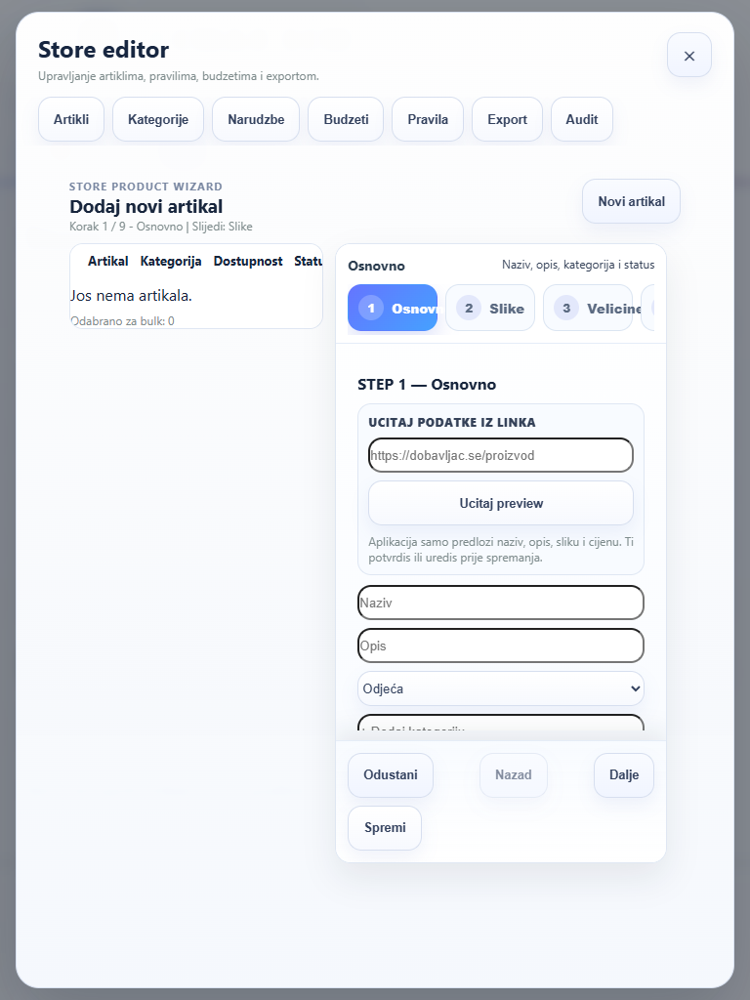

- Sta je prije bilo lose: Prije Store wizard nije bio vizualno uskladjen sa Backup/New Site wizardima i napredak nije bio jasan.
- Sta je promijenjeno: Step 1 sada ima vidljiv moderni stepper, aktivni/done state, header meta i sticky footer akcije.
- Zasto: da korisnik dobije siguran, vidljiv i touch-friendly workflow bez tehnickog unosa.
- Kompromis: Na manjim ekranima stepper horizontalno scrolla unutar wizard panela, ne kroz cijelu stranicu.
- Guard: horizontal overflow NO, visible buttons 34.

### PASS - tablet-768x1024 - store-wizard-step-2

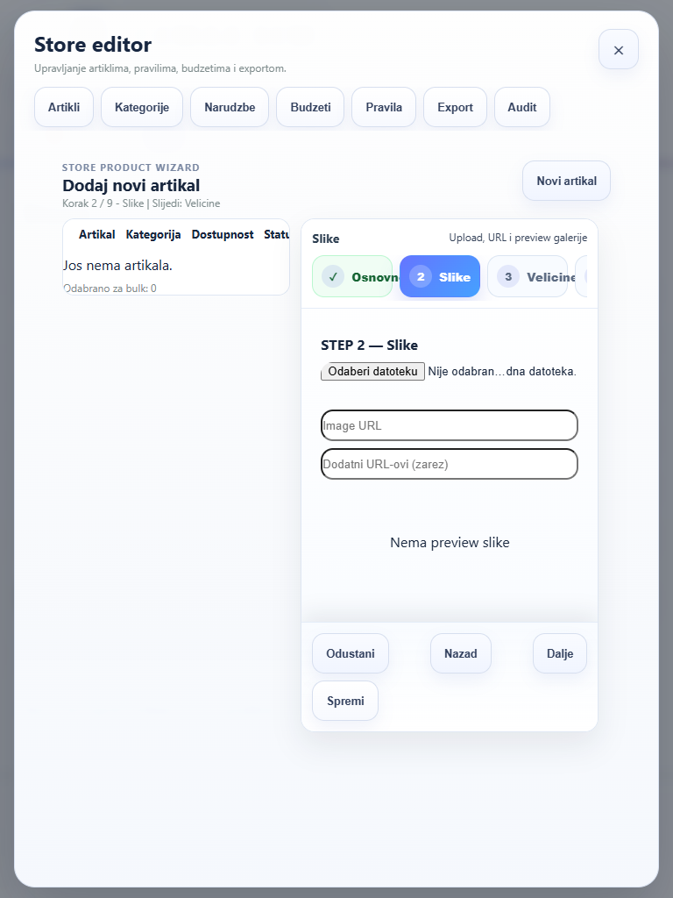

- Sta je prije bilo lose: Prije Store wizard nije bio vizualno uskladjen sa Backup/New Site wizardima i napredak nije bio jasan.
- Sta je promijenjeno: Step 2 sada ima vidljiv moderni stepper, aktivni/done state, header meta i sticky footer akcije.
- Zasto: da korisnik dobije siguran, vidljiv i touch-friendly workflow bez tehnickog unosa.
- Kompromis: Na manjim ekranima stepper horizontalno scrolla unutar wizard panela, ne kroz cijelu stranicu.
- Guard: horizontal overflow NO, visible buttons 31.

### PASS - tablet-768x1024 - store-wizard-step-3

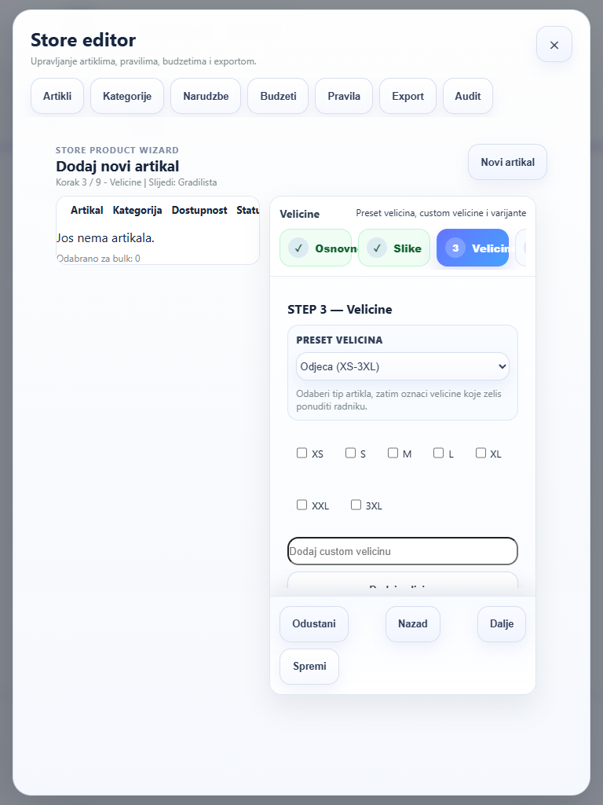

- Sta je prije bilo lose: Prije Store wizard nije bio vizualno uskladjen sa Backup/New Site wizardima i napredak nije bio jasan.
- Sta je promijenjeno: Step 3 sada ima vidljiv moderni stepper, aktivni/done state, header meta i sticky footer akcije.
- Zasto: da korisnik dobije siguran, vidljiv i touch-friendly workflow bez tehnickog unosa.
- Kompromis: Na manjim ekranima stepper horizontalno scrolla unutar wizard panela, ne kroz cijelu stranicu.
- Guard: horizontal overflow NO, visible buttons 33.

### PASS - tablet-768x1024 - store-wizard-step-4

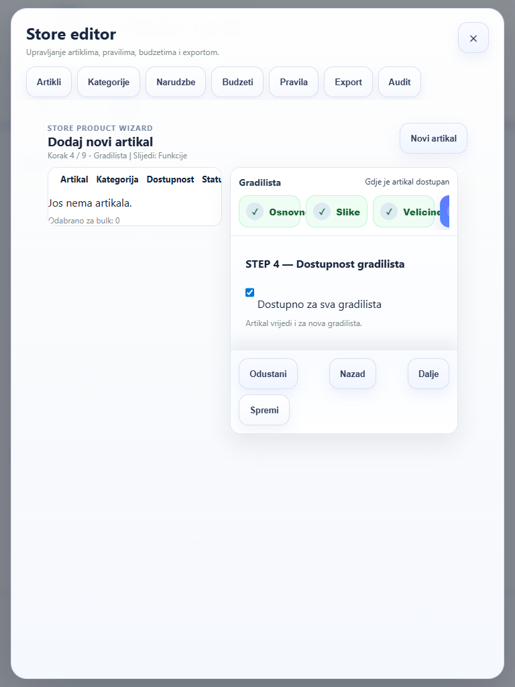

- Sta je prije bilo lose: Prije Store wizard nije bio vizualno uskladjen sa Backup/New Site wizardima i napredak nije bio jasan.
- Sta je promijenjeno: Step 4 sada ima vidljiv moderni stepper, aktivni/done state, header meta i sticky footer akcije.
- Zasto: da korisnik dobije siguran, vidljiv i touch-friendly workflow bez tehnickog unosa.
- Kompromis: Na manjim ekranima stepper horizontalno scrolla unutar wizard panela, ne kroz cijelu stranicu.
- Guard: horizontal overflow NO, visible buttons 31.

### PASS - tablet-768x1024 - store-wizard-step-5

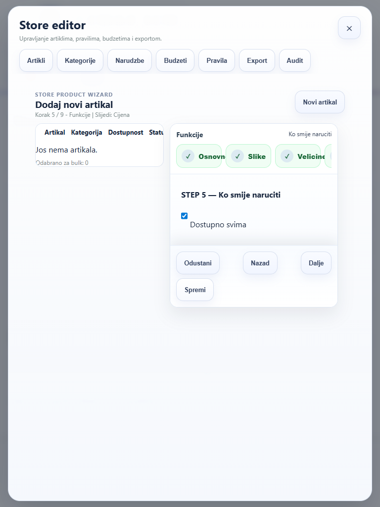

- Sta je prije bilo lose: Prije Store wizard nije bio vizualno uskladjen sa Backup/New Site wizardima i napredak nije bio jasan.
- Sta je promijenjeno: Step 5 sada ima vidljiv moderni stepper, aktivni/done state, header meta i sticky footer akcije.
- Zasto: da korisnik dobije siguran, vidljiv i touch-friendly workflow bez tehnickog unosa.
- Kompromis: Na manjim ekranima stepper horizontalno scrolla unutar wizard panela, ne kroz cijelu stranicu.
- Guard: horizontal overflow NO, visible buttons 31.

### PASS - tablet-768x1024 - store-wizard-step-6

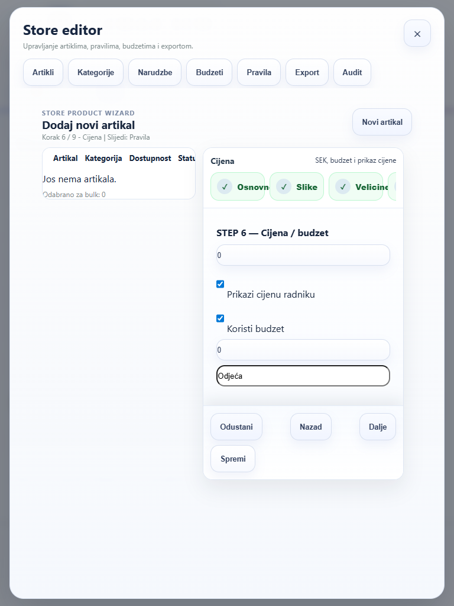

- Sta je prije bilo lose: Prije Store wizard nije bio vizualno uskladjen sa Backup/New Site wizardima i napredak nije bio jasan.
- Sta je promijenjeno: Step 6 sada ima vidljiv moderni stepper, aktivni/done state, header meta i sticky footer akcije.
- Zasto: da korisnik dobije siguran, vidljiv i touch-friendly workflow bez tehnickog unosa.
- Kompromis: Na manjim ekranima stepper horizontalno scrolla unutar wizard panela, ne kroz cijelu stranicu.
- Guard: horizontal overflow NO, visible buttons 31.

### PASS - tablet-768x1024 - store-wizard-step-7

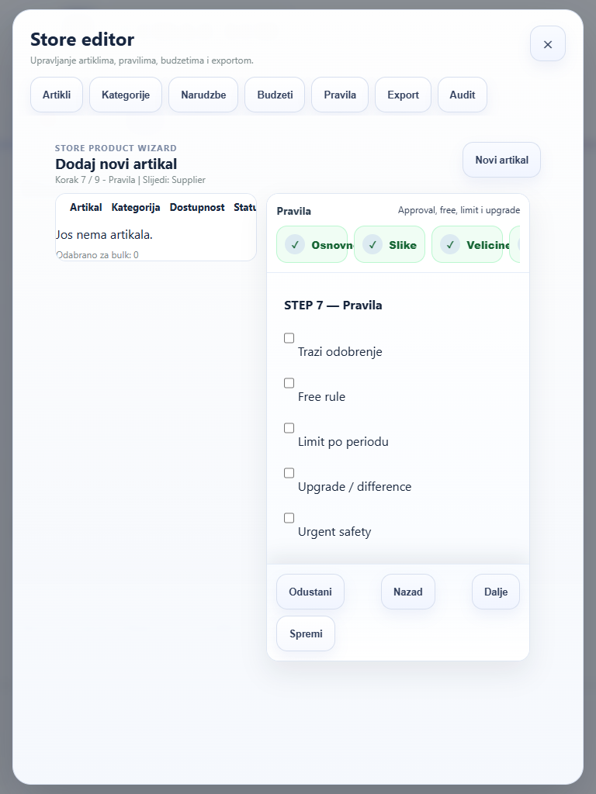

- Sta je prije bilo lose: Prije Store wizard nije bio vizualno uskladjen sa Backup/New Site wizardima i napredak nije bio jasan.
- Sta je promijenjeno: Step 7 sada ima vidljiv moderni stepper, aktivni/done state, header meta i sticky footer akcije.
- Zasto: da korisnik dobije siguran, vidljiv i touch-friendly workflow bez tehnickog unosa.
- Kompromis: Na manjim ekranima stepper horizontalno scrolla unutar wizard panela, ne kroz cijelu stranicu.
- Guard: horizontal overflow NO, visible buttons 31.

### PASS - tablet-768x1024 - store-wizard-step-8

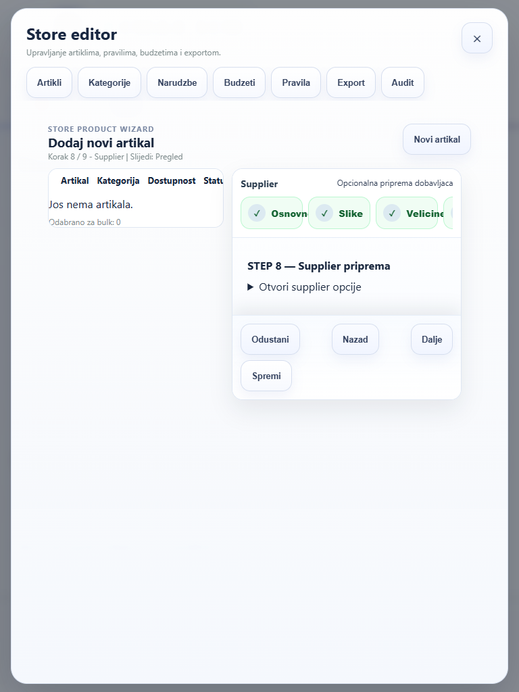

- Sta je prije bilo lose: Prije Store wizard nije bio vizualno uskladjen sa Backup/New Site wizardima i napredak nije bio jasan.
- Sta je promijenjeno: Step 8 sada ima vidljiv moderni stepper, aktivni/done state, header meta i sticky footer akcije.
- Zasto: da korisnik dobije siguran, vidljiv i touch-friendly workflow bez tehnickog unosa.
- Kompromis: Na manjim ekranima stepper horizontalno scrolla unutar wizard panela, ne kroz cijelu stranicu.
- Guard: horizontal overflow NO, visible buttons 31.

### PASS - tablet-768x1024 - store-wizard-step-9

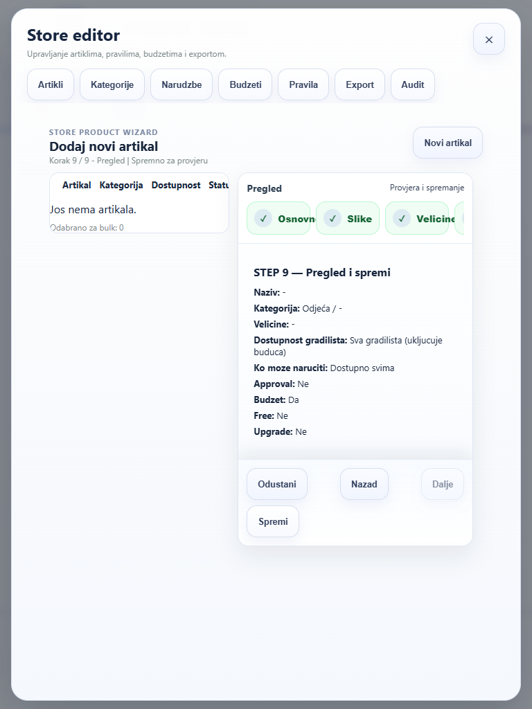

- Sta je prije bilo lose: Prije Store wizard nije bio vizualno uskladjen sa Backup/New Site wizardima i napredak nije bio jasan.
- Sta je promijenjeno: Step 9 sada ima vidljiv moderni stepper, aktivni/done state, header meta i sticky footer akcije.
- Zasto: da korisnik dobije siguran, vidljiv i touch-friendly workflow bez tehnickog unosa.
- Kompromis: Na manjim ekranima stepper horizontalno scrolla unutar wizard panela, ne kroz cijelu stranicu.
- Guard: horizontal overflow NO, visible buttons 31.

### PASS - mobile-390x844 - new-site-location-empty

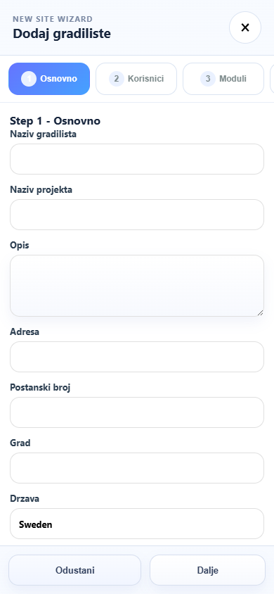

- Sta je prije bilo lose: Prije je lokacija bila rucni latitude/longitude ili tekstualni Google query koji je znao otvoriti samo Sweden.
- Sta je promijenjeno: Location step sada ima address search, map picker, hidden koordinatne vrijednosti i warning da pin jos nije postavljen.
- Zasto: da korisnik dobije siguran, vidljiv i touch-friendly workflow bez tehnickog unosa.
- Kompromis: Nema funkcionalnog kompromisa; screenshot je focused proof za ovaj scenario.
- Guard: horizontal overflow NO, visible buttons 18.

### PASS - mobile-390x844 - new-site-address-entered

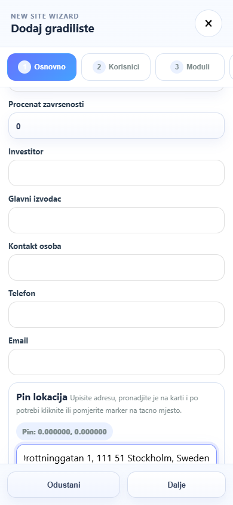

- Sta je prije bilo lose: Prije upisana adresa nije bila vezana za stabilan pin.
- Sta je promijenjeno: Adresa je unesena u search polje; korisnik sada ima jasan gumb Pronadji na karti i picker ispod.
- Zasto: da korisnik dobije siguran, vidljiv i touch-friendly workflow bez tehnickog unosa.
- Kompromis: Nema funkcionalnog kompromisa; screenshot je focused proof za ovaj scenario.
- Guard: horizontal overflow NO, visible buttons 19.

### PASS - mobile-390x844 - new-site-map-with-pin

- Sta je prije bilo lose: Prije se mogao spremiti neprecizan tekstualni query.
- Sta je promijenjeno: Pin je postavljen na stvarne Stockholm koordinate i prikazan kao potvrdiva lokacija.
- Zasto: da korisnik dobije siguran, vidljiv i touch-friendly workflow bez tehnickog unosa.
- Kompromis: Nema funkcionalnog kompromisa; screenshot je focused proof za ovaj scenario.
- Guard: horizontal overflow NO, visible buttons 19.

### PASS - mobile-390x844 - new-site-pin-moved

- Sta je prije bilo lose: Prije nije bilo sigurnog nacina da se pin pomjeri ako geocode nije tacan.
- Sta je promijenjeno: Pin se moze klikom/dragom promijeniti; proof ga pomjera na drugu koordinatu.
- Zasto: da korisnik dobije siguran, vidljiv i touch-friendly workflow bez tehnickog unosa.
- Kompromis: Nema funkcionalnog kompromisa; screenshot je focused proof za ovaj scenario.
- Guard: horizontal overflow NO, visible buttons 19.

### PASS - mobile-390x844 - new-site-review-map-preview

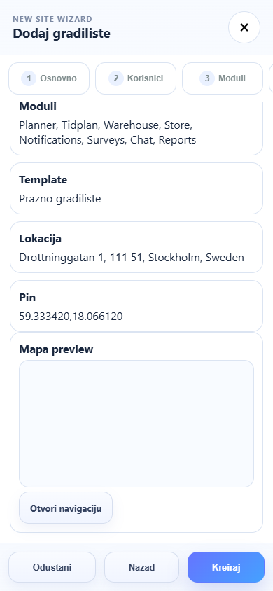

- Sta je prije bilo lose: Prije review nije dokazivao da ce se spremiti stvarni pin.
- Sta je promijenjeno: Review sada prikazuje Pin i map preview sa Google Maps queryjem koji koristi koordinate.
- Zasto: da korisnik dobije siguran, vidljiv i touch-friendly workflow bez tehnickog unosa.
- Kompromis: Nema funkcionalnog kompromisa; screenshot je focused proof za ovaj scenario.
- Guard: horizontal overflow NO, visible buttons 20.

### PASS - mobile-390x844 - home-site-info-exact-pin

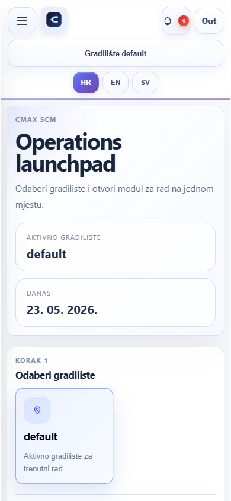

- Sta je prije bilo lose: Prije Info Baustele mogla je otvoriti adresu ili Sweden umjesto tacnog pina.
- Sta je promijenjeno: Info Baustele koristi spremljene brojevne koordinate i navigation link ide na tacan LAT,LNG.
- Zasto: da korisnik dobije siguran, vidljiv i touch-friendly workflow bez tehnickog unosa.
- Kompromis: Nema funkcionalnog kompromisa; screenshot je focused proof za ovaj scenario.
- Guard: horizontal overflow NO, visible buttons 8.

### PASS - mobile-390x844 - store-wizard-step-1

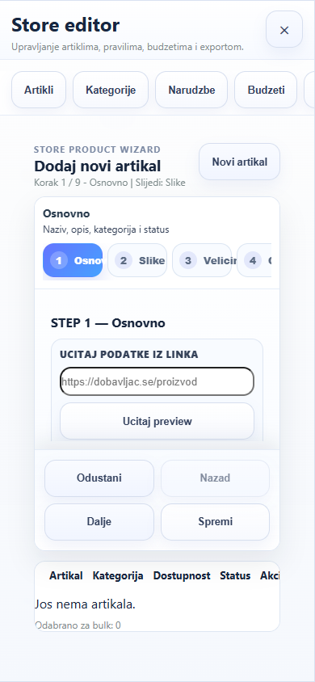

- Sta je prije bilo lose: Prije Store wizard nije bio vizualno uskladjen sa Backup/New Site wizardima i napredak nije bio jasan.
- Sta je promijenjeno: Step 1 sada ima vidljiv moderni stepper, aktivni/done state, header meta i sticky footer akcije.
- Zasto: da korisnik dobije siguran, vidljiv i touch-friendly workflow bez tehnickog unosa.
- Kompromis: Na manjim ekranima stepper horizontalno scrolla unutar wizard panela, ne kroz cijelu stranicu.
- Guard: horizontal overflow NO, visible buttons 31.

### PASS - mobile-390x844 - store-wizard-step-2

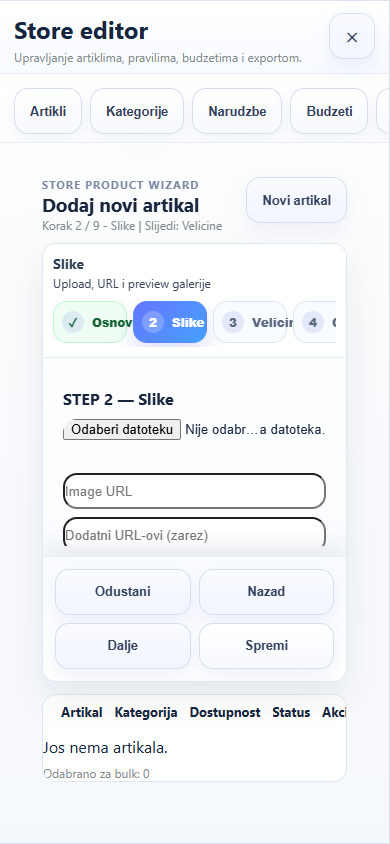

- Sta je prije bilo lose: Prije Store wizard nije bio vizualno uskladjen sa Backup/New Site wizardima i napredak nije bio jasan.
- Sta je promijenjeno: Step 2 sada ima vidljiv moderni stepper, aktivni/done state, header meta i sticky footer akcije.
- Zasto: da korisnik dobije siguran, vidljiv i touch-friendly workflow bez tehnickog unosa.
- Kompromis: Na manjim ekranima stepper horizontalno scrolla unutar wizard panela, ne kroz cijelu stranicu.
- Guard: horizontal overflow NO, visible buttons 29.

### PASS - mobile-390x844 - store-wizard-step-3

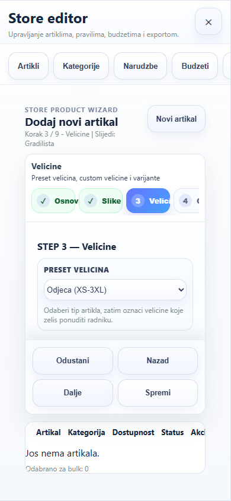

- Sta je prije bilo lose: Prije Store wizard nije bio vizualno uskladjen sa Backup/New Site wizardima i napredak nije bio jasan.
- Sta je promijenjeno: Step 3 sada ima vidljiv moderni stepper, aktivni/done state, header meta i sticky footer akcije.
- Zasto: da korisnik dobije siguran, vidljiv i touch-friendly workflow bez tehnickog unosa.
- Kompromis: Na manjim ekranima stepper horizontalno scrolla unutar wizard panela, ne kroz cijelu stranicu.
- Guard: horizontal overflow NO, visible buttons 30.

### PASS - mobile-390x844 - store-wizard-step-4

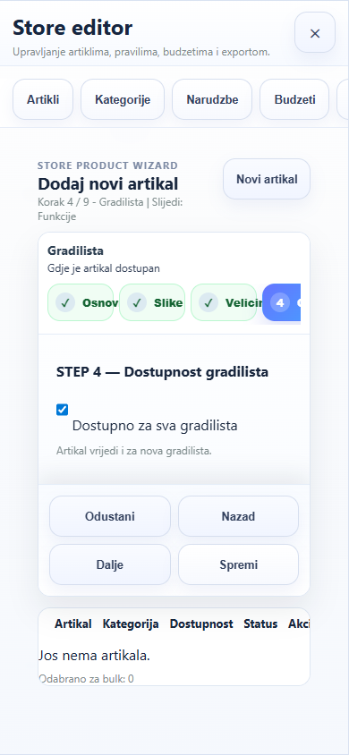

- Sta je prije bilo lose: Prije Store wizard nije bio vizualno uskladjen sa Backup/New Site wizardima i napredak nije bio jasan.
- Sta je promijenjeno: Step 4 sada ima vidljiv moderni stepper, aktivni/done state, header meta i sticky footer akcije.
- Zasto: da korisnik dobije siguran, vidljiv i touch-friendly workflow bez tehnickog unosa.
- Kompromis: Na manjim ekranima stepper horizontalno scrolla unutar wizard panela, ne kroz cijelu stranicu.
- Guard: horizontal overflow NO, visible buttons 29.

### PASS - mobile-390x844 - store-wizard-step-5

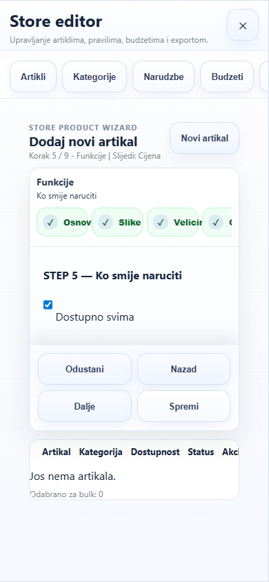

- Sta je prije bilo lose: Prije Store wizard nije bio vizualno uskladjen sa Backup/New Site wizardima i napredak nije bio jasan.
- Sta je promijenjeno: Step 5 sada ima vidljiv moderni stepper, aktivni/done state, header meta i sticky footer akcije.
- Zasto: da korisnik dobije siguran, vidljiv i touch-friendly workflow bez tehnickog unosa.
- Kompromis: Na manjim ekranima stepper horizontalno scrolla unutar wizard panela, ne kroz cijelu stranicu.
- Guard: horizontal overflow NO, visible buttons 29.

### PASS - mobile-390x844 - store-wizard-step-6

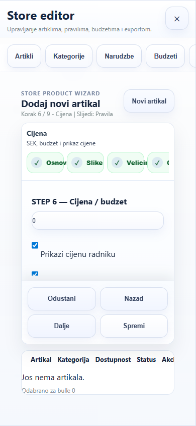

- Sta je prije bilo lose: Prije Store wizard nije bio vizualno uskladjen sa Backup/New Site wizardima i napredak nije bio jasan.
- Sta je promijenjeno: Step 6 sada ima vidljiv moderni stepper, aktivni/done state, header meta i sticky footer akcije.
- Zasto: da korisnik dobije siguran, vidljiv i touch-friendly workflow bez tehnickog unosa.
- Kompromis: Na manjim ekranima stepper horizontalno scrolla unutar wizard panela, ne kroz cijelu stranicu.
- Guard: horizontal overflow NO, visible buttons 29.

### PASS - mobile-390x844 - store-wizard-step-7

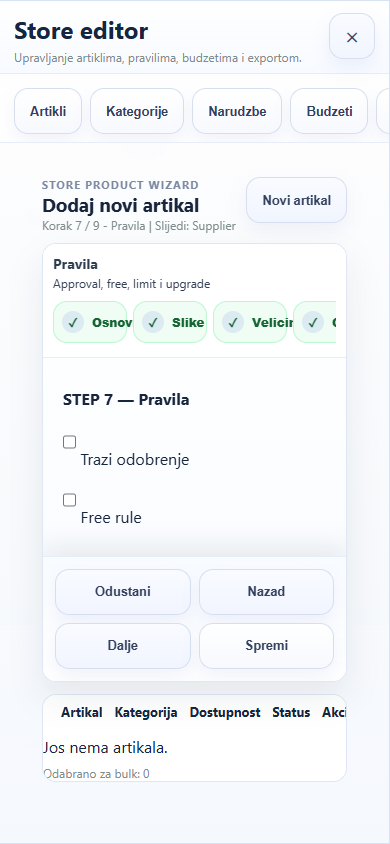

- Sta je prije bilo lose: Prije Store wizard nije bio vizualno uskladjen sa Backup/New Site wizardima i napredak nije bio jasan.
- Sta je promijenjeno: Step 7 sada ima vidljiv moderni stepper, aktivni/done state, header meta i sticky footer akcije.
- Zasto: da korisnik dobije siguran, vidljiv i touch-friendly workflow bez tehnickog unosa.
- Kompromis: Na manjim ekranima stepper horizontalno scrolla unutar wizard panela, ne kroz cijelu stranicu.
- Guard: horizontal overflow NO, visible buttons 29.

### PASS - mobile-390x844 - store-wizard-step-8

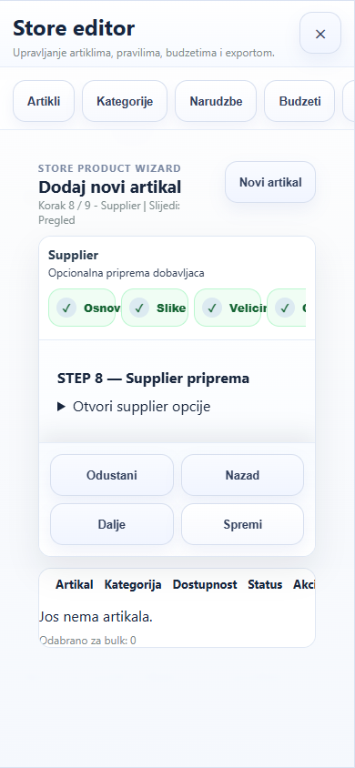

- Sta je prije bilo lose: Prije Store wizard nije bio vizualno uskladjen sa Backup/New Site wizardima i napredak nije bio jasan.
- Sta je promijenjeno: Step 8 sada ima vidljiv moderni stepper, aktivni/done state, header meta i sticky footer akcije.
- Zasto: da korisnik dobije siguran, vidljiv i touch-friendly workflow bez tehnickog unosa.
- Kompromis: Na manjim ekranima stepper horizontalno scrolla unutar wizard panela, ne kroz cijelu stranicu.
- Guard: horizontal overflow NO, visible buttons 29.

### PASS - mobile-390x844 - store-wizard-step-9

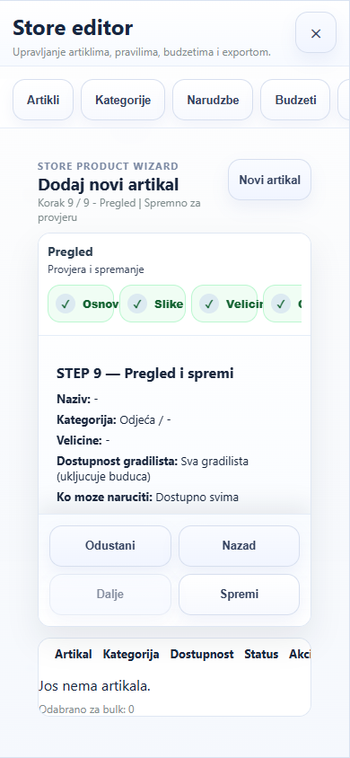

- Sta je prije bilo lose: Prije Store wizard nije bio vizualno uskladjen sa Backup/New Site wizardima i napredak nije bio jasan.
- Sta je promijenjeno: Step 9 sada ima vidljiv moderni stepper, aktivni/done state, header meta i sticky footer akcije.
- Zasto: da korisnik dobije siguran, vidljiv i touch-friendly workflow bez tehnickog unosa.
- Kompromis: Na manjim ekranima stepper horizontalno scrolla unutar wizard panela, ne kroz cijelu stranicu.
- Guard: horizontal overflow NO, visible buttons 29.
