# Full Recent Changes Proof Review

Generated: 2026-05-23T09:22:22.341Z

Summary: PASS 75, MINOR 0, MAJOR 0, BLOCKER 0.

Scope: admin wizard, backup wizard, site wizard/info/map, Store editor/cart/orders, Site Chat shell, Planner entity conflict, Tidplan fullscreen, notifications/account panel, header/mobile/tablet surfaces.

### PASS - desktop-1440x1000 - header-home-site-info - home

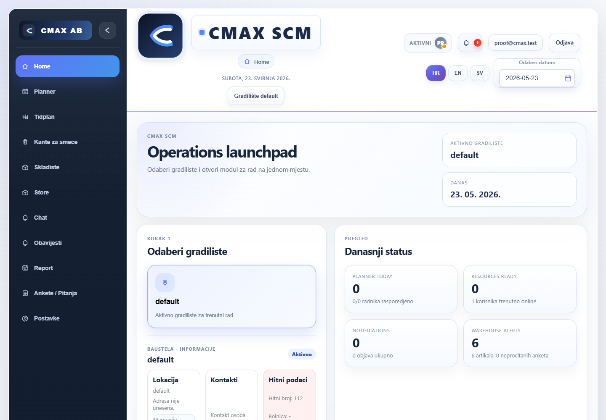

- Pregledano: Header, site metadata, map/navigation, dynamic contact/emergency cards
- Estetika/UX: nema vidljivog overflowa ili JS greske u automatskom guardu.
- Responsive guard: horizontal overflow NO, buttons 19.
- JS errors: none.

### PASS - desktop-1440x1000 - new-site-wizard - editable-site-details

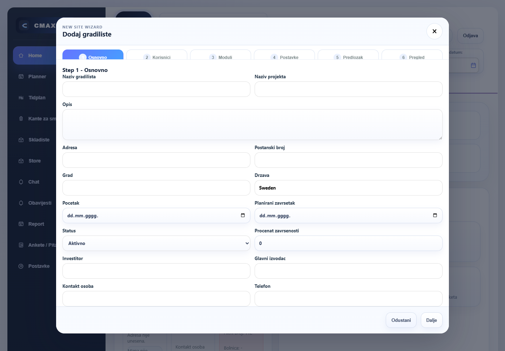

- Pregledano: Map picker plus editable contact/work/rule/logistics/emergency sections
- Estetika/UX: nema vidljivog overflowa ili JS greske u automatskom guardu.
- Responsive guard: horizontal overflow NO, buttons 28.
- JS errors: none.

### PASS - desktop-1440x1000 - new-site-wizard - editable-dynamic-sections

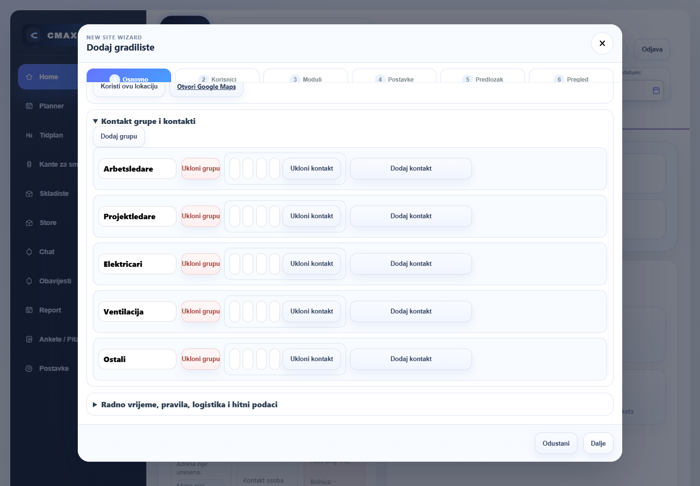

- Pregledano: Editable contact groups, work hours, safety rules, logistics and emergency rows
- Estetika/UX: nema vidljivog overflowa ili JS greske u automatskom guardu.
- Responsive guard: horizontal overflow NO, buttons 50.
- JS errors: none.

### PASS - desktop-1440x1000 - admin-user-wizard - create-user-stepper

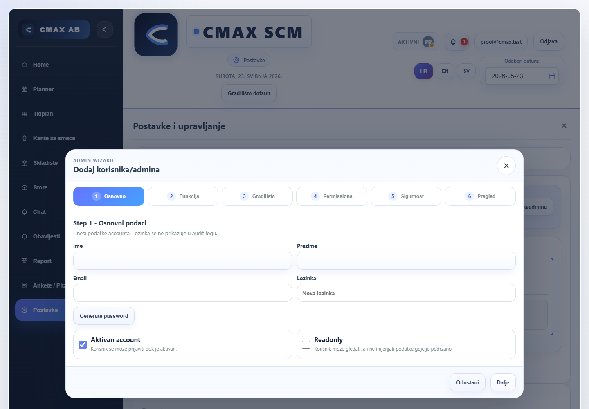

- Pregledano: Admin user wizard stepper, permissions and safe modal spacing
- Estetika/UX: nema vidljivog overflowa ili JS greske u automatskom guardu.
- Responsive guard: horizontal overflow NO, buttons 34.
- JS errors: none.

### PASS - desktop-1440x1000 - backup-restore-wizard - select-or-empty

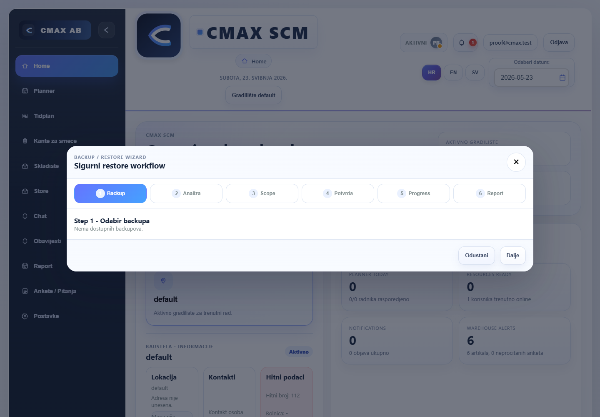

- Pregledano: Backup wizard card workflow/dry-run safety shell
- Estetika/UX: nema vidljivog overflowa ili JS greske u automatskom guardu.
- Responsive guard: horizontal overflow NO, buttons 28.
- JS errors: none.

### PASS - desktop-1440x1000 - store - manager-editor

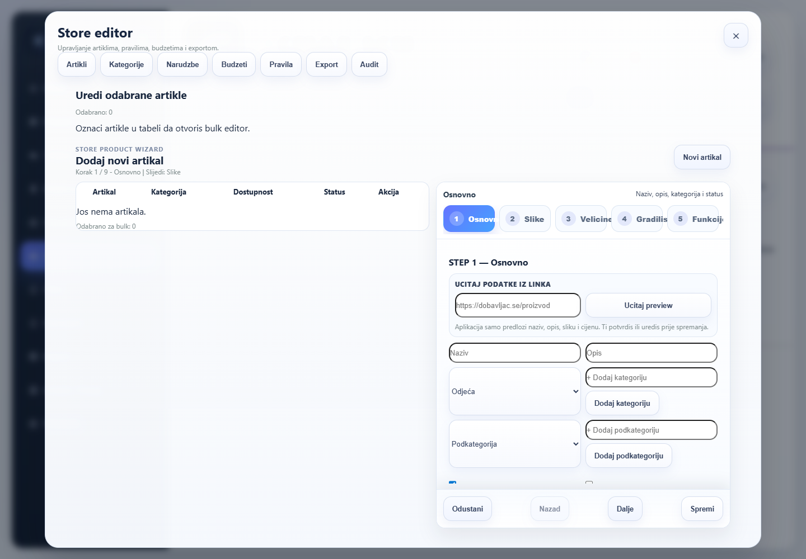

- Pregledano: Store editor overlay, product table, wizard progress, product cards
- Estetika/UX: nema vidljivog overflowa ili JS greske u automatskom guardu.
- Responsive guard: horizontal overflow NO, buttons 47.
- JS errors: none.

### PASS - desktop-1440x1000 - store - cart-overlay

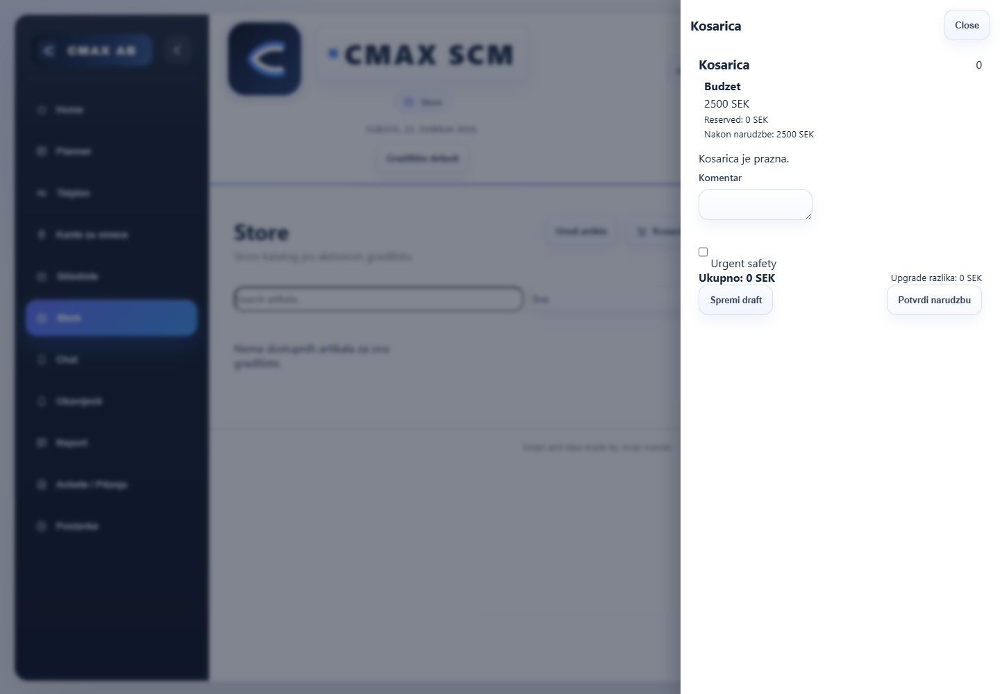

- Pregledano: Cart overlay stays readable and within viewport
- Estetika/UX: nema vidljivog overflowa ili JS greske u automatskom guardu.
- Responsive guard: horizontal overflow NO, buttons 27.
- JS errors: none.

### PASS - desktop-1440x1000 - store - orders-panel

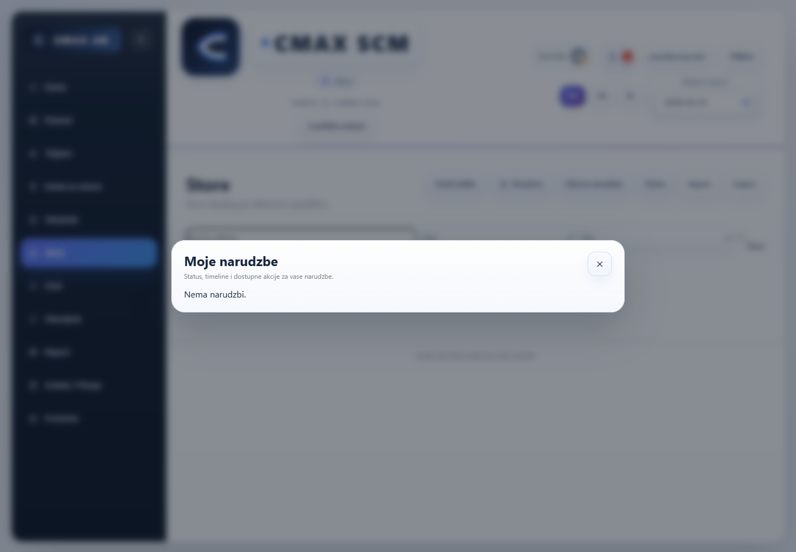

- Pregledano: My orders panel separated from catalog
- Estetika/UX: nema vidljivog overflowa ili JS greske u automatskom guardu.
- Responsive guard: horizontal overflow NO, buttons 25.
- JS errors: none.

### PASS - desktop-1440x1000 - site-chat - list-thread

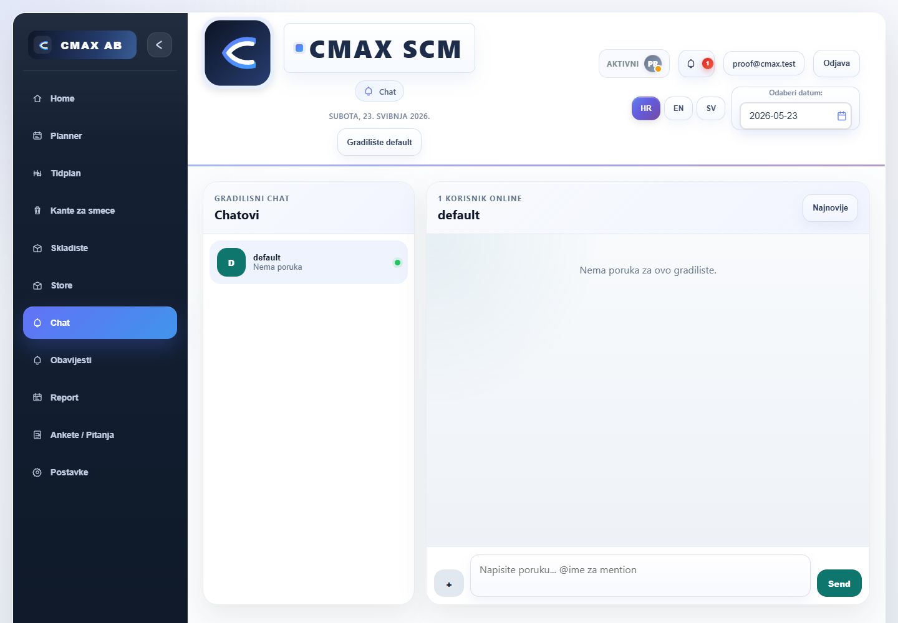

- Pregledano: Site chat list/thread responsive shell and account-notification separation surface
- Estetika/UX: nema vidljivog overflowa ili JS greske u automatskom guardu.
- Responsive guard: horizontal overflow NO, buttons 21.
- JS errors: none.

### PASS - desktop-1440x1000 - planner - row-save-surface

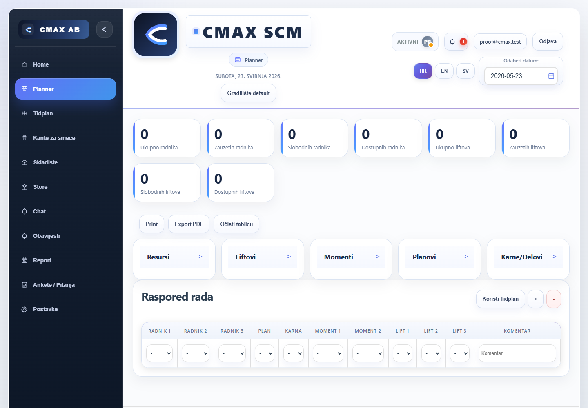

- Pregledano: Planner surface after row-level save/conflict work
- Estetika/UX: nema vidljivog overflowa ili JS greske u automatskom guardu.
- Responsive guard: horizontal overflow NO, buttons 29.
- JS errors: none.

### PASS - desktop-1440x1000 - planner - entity-conflict-ui

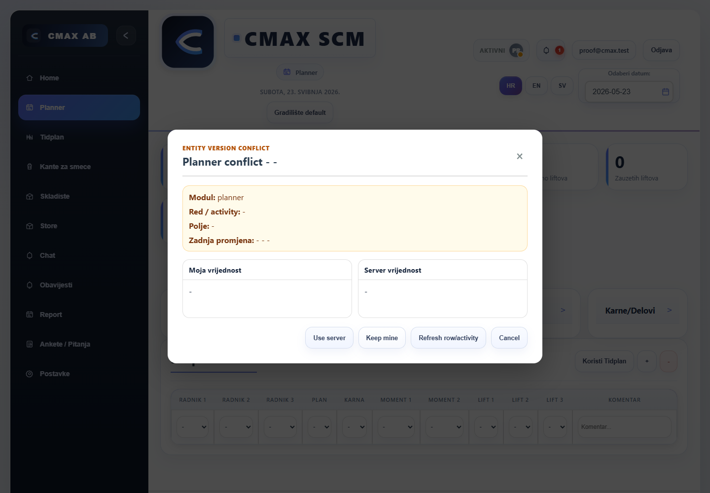

- Pregledano: Entity conflict UI scoped to row/field
- Estetika/UX: nema vidljivog overflowa ili JS greske u automatskom guardu.
- Responsive guard: horizontal overflow NO, buttons 33.
- JS errors: none.

### PASS - desktop-1440x1000 - tidplan - normal

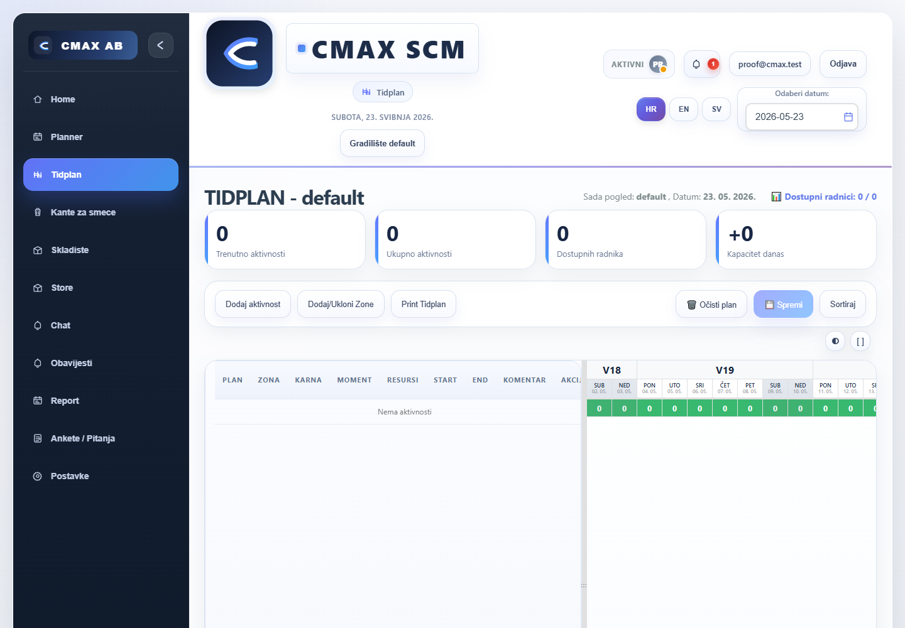

- Pregledano: Tidplan activity patch surface
- Estetika/UX: nema vidljivog overflowa ili JS greske u automatskom guardu.
- Responsive guard: horizontal overflow NO, buttons 24.
- JS errors: none.

### PASS - desktop-1440x1000 - tidplan - fullscreen-gantt

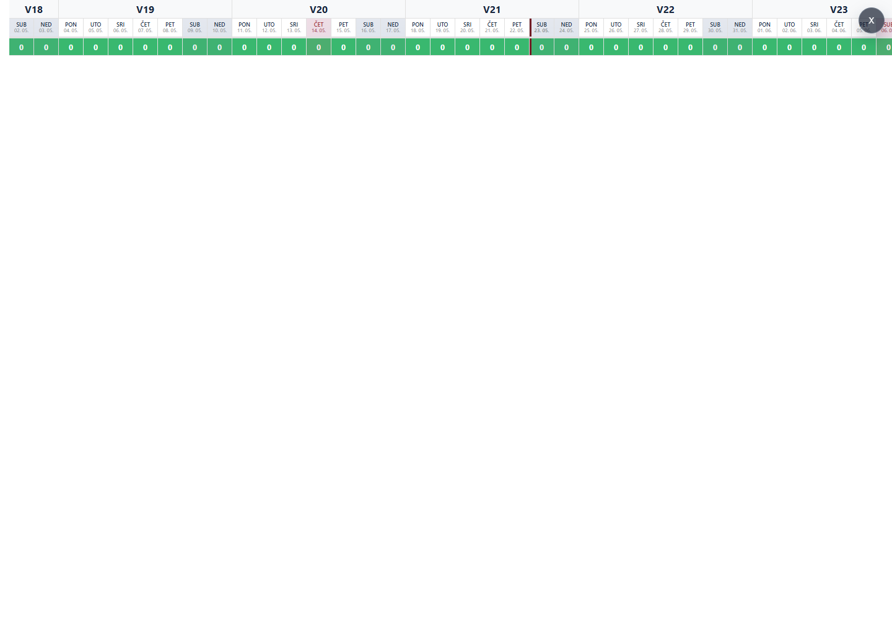

- Pregledano: Fullscreen Gantt after recent fixes
- Estetika/UX: nema vidljivog overflowa ili JS greske u automatskom guardu.
- Responsive guard: horizontal overflow NO, buttons 25.
- JS errors: none.

### PASS - desktop-1440x1000 - notifications - site-notifications

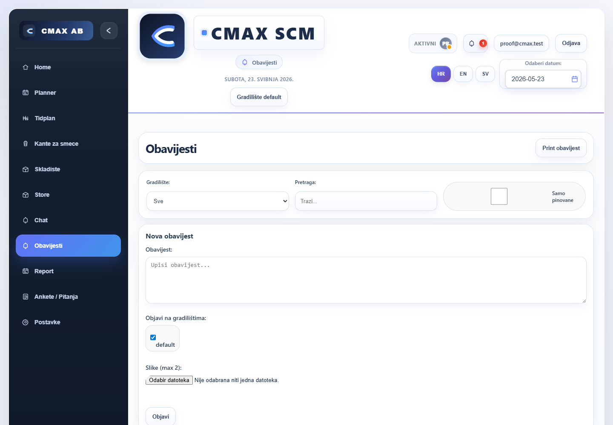

- Pregledano: Site notifications module remains separate from account notifications
- Estetika/UX: nema vidljivog overflowa ili JS greske u automatskom guardu.
- Responsive guard: horizontal overflow NO, buttons 20.
- JS errors: none.

### PASS - desktop-1440x1000 - notifications - account-panel

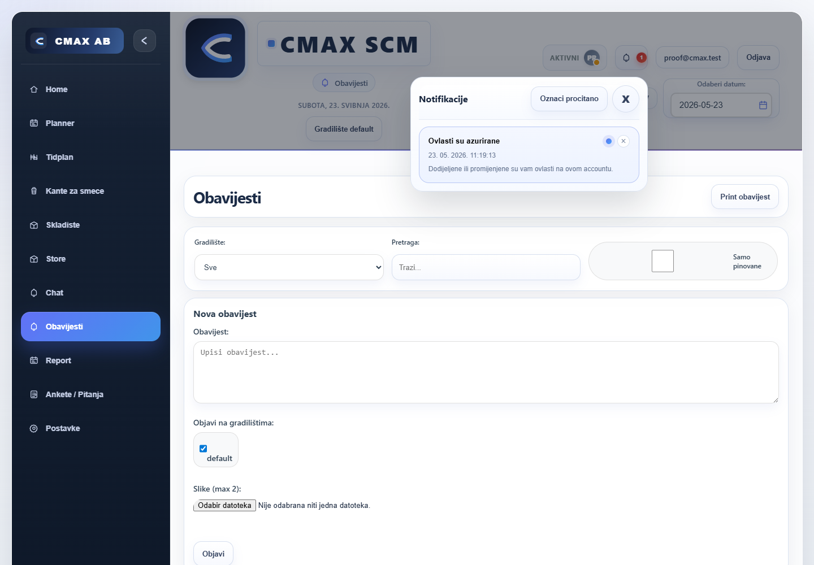

- Pregledano: Account notifications panel/badge responsive surface
- Estetika/UX: nema vidljivog overflowa ili JS greske u automatskom guardu.
- Responsive guard: horizontal overflow NO, buttons 24.
- JS errors: none.

### PASS - tablet-768x1024 - header-home-site-info - home

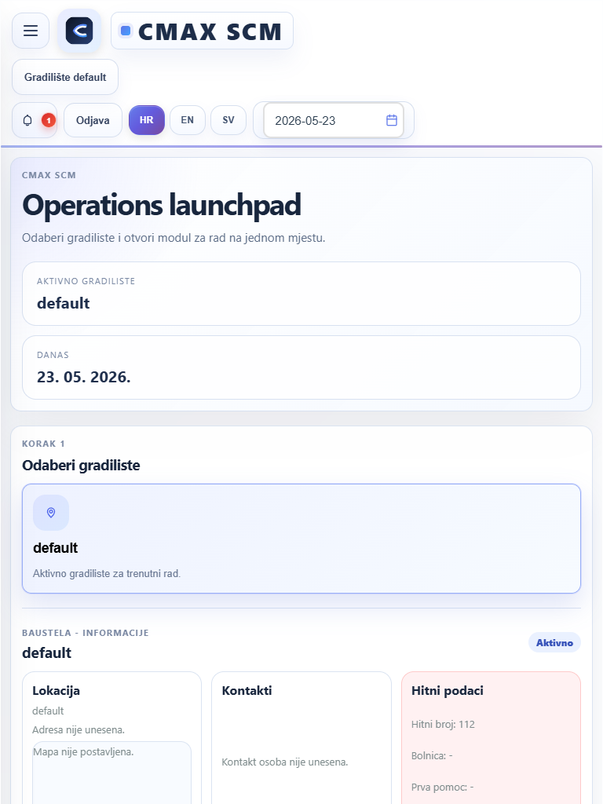

- Pregledano: Header, site metadata, map/navigation, dynamic contact/emergency cards
- Estetika/UX: nema vidljivog overflowa ili JS greske u automatskom guardu.
- Responsive guard: horizontal overflow NO, buttons 8.
- JS errors: none.

### PASS - tablet-768x1024 - new-site-wizard - editable-site-details

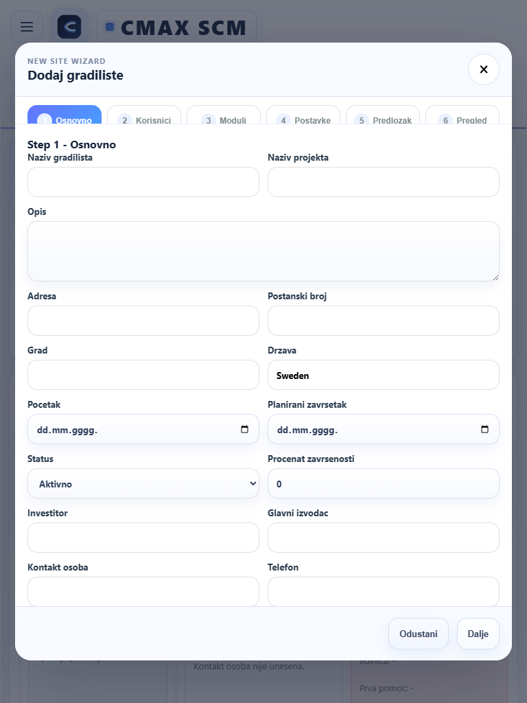

- Pregledano: Map picker plus editable contact/work/rule/logistics/emergency sections
- Estetika/UX: nema vidljivog overflowa ili JS greske u automatskom guardu.
- Responsive guard: horizontal overflow NO, buttons 17.
- JS errors: none.

### PASS - tablet-768x1024 - new-site-wizard - editable-dynamic-sections

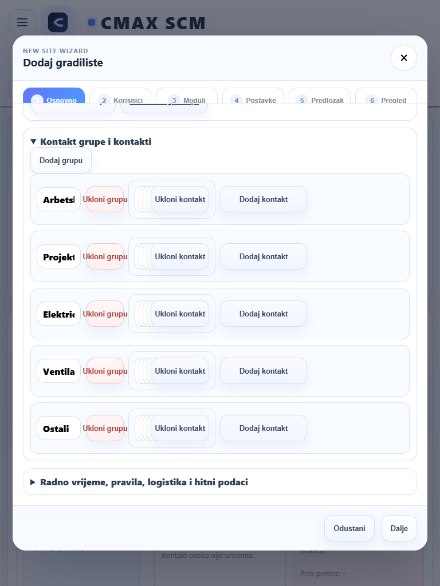

- Pregledano: Editable contact groups, work hours, safety rules, logistics and emergency rows
- Estetika/UX: nema vidljivog overflowa ili JS greske u automatskom guardu.
- Responsive guard: horizontal overflow NO, buttons 39.
- JS errors: none.

### PASS - tablet-768x1024 - admin-user-wizard - create-user-stepper

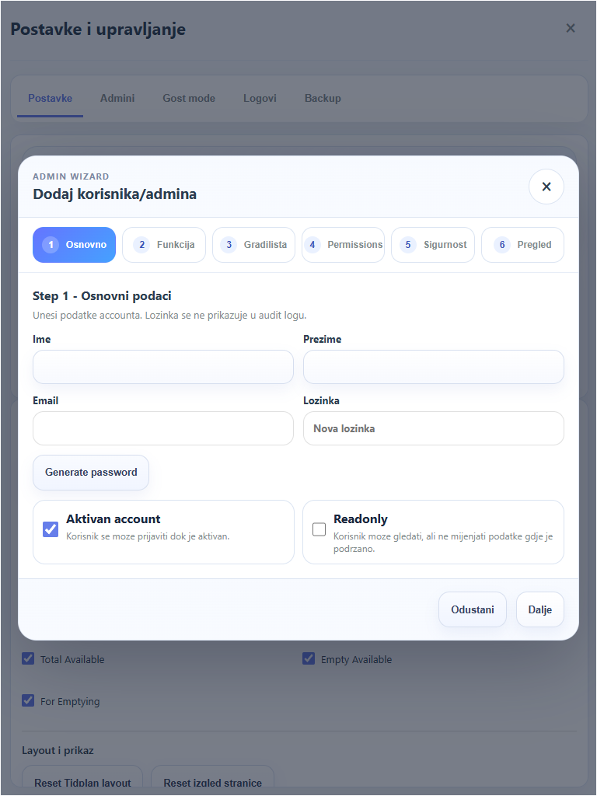

- Pregledano: Admin user wizard stepper, permissions and safe modal spacing
- Estetika/UX: nema vidljivog overflowa ili JS greske u automatskom guardu.
- Responsive guard: horizontal overflow NO, buttons 36.
- JS errors: none.

### PASS - tablet-768x1024 - backup-restore-wizard - select-or-empty

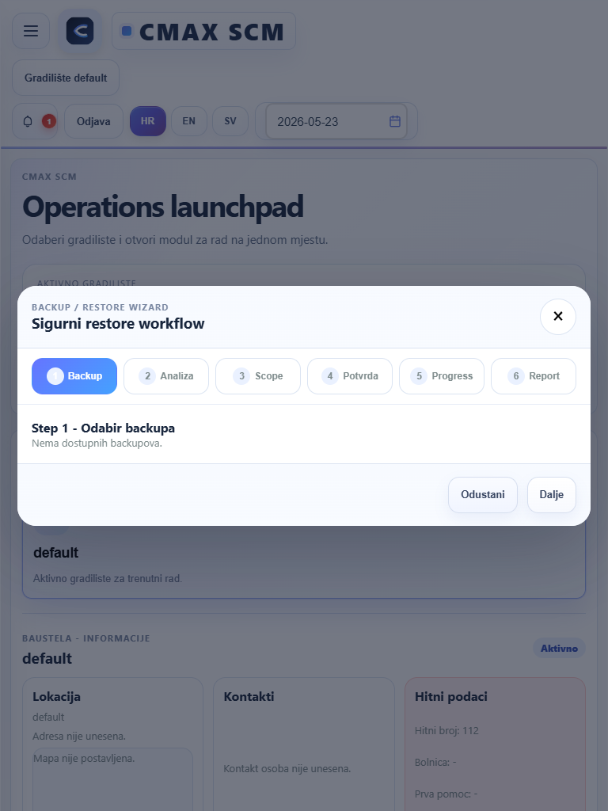

- Pregledano: Backup wizard card workflow/dry-run safety shell
- Estetika/UX: nema vidljivog overflowa ili JS greske u automatskom guardu.
- Responsive guard: horizontal overflow NO, buttons 17.
- JS errors: none.

### PASS - tablet-768x1024 - store - manager-editor

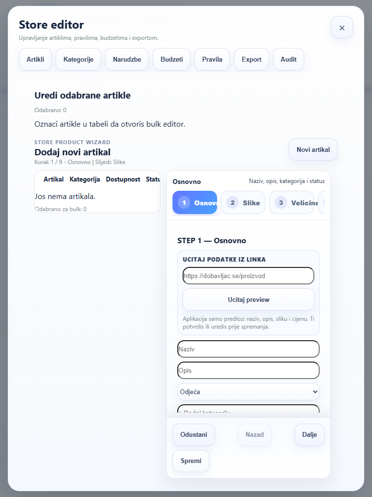

- Pregledano: Store editor overlay, product table, wizard progress, product cards
- Estetika/UX: nema vidljivog overflowa ili JS greske u automatskom guardu.
- Responsive guard: horizontal overflow NO, buttons 34.
- JS errors: none.

### PASS - tablet-768x1024 - store - cart-overlay

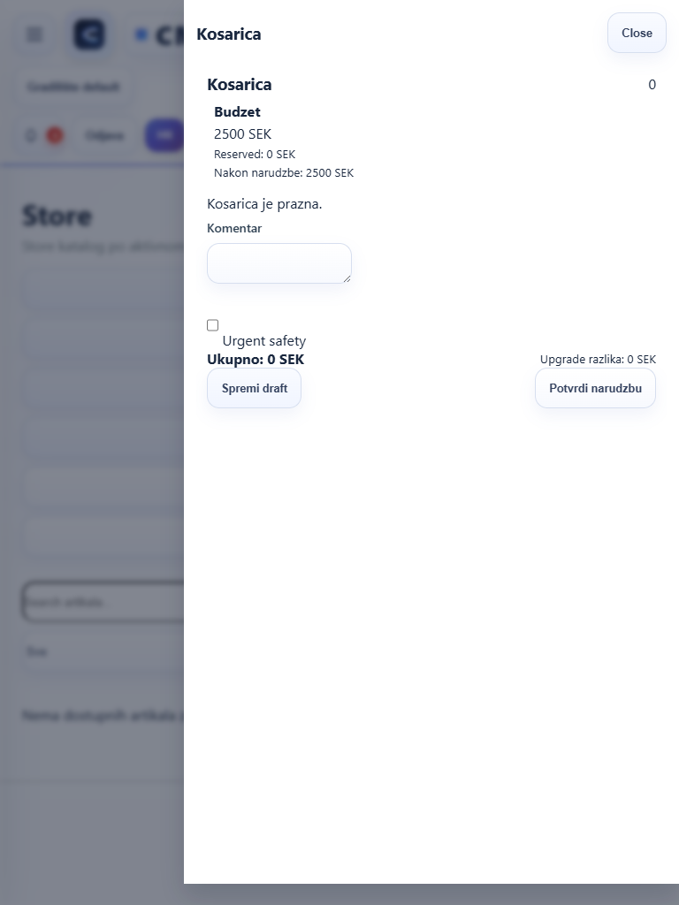

- Pregledano: Cart overlay stays readable and within viewport
- Estetika/UX: nema vidljivog overflowa ili JS greske u automatskom guardu.
- Responsive guard: horizontal overflow NO, buttons 16.
- JS errors: none.

### PASS - tablet-768x1024 - store - orders-panel

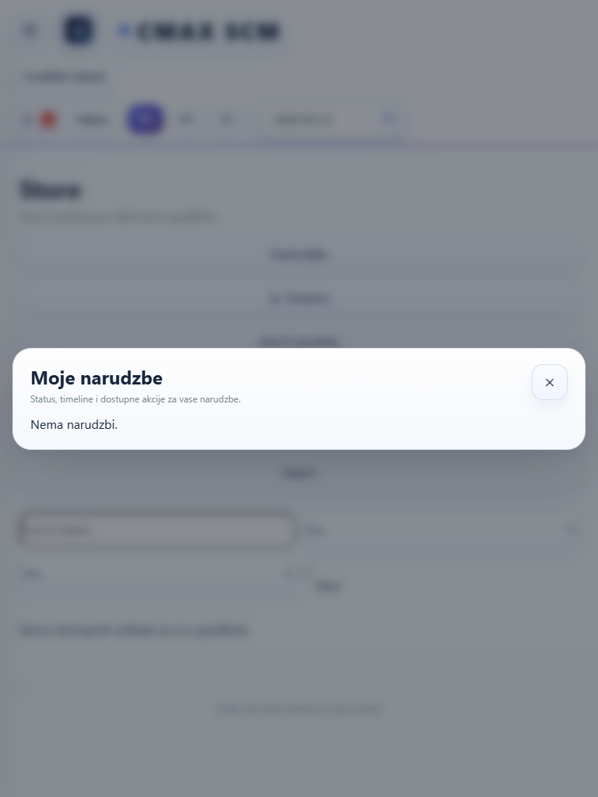

- Pregledano: My orders panel separated from catalog
- Estetika/UX: nema vidljivog overflowa ili JS greske u automatskom guardu.
- Responsive guard: horizontal overflow NO, buttons 14.
- JS errors: none.

### PASS - tablet-768x1024 - site-chat - list-thread

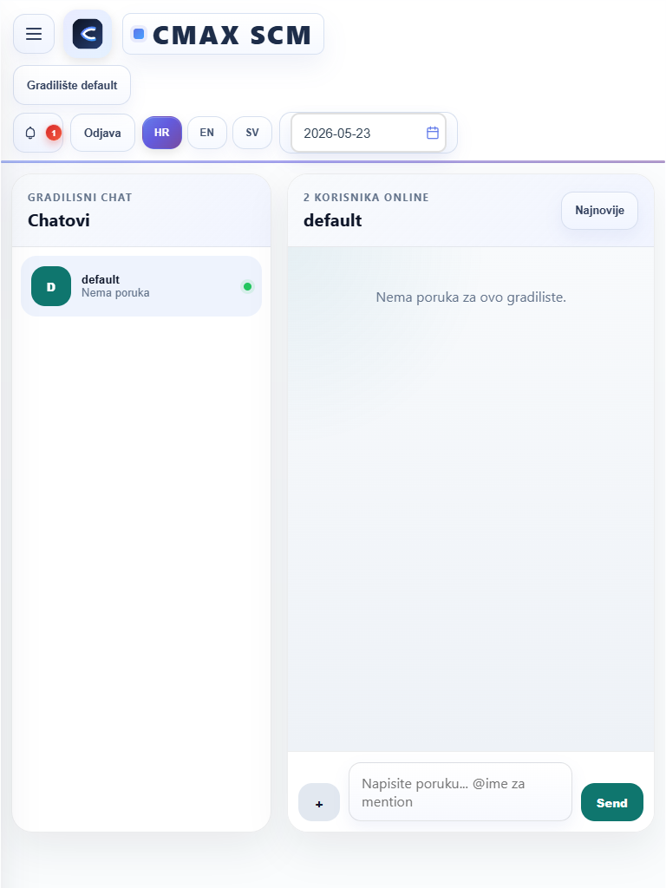

- Pregledano: Site chat list/thread responsive shell and account-notification separation surface
- Estetika/UX: nema vidljivog overflowa ili JS greske u automatskom guardu.
- Responsive guard: horizontal overflow NO, buttons 10.
- JS errors: none.

### PASS - tablet-768x1024 - planner - row-save-surface

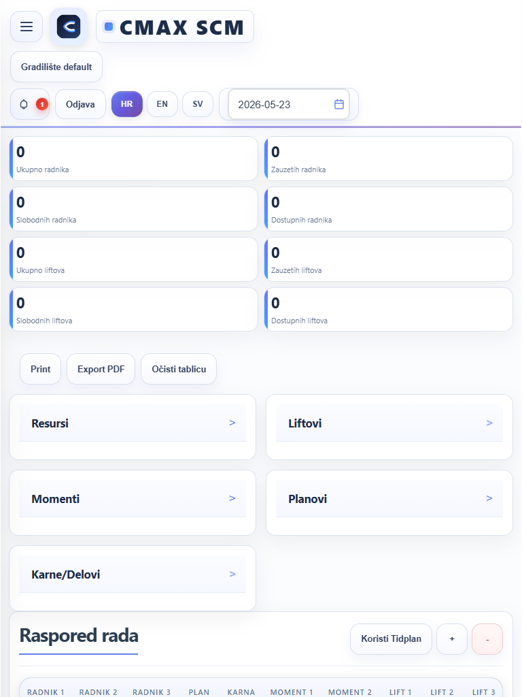

- Pregledano: Planner surface after row-level save/conflict work
- Estetika/UX: nema vidljivog overflowa ili JS greske u automatskom guardu.
- Responsive guard: horizontal overflow NO, buttons 18.
- JS errors: none.

### PASS - tablet-768x1024 - planner - entity-conflict-ui

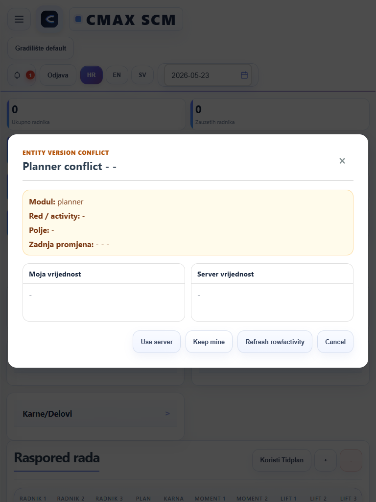

- Pregledano: Entity conflict UI scoped to row/field
- Estetika/UX: nema vidljivog overflowa ili JS greske u automatskom guardu.
- Responsive guard: horizontal overflow NO, buttons 23.
- JS errors: none.

### PASS - tablet-768x1024 - tidplan - normal

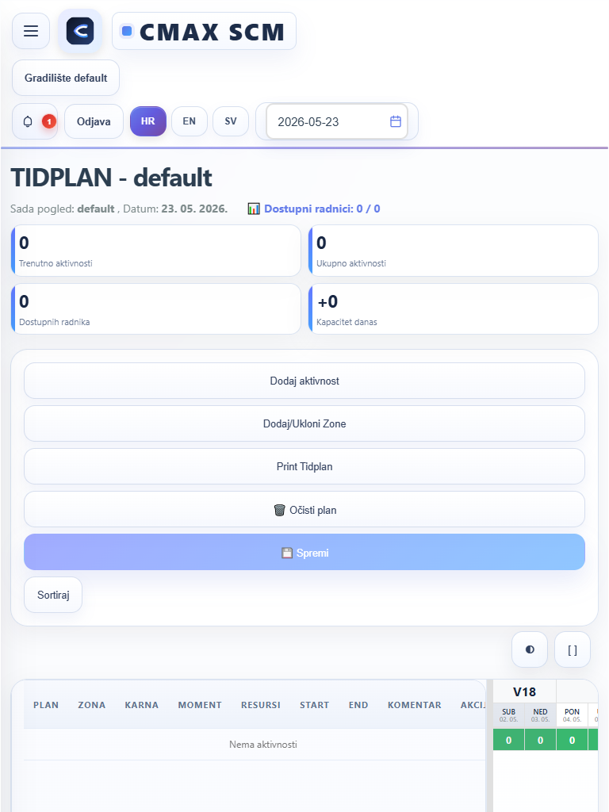

- Pregledano: Tidplan activity patch surface
- Estetika/UX: nema vidljivog overflowa ili JS greske u automatskom guardu.
- Responsive guard: horizontal overflow NO, buttons 15.
- JS errors: none.

### PASS - tablet-768x1024 - tidplan - fullscreen-gantt

- Pregledano: Fullscreen Gantt after recent fixes
- Estetika/UX: nema vidljivog overflowa ili JS greske u automatskom guardu.
- Responsive guard: horizontal overflow NO, buttons 16.
- JS errors: none.

### PASS - tablet-768x1024 - notifications - site-notifications

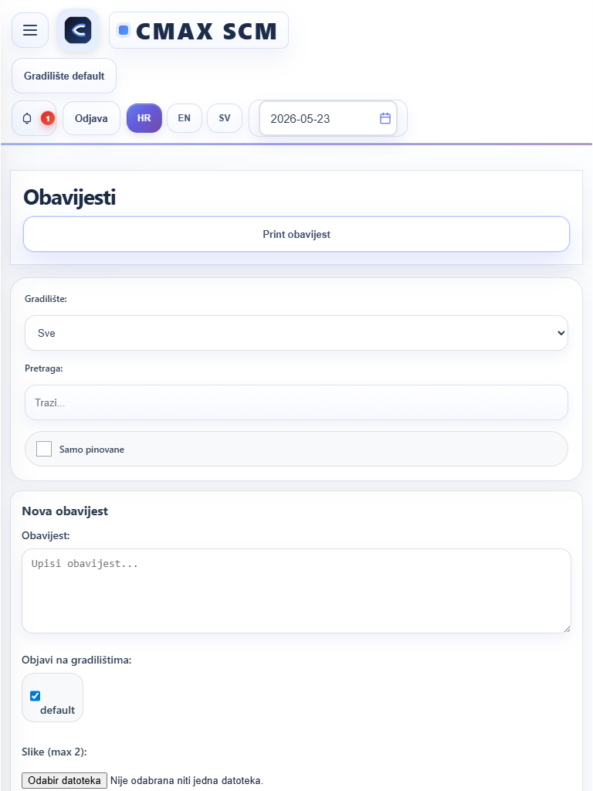

- Pregledano: Site notifications module remains separate from account notifications
- Estetika/UX: nema vidljivog overflowa ili JS greske u automatskom guardu.
- Responsive guard: horizontal overflow NO, buttons 8.
- JS errors: none.

### PASS - tablet-768x1024 - notifications - account-panel

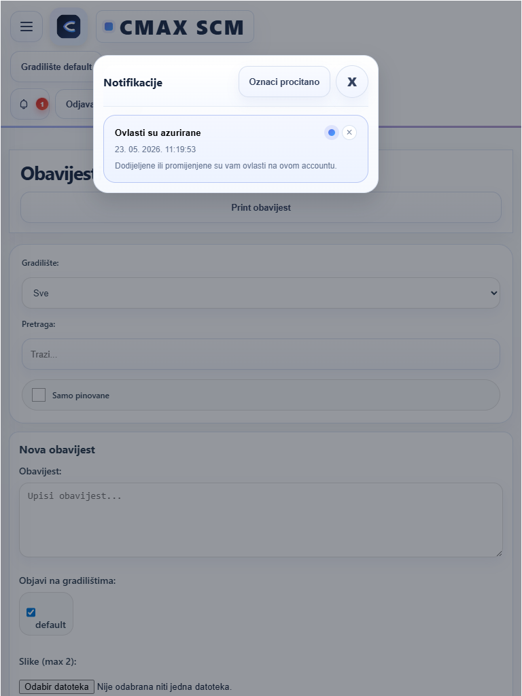

- Pregledano: Account notifications panel/badge responsive surface
- Estetika/UX: nema vidljivog overflowa ili JS greske u automatskom guardu.
- Responsive guard: horizontal overflow NO, buttons 12.
- JS errors: none.

### PASS - tablet-1024x1366 - header-home-site-info - home

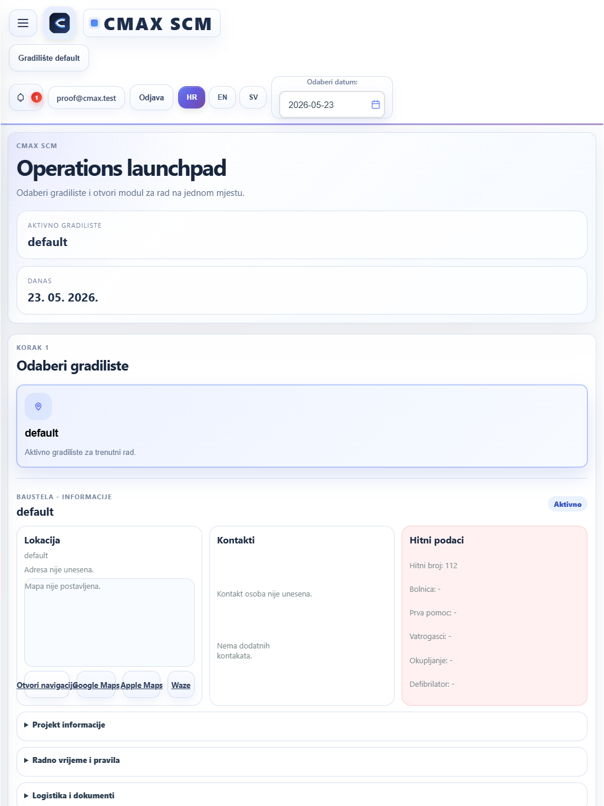

- Pregledano: Header, site metadata, map/navigation, dynamic contact/emergency cards
- Estetika/UX: nema vidljivog overflowa ili JS greske u automatskom guardu.
- Responsive guard: horizontal overflow NO, buttons 12.
- JS errors: none.

### PASS - tablet-1024x1366 - new-site-wizard - editable-site-details

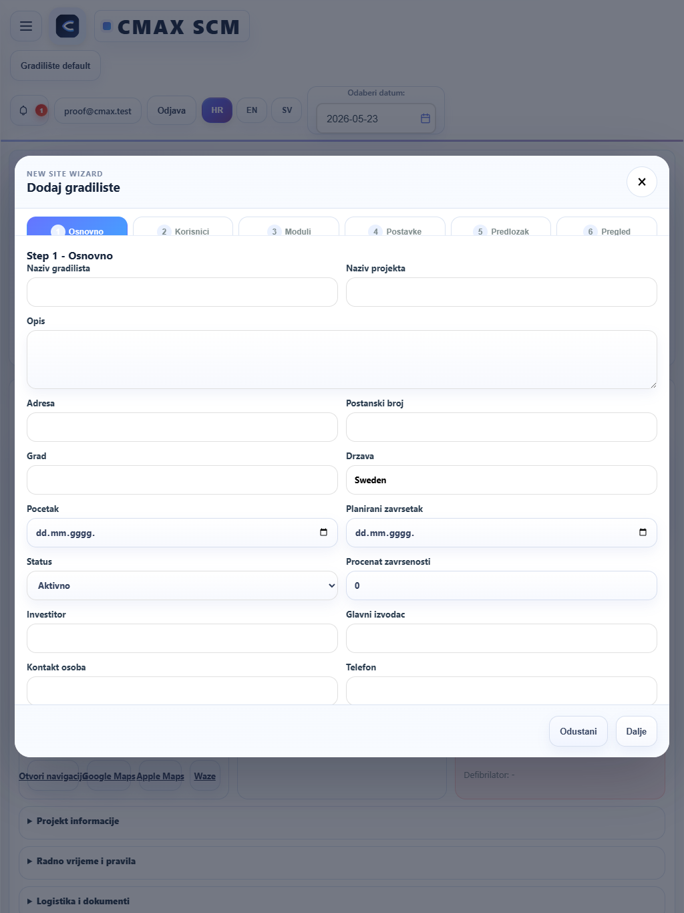

- Pregledano: Map picker plus editable contact/work/rule/logistics/emergency sections
- Estetika/UX: nema vidljivog overflowa ili JS greske u automatskom guardu.
- Responsive guard: horizontal overflow NO, buttons 22.
- JS errors: none.

### PASS - tablet-1024x1366 - new-site-wizard - editable-dynamic-sections

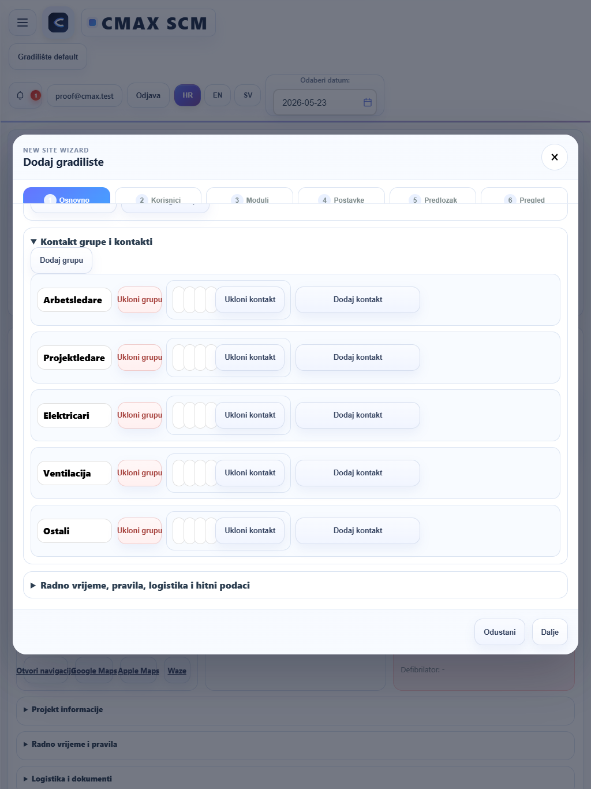

- Pregledano: Editable contact groups, work hours, safety rules, logistics and emergency rows
- Estetika/UX: nema vidljivog overflowa ili JS greske u automatskom guardu.
- Responsive guard: horizontal overflow NO, buttons 45.
- JS errors: none.

### PASS - tablet-1024x1366 - admin-user-wizard - create-user-stepper

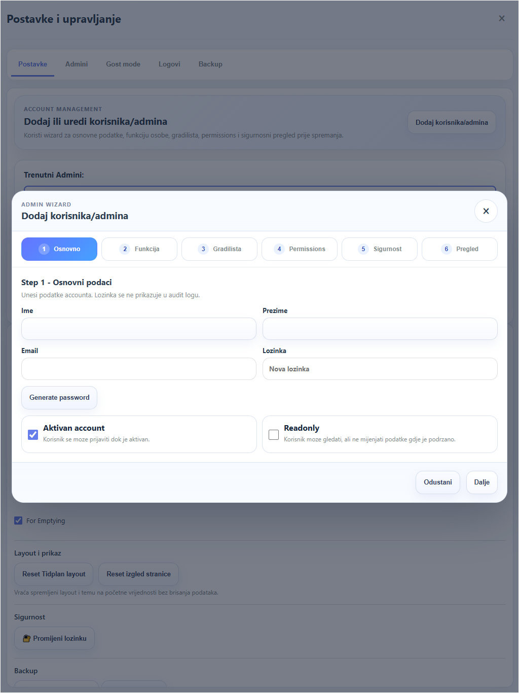

- Pregledano: Admin user wizard stepper, permissions and safe modal spacing
- Estetika/UX: nema vidljivog overflowa ili JS greske u automatskom guardu.
- Responsive guard: horizontal overflow NO, buttons 39.
- JS errors: none.

### PASS - tablet-1024x1366 - backup-restore-wizard - select-or-empty

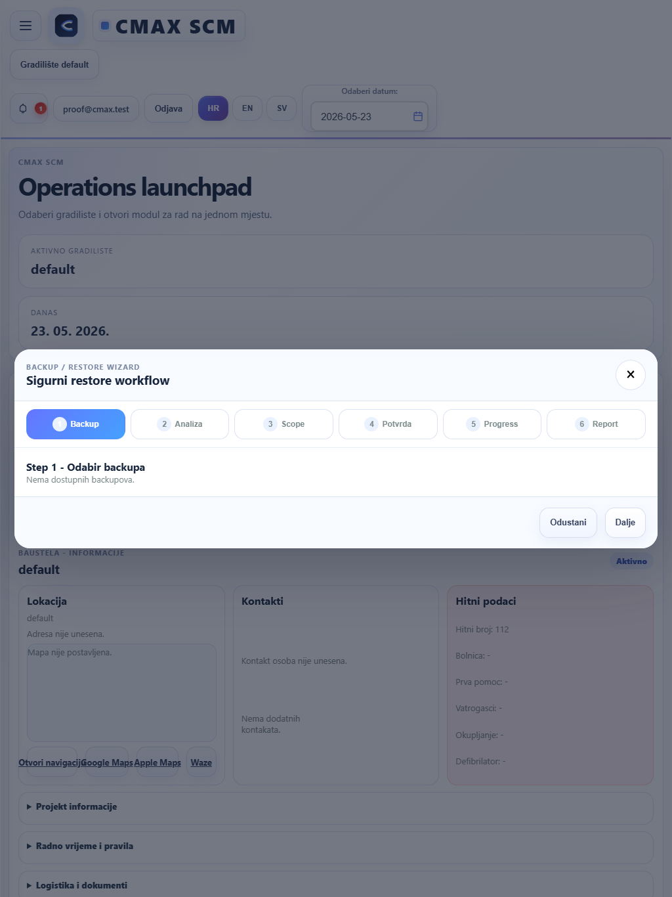

- Pregledano: Backup wizard card workflow/dry-run safety shell
- Estetika/UX: nema vidljivog overflowa ili JS greske u automatskom guardu.
- Responsive guard: horizontal overflow NO, buttons 21.
- JS errors: none.

### PASS - tablet-1024x1366 - store - manager-editor

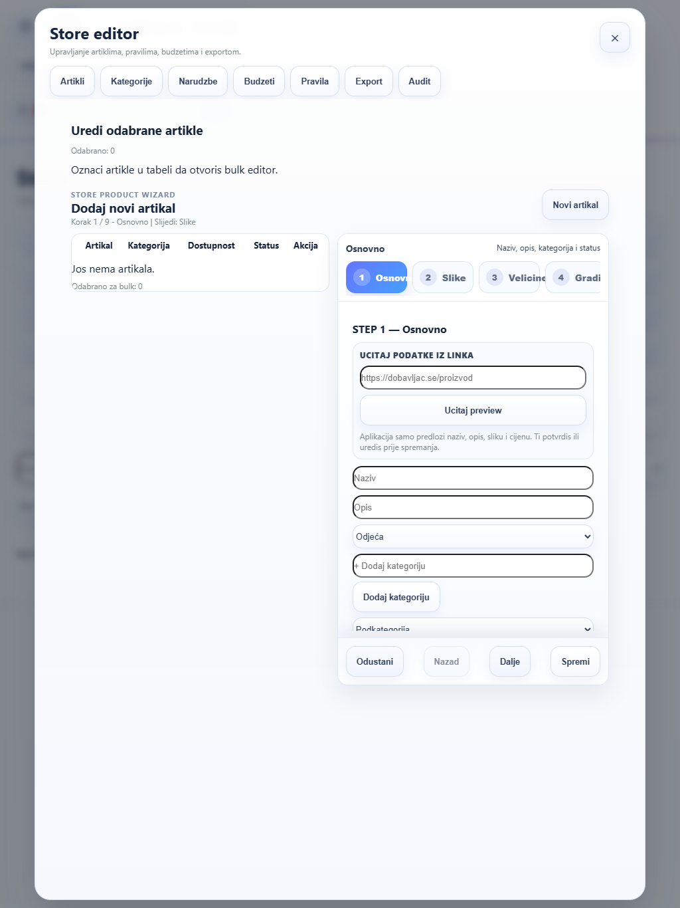

- Pregledano: Store editor overlay, product table, wizard progress, product cards
- Estetika/UX: nema vidljivog overflowa ili JS greske u automatskom guardu.
- Responsive guard: horizontal overflow NO, buttons 35.
- JS errors: none.

### PASS - tablet-1024x1366 - store - cart-overlay

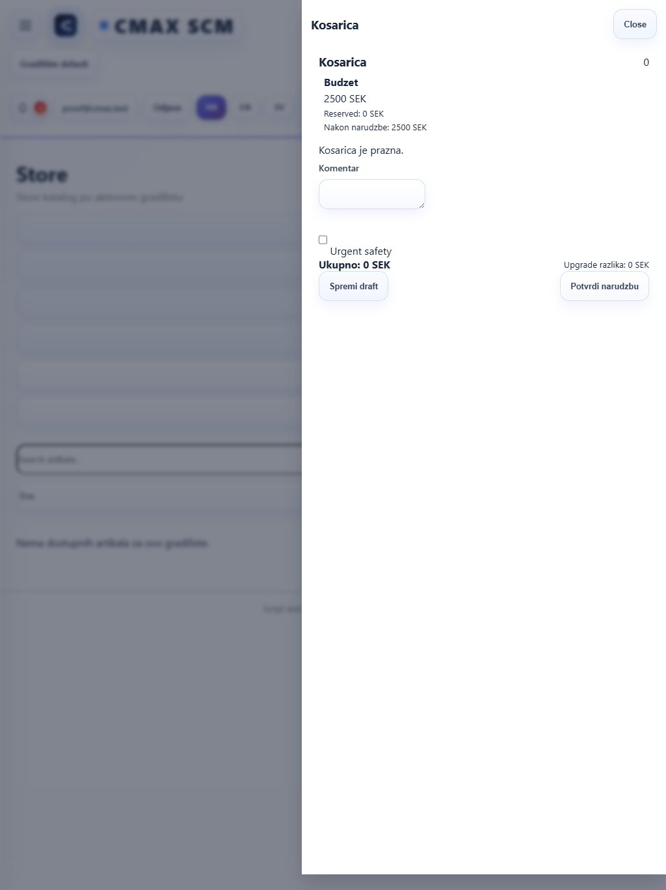

- Pregledano: Cart overlay stays readable and within viewport
- Estetika/UX: nema vidljivog overflowa ili JS greske u automatskom guardu.
- Responsive guard: horizontal overflow NO, buttons 16.
- JS errors: none.

### PASS - tablet-1024x1366 - store - orders-panel

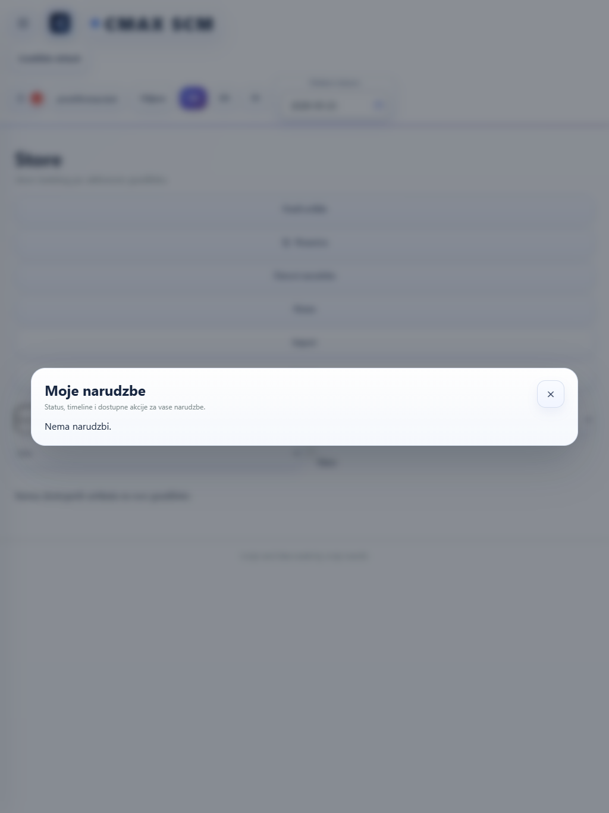

- Pregledano: My orders panel separated from catalog
- Estetika/UX: nema vidljivog overflowa ili JS greske u automatskom guardu.
- Responsive guard: horizontal overflow NO, buttons 14.
- JS errors: none.

### PASS - tablet-1024x1366 - site-chat - list-thread

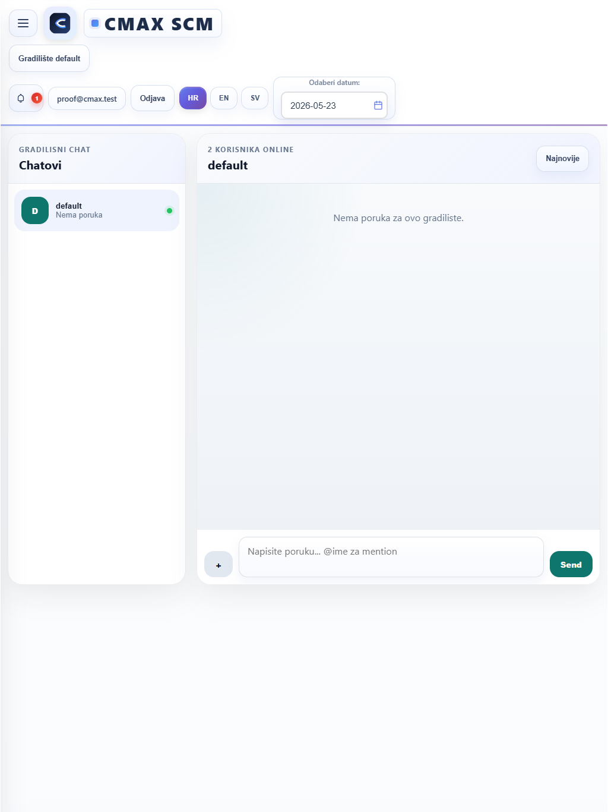

- Pregledano: Site chat list/thread responsive shell and account-notification separation surface
- Estetika/UX: nema vidljivog overflowa ili JS greske u automatskom guardu.
- Responsive guard: horizontal overflow NO, buttons 10.
- JS errors: none.

### PASS - tablet-1024x1366 - planner - row-save-surface

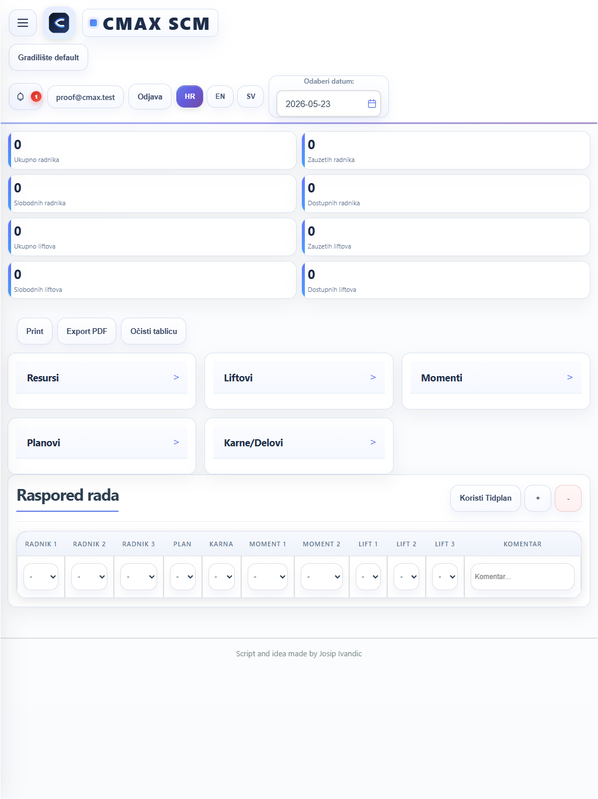

- Pregledano: Planner surface after row-level save/conflict work
- Estetika/UX: nema vidljivog overflowa ili JS greske u automatskom guardu.
- Responsive guard: horizontal overflow NO, buttons 18.
- JS errors: none.

### PASS - tablet-1024x1366 - planner - entity-conflict-ui

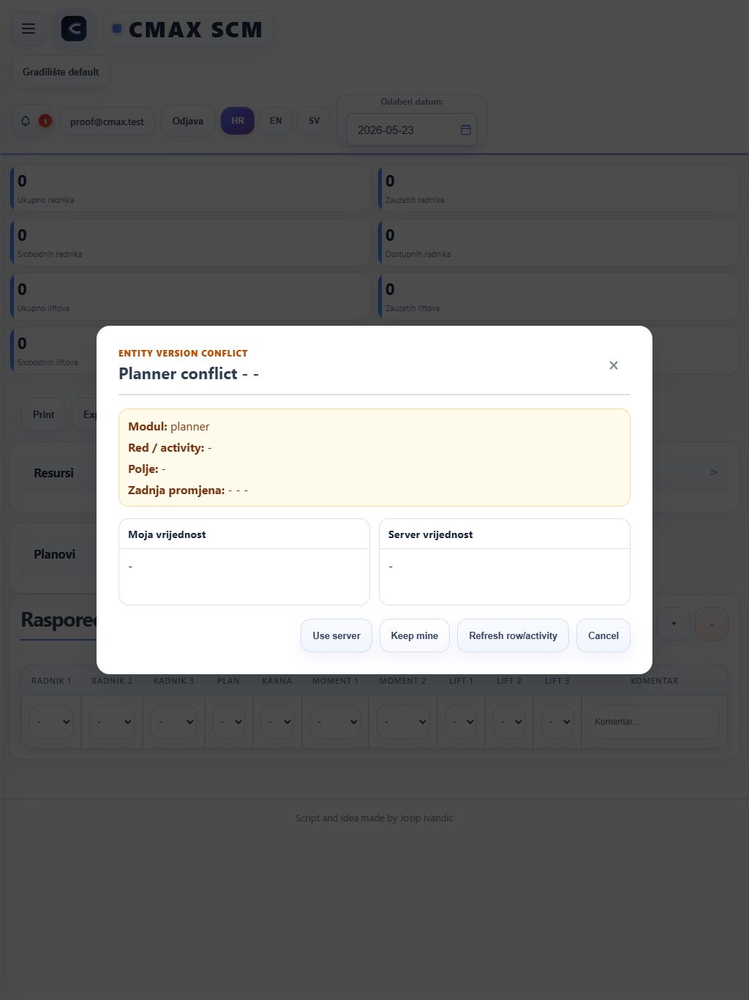

- Pregledano: Entity conflict UI scoped to row/field
- Estetika/UX: nema vidljivog overflowa ili JS greske u automatskom guardu.
- Responsive guard: horizontal overflow NO, buttons 23.
- JS errors: none.

### PASS - tablet-1024x1366 - tidplan - normal

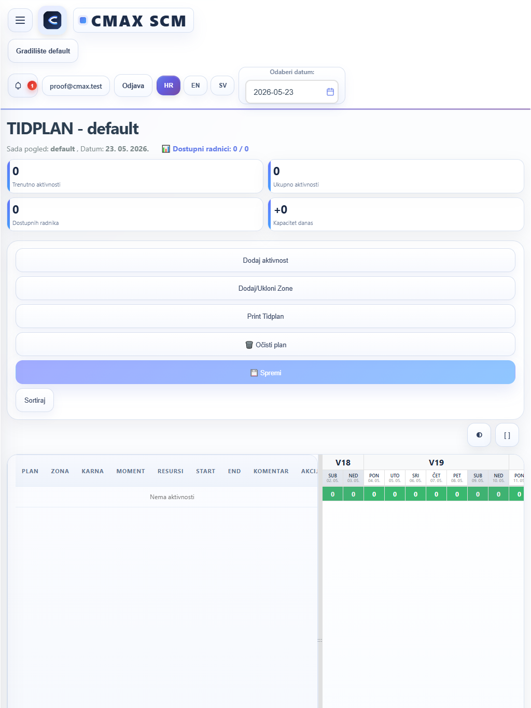

- Pregledano: Tidplan activity patch surface
- Estetika/UX: nema vidljivog overflowa ili JS greske u automatskom guardu.
- Responsive guard: horizontal overflow NO, buttons 15.
- JS errors: none.

### PASS - tablet-1024x1366 - tidplan - fullscreen-gantt

- Pregledano: Fullscreen Gantt after recent fixes
- Estetika/UX: nema vidljivog overflowa ili JS greske u automatskom guardu.
- Responsive guard: horizontal overflow NO, buttons 16.
- JS errors: none.

### PASS - tablet-1024x1366 - notifications - site-notifications

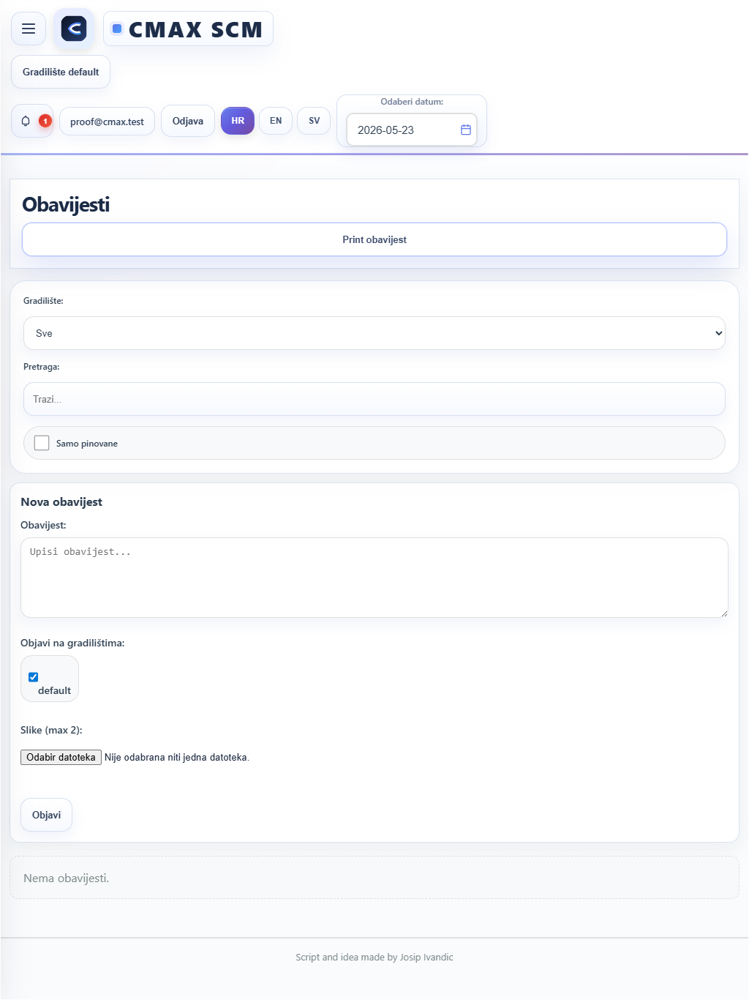

- Pregledano: Site notifications module remains separate from account notifications
- Estetika/UX: nema vidljivog overflowa ili JS greske u automatskom guardu.
- Responsive guard: horizontal overflow NO, buttons 9.
- JS errors: none.

### PASS - tablet-1024x1366 - notifications - account-panel

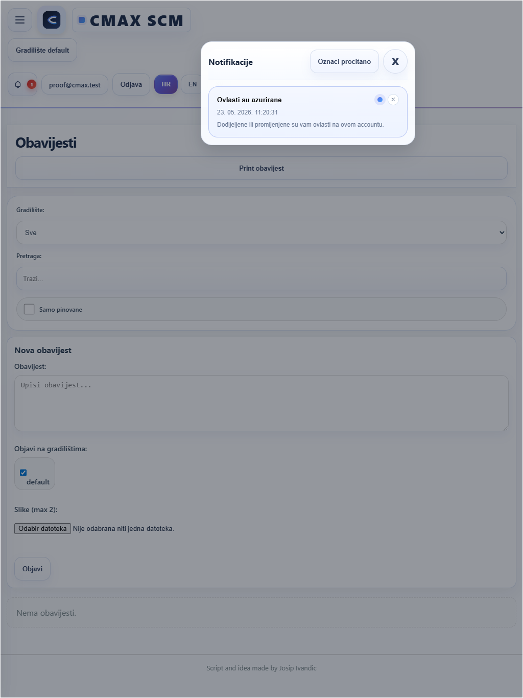

- Pregledano: Account notifications panel/badge responsive surface
- Estetika/UX: nema vidljivog overflowa ili JS greske u automatskom guardu.
- Responsive guard: horizontal overflow NO, buttons 13.
- JS errors: none.

### PASS - mobile-390x844 - header-home-site-info - home

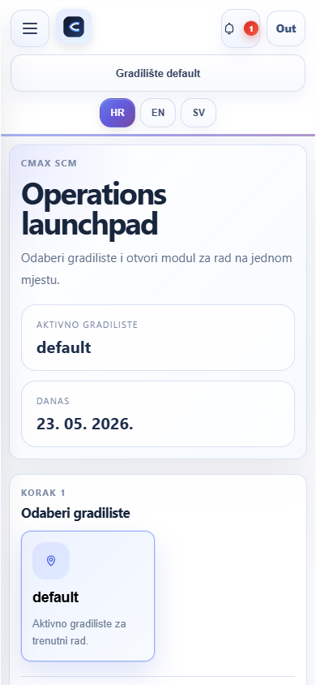

- Pregledano: Header, site metadata, map/navigation, dynamic contact/emergency cards
- Estetika/UX: nema vidljivog overflowa ili JS greske u automatskom guardu.
- Responsive guard: horizontal overflow NO, buttons 8.
- JS errors: none.

### PASS - mobile-390x844 - new-site-wizard - editable-site-details

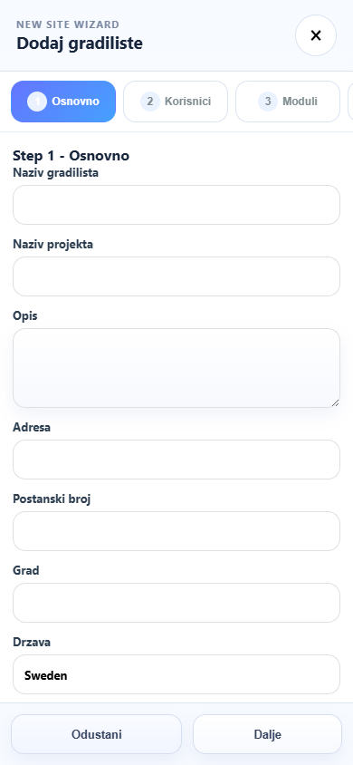

- Pregledano: Map picker plus editable contact/work/rule/logistics/emergency sections
- Estetika/UX: nema vidljivog overflowa ili JS greske u automatskom guardu.
- Responsive guard: horizontal overflow NO, buttons 15.
- JS errors: none.

### PASS - mobile-390x844 - new-site-wizard - editable-dynamic-sections

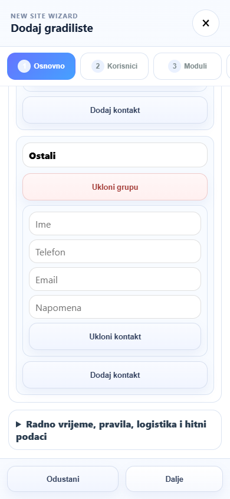

- Pregledano: Editable contact groups, work hours, safety rules, logistics and emergency rows
- Estetika/UX: nema vidljivog overflowa ili JS greske u automatskom guardu.
- Responsive guard: horizontal overflow NO, buttons 21.
- JS errors: none.

### PASS - mobile-390x844 - admin-user-wizard - create-user-stepper

- Pregledano: Admin user wizard stepper, permissions and safe modal spacing
- Estetika/UX: nema vidljivog overflowa ili JS greske u automatskom guardu.
- Responsive guard: horizontal overflow NO, buttons 32.
- JS errors: none.

### PASS - mobile-390x844 - backup-restore-wizard - select-or-empty

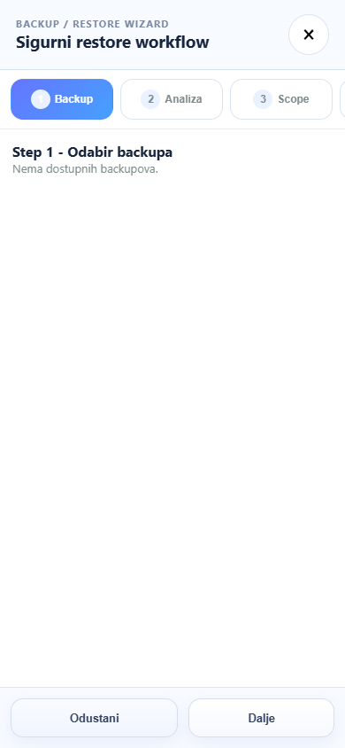

- Pregledano: Backup wizard card workflow/dry-run safety shell
- Estetika/UX: nema vidljivog overflowa ili JS greske u automatskom guardu.
- Responsive guard: horizontal overflow NO, buttons 15.
- JS errors: none.

### PASS - mobile-390x844 - store - manager-editor

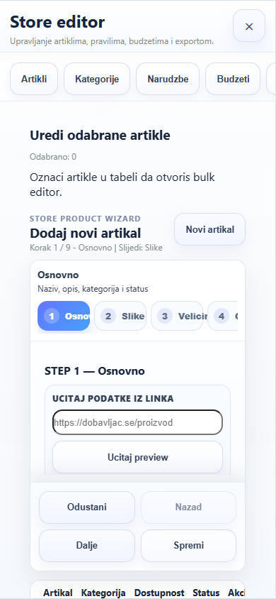

- Pregledano: Store editor overlay, product table, wizard progress, product cards
- Estetika/UX: nema vidljivog overflowa ili JS greske u automatskom guardu.
- Responsive guard: horizontal overflow NO, buttons 30.
- JS errors: none.

### PASS - mobile-390x844 - store - cart-overlay

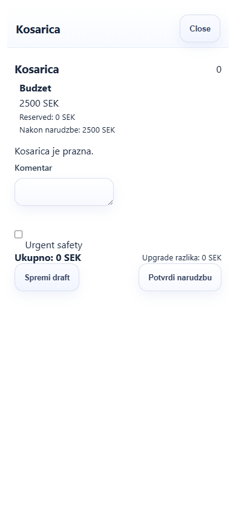

- Pregledano: Cart overlay stays readable and within viewport
- Estetika/UX: nema vidljivog overflowa ili JS greske u automatskom guardu.
- Responsive guard: horizontal overflow NO, buttons 16.
- JS errors: none.

### PASS - mobile-390x844 - store - orders-panel

- Pregledano: My orders panel separated from catalog
- Estetika/UX: nema vidljivog overflowa ili JS greske u automatskom guardu.
- Responsive guard: horizontal overflow NO, buttons 14.
- JS errors: none.

### PASS - mobile-390x844 - site-chat - list-thread

- Pregledano: Site chat list/thread responsive shell and account-notification separation surface
- Estetika/UX: nema vidljivog overflowa ili JS greske u automatskom guardu.
- Responsive guard: horizontal overflow NO, buttons 8.
- JS errors: none.

### PASS - mobile-390x844 - planner - row-save-surface

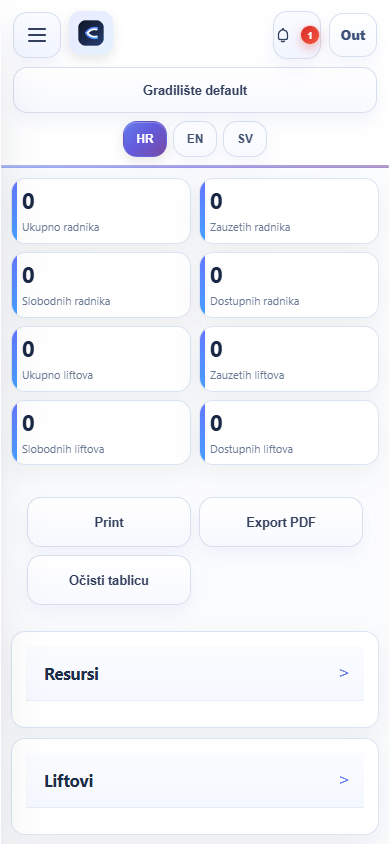

- Pregledano: Planner surface after row-level save/conflict work
- Estetika/UX: nema vidljivog overflowa ili JS greske u automatskom guardu.
- Responsive guard: horizontal overflow NO, buttons 12.
- JS errors: none.

### PASS - mobile-390x844 - planner - entity-conflict-ui

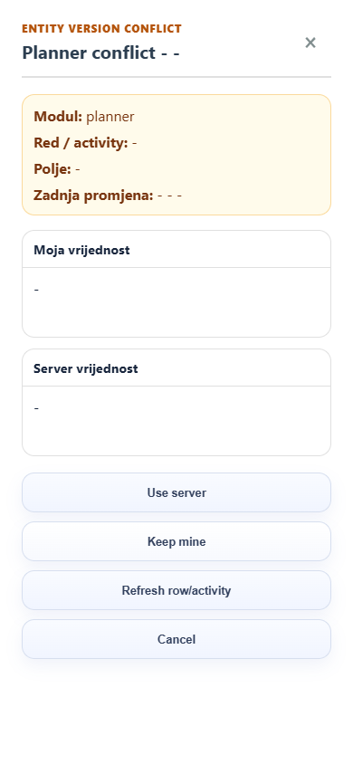

- Pregledano: Entity conflict UI scoped to row/field
- Estetika/UX: nema vidljivog overflowa ili JS greske u automatskom guardu.
- Responsive guard: horizontal overflow NO, buttons 17.
- JS errors: none.

### PASS - mobile-390x844 - tidplan - normal

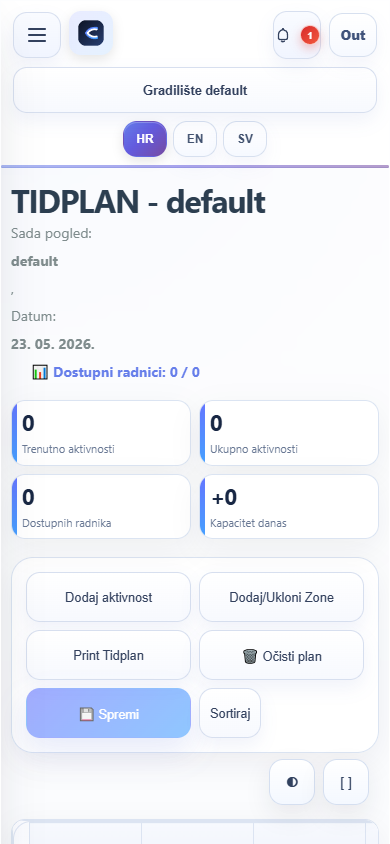

- Pregledano: Tidplan activity patch surface
- Estetika/UX: nema vidljivog overflowa ili JS greske u automatskom guardu.
- Responsive guard: horizontal overflow NO, buttons 15.
- JS errors: none.

### PASS - mobile-390x844 - tidplan - fullscreen-gantt

- Pregledano: Fullscreen Gantt after recent fixes
- Estetika/UX: nema vidljivog overflowa ili JS greske u automatskom guardu.
- Responsive guard: horizontal overflow NO, buttons 16.
- JS errors: none.

### PASS - mobile-390x844 - notifications - site-notifications

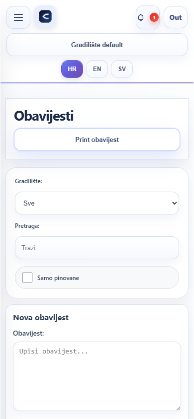

- Pregledano: Site notifications module remains separate from account notifications
- Estetika/UX: nema vidljivog overflowa ili JS greske u automatskom guardu.
- Responsive guard: horizontal overflow NO, buttons 8.
- JS errors: none.

### PASS - mobile-390x844 - notifications - account-panel

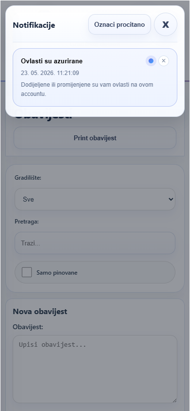

- Pregledano: Account notifications panel/badge responsive surface
- Estetika/UX: nema vidljivog overflowa ili JS greske u automatskom guardu.
- Responsive guard: horizontal overflow NO, buttons 12.
- JS errors: none.

### PASS - mobile-430x932 - header-home-site-info - home

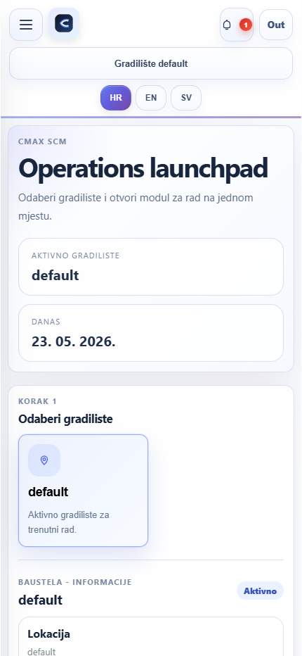

- Pregledano: Header, site metadata, map/navigation, dynamic contact/emergency cards
- Estetika/UX: nema vidljivog overflowa ili JS greske u automatskom guardu.
- Responsive guard: horizontal overflow NO, buttons 8.
- JS errors: none.

### PASS - mobile-430x932 - new-site-wizard - editable-site-details

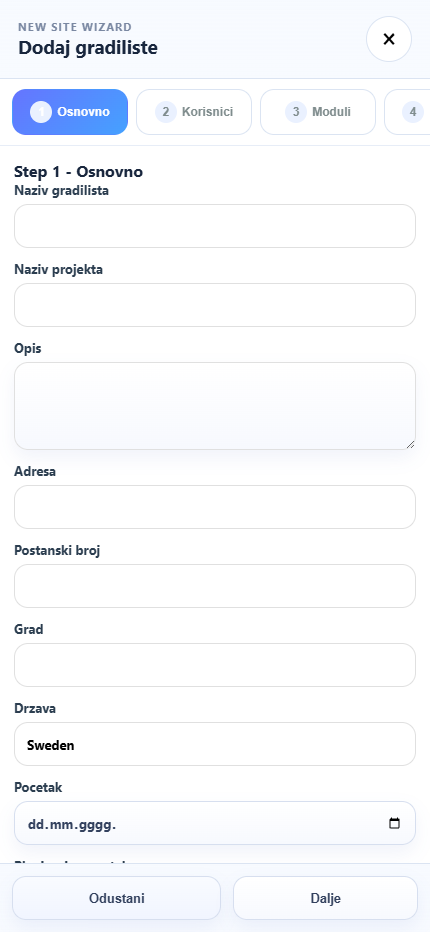

- Pregledano: Map picker plus editable contact/work/rule/logistics/emergency sections
- Estetika/UX: nema vidljivog overflowa ili JS greske u automatskom guardu.
- Responsive guard: horizontal overflow NO, buttons 15.
- JS errors: none.

### PASS - mobile-430x932 - new-site-wizard - editable-dynamic-sections

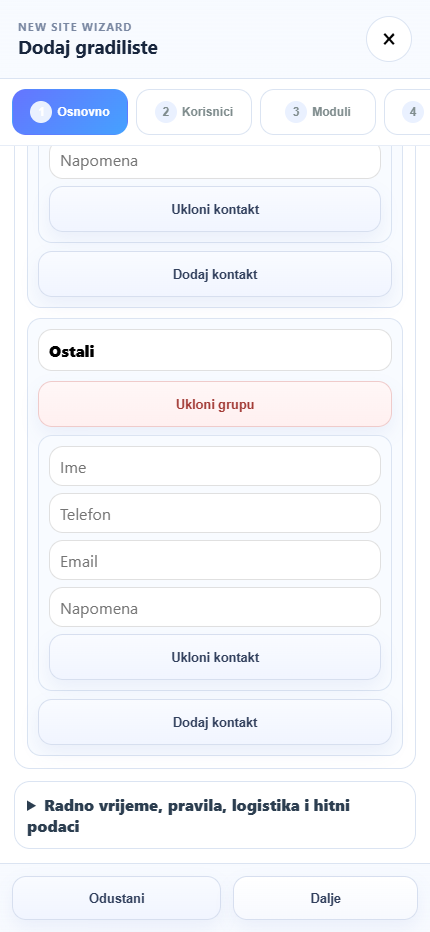

- Pregledano: Editable contact groups, work hours, safety rules, logistics and emergency rows
- Estetika/UX: nema vidljivog overflowa ili JS greske u automatskom guardu.
- Responsive guard: horizontal overflow NO, buttons 21.
- JS errors: none.

### PASS - mobile-430x932 - admin-user-wizard - create-user-stepper

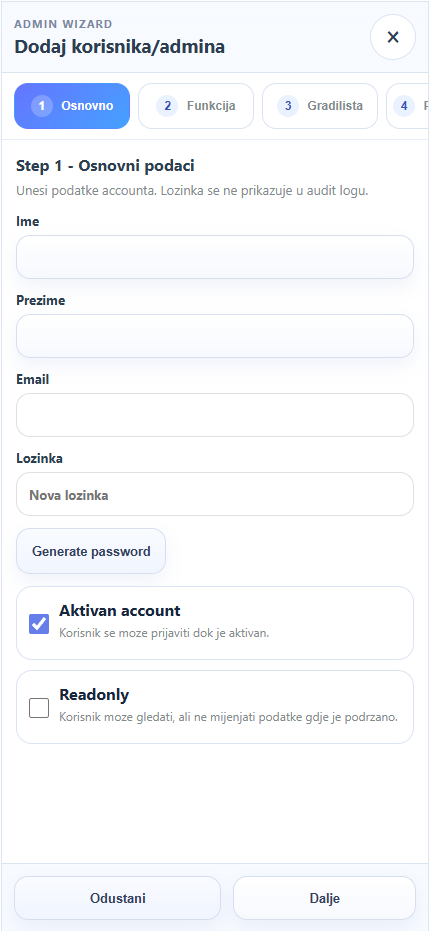

- Pregledano: Admin user wizard stepper, permissions and safe modal spacing
- Estetika/UX: nema vidljivog overflowa ili JS greske u automatskom guardu.
- Responsive guard: horizontal overflow NO, buttons 32.
- JS errors: none.

### PASS - mobile-430x932 - backup-restore-wizard - select-or-empty

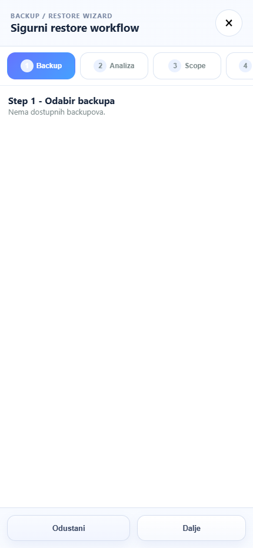

- Pregledano: Backup wizard card workflow/dry-run safety shell
- Estetika/UX: nema vidljivog overflowa ili JS greske u automatskom guardu.
- Responsive guard: horizontal overflow NO, buttons 15.
- JS errors: none.

### PASS - mobile-430x932 - store - manager-editor

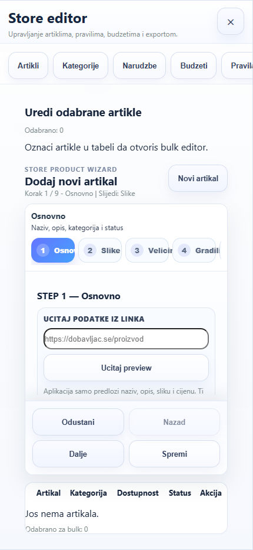

- Pregledano: Store editor overlay, product table, wizard progress, product cards
- Estetika/UX: nema vidljivog overflowa ili JS greske u automatskom guardu.
- Responsive guard: horizontal overflow NO, buttons 31.
- JS errors: none.

### PASS - mobile-430x932 - store - cart-overlay

- Pregledano: Cart overlay stays readable and within viewport
- Estetika/UX: nema vidljivog overflowa ili JS greske u automatskom guardu.
- Responsive guard: horizontal overflow NO, buttons 16.
- JS errors: none.

### PASS - mobile-430x932 - store - orders-panel

- Pregledano: My orders panel separated from catalog
- Estetika/UX: nema vidljivog overflowa ili JS greske u automatskom guardu.
- Responsive guard: horizontal overflow NO, buttons 14.
- JS errors: none.

### PASS - mobile-430x932 - site-chat - list-thread

- Pregledano: Site chat list/thread responsive shell and account-notification separation surface
- Estetika/UX: nema vidljivog overflowa ili JS greske u automatskom guardu.
- Responsive guard: horizontal overflow NO, buttons 8.
- JS errors: none.

### PASS - mobile-430x932 - planner - row-save-surface

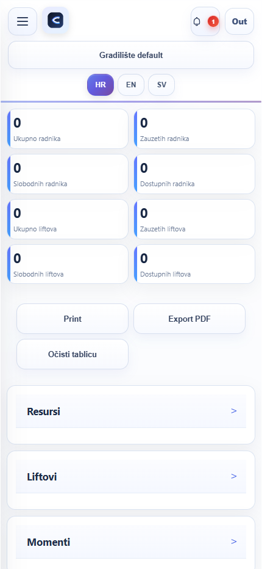

- Pregledano: Planner surface after row-level save/conflict work
- Estetika/UX: nema vidljivog overflowa ili JS greske u automatskom guardu.
- Responsive guard: horizontal overflow NO, buttons 12.
- JS errors: none.

### PASS - mobile-430x932 - planner - entity-conflict-ui

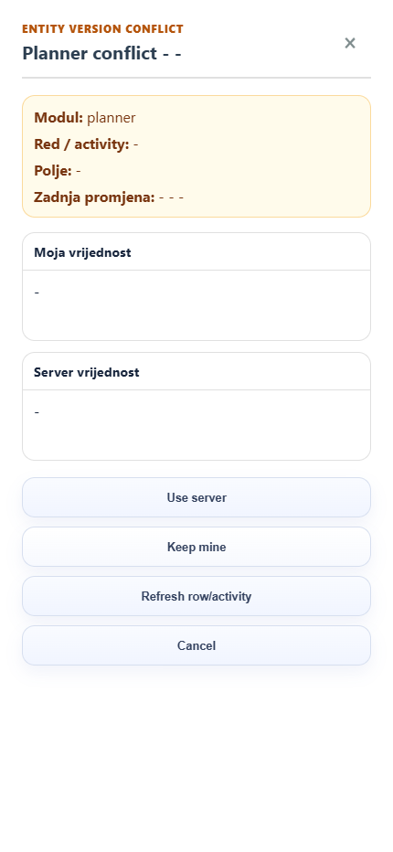

- Pregledano: Entity conflict UI scoped to row/field
- Estetika/UX: nema vidljivog overflowa ili JS greske u automatskom guardu.
- Responsive guard: horizontal overflow NO, buttons 17.
- JS errors: none.

### PASS - mobile-430x932 - tidplan - normal

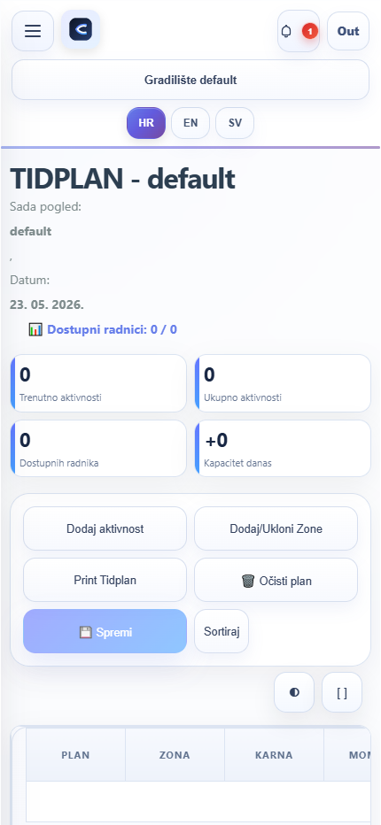

- Pregledano: Tidplan activity patch surface
- Estetika/UX: nema vidljivog overflowa ili JS greske u automatskom guardu.
- Responsive guard: horizontal overflow NO, buttons 15.
- JS errors: none.

### PASS - mobile-430x932 - tidplan - fullscreen-gantt

- Pregledano: Fullscreen Gantt after recent fixes
- Estetika/UX: nema vidljivog overflowa ili JS greske u automatskom guardu.
- Responsive guard: horizontal overflow NO, buttons 16.
- JS errors: none.

### PASS - mobile-430x932 - notifications - site-notifications

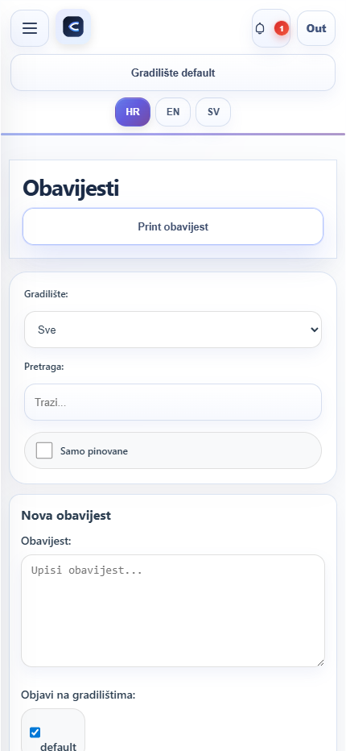

- Pregledano: Site notifications module remains separate from account notifications
- Estetika/UX: nema vidljivog overflowa ili JS greske u automatskom guardu.
- Responsive guard: horizontal overflow NO, buttons 8.
- JS errors: none.

### PASS - mobile-430x932 - notifications - account-panel

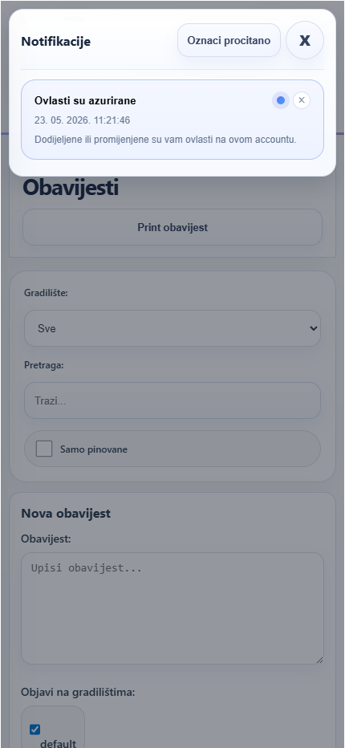

- Pregledano: Account notifications panel/badge responsive surface
- Estetika/UX: nema vidljivog overflowa ili JS greske u automatskom guardu.
- Responsive guard: horizontal overflow NO, buttons 12.
- JS errors: none.
