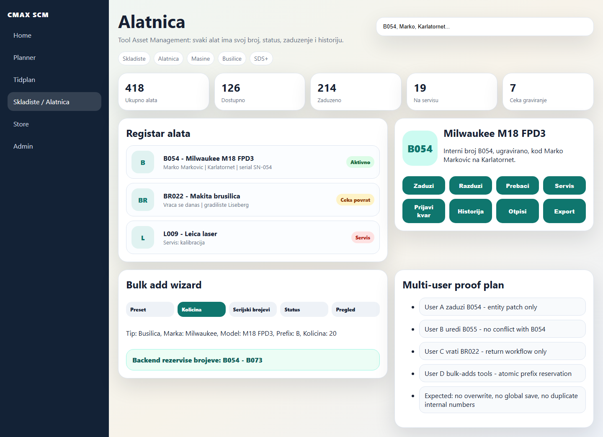
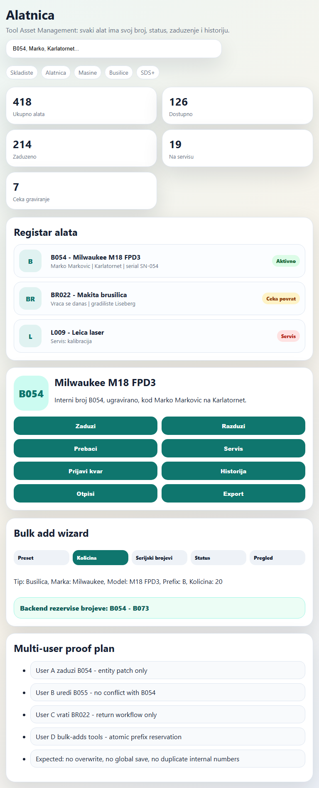
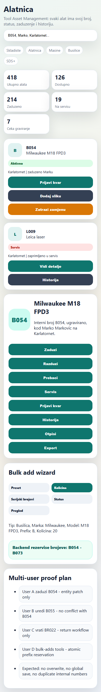
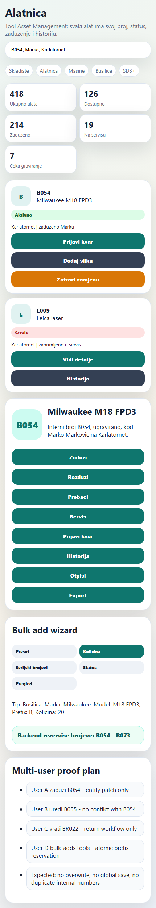

# Toolroom Architecture Proof

This is a static architecture/mock proof. It is not production UI implementation.

## GOOD - desktop-1440



```json
{
  "horizontalOverflow": false,
  "quickActions": 8,
  "mobileCards": 2,
  "breadcrumbItems": 5
}
```

## GOOD - tablet-768



```json
{
  "horizontalOverflow": false,
  "quickActions": 8,
  "mobileCards": 2,
  "breadcrumbItems": 5
}
```

## GOOD - mobile-390



```json
{
  "horizontalOverflow": false,
  "quickActions": 8,
  "mobileCards": 2,
  "breadcrumbItems": 5
}
```

## GOOD - mobile-430



```json
{
  "horizontalOverflow": false,
  "quickActions": 8,
  "mobileCards": 2,
  "breadcrumbItems": 5
}
```
