# Toolroom Full Real-world Proof

Run: toolroom-full-proof-1779729825732

Coverage: dashboard, Alati, Preseti, Moji alati, assign, return, transfer, fault, service, replacement, history, notifications, permission denied, backup/restore result.

## GOOD - desktop-1440 - dashboard

Dashboard with registry, assignments, faults and service counts.

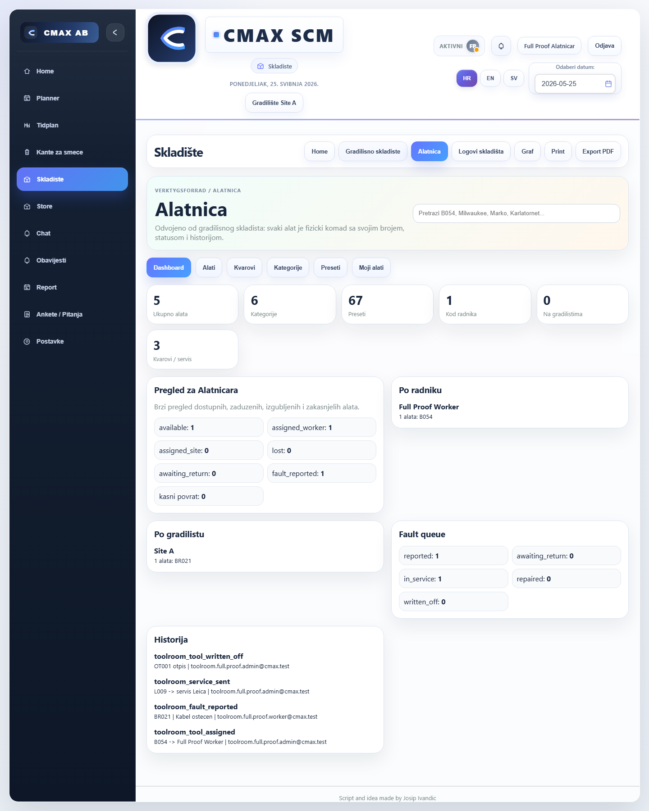

```json
{
  "horizontalOverflow": false,
  "toolroomVisible": true,
  "cards": 5,
  "actionPanel": 0,
  "faultCards": 0,
  "myCards": 0,
  "accountBadge": "0"
}
```

## GOOD - desktop-1440 - alati

Tool registry with multiple statuses.

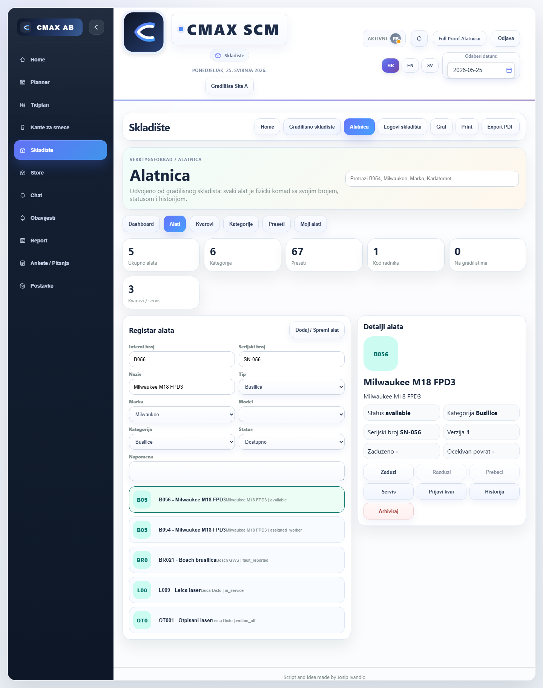

```json
{
  "horizontalOverflow": false,
  "toolroomVisible": true,
  "cards": 2,
  "actionPanel": 0,
  "faultCards": 0,
  "myCards": 0,
  "accountBadge": "0"
}
```

## GOOD - desktop-1440 - preseti

Editable presets panel.

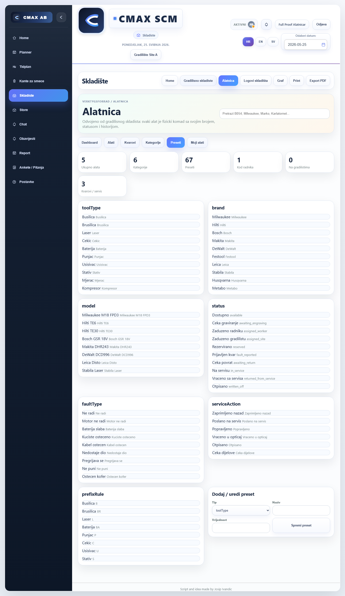

```json
{
  "horizontalOverflow": false,
  "toolroomVisible": true,
  "cards": 8,
  "actionPanel": 0,
  "faultCards": 0,
  "myCards": 0,
  "accountBadge": "0"
}
```

## GOOD - desktop-1440 - assign-flow

Assign flow.

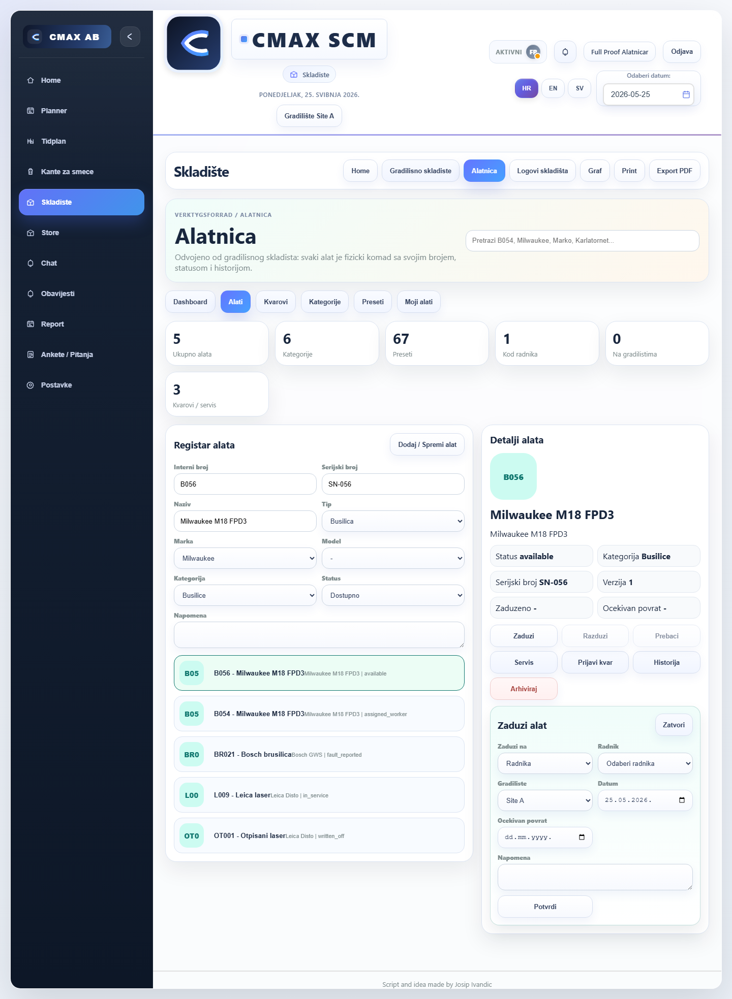

```json
{
  "horizontalOverflow": false,
  "toolroomVisible": true,
  "cards": 2,
  "actionPanel": 1,
  "faultCards": 0,
  "myCards": 0,
  "accountBadge": "0"
}
```

## GOOD - desktop-1440 - return-flow

Return flow.

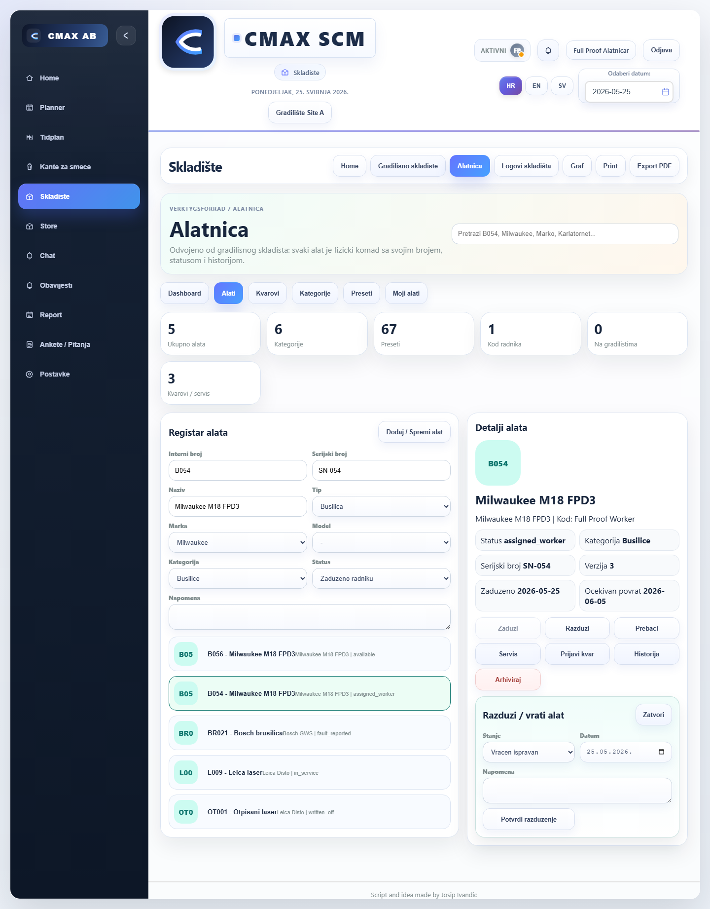

```json
{
  "horizontalOverflow": false,
  "toolroomVisible": true,
  "cards": 2,
  "actionPanel": 1,
  "faultCards": 0,
  "myCards": 0,
  "accountBadge": "0"
}
```

## GOOD - desktop-1440 - transfer-flow

Transfer flow.

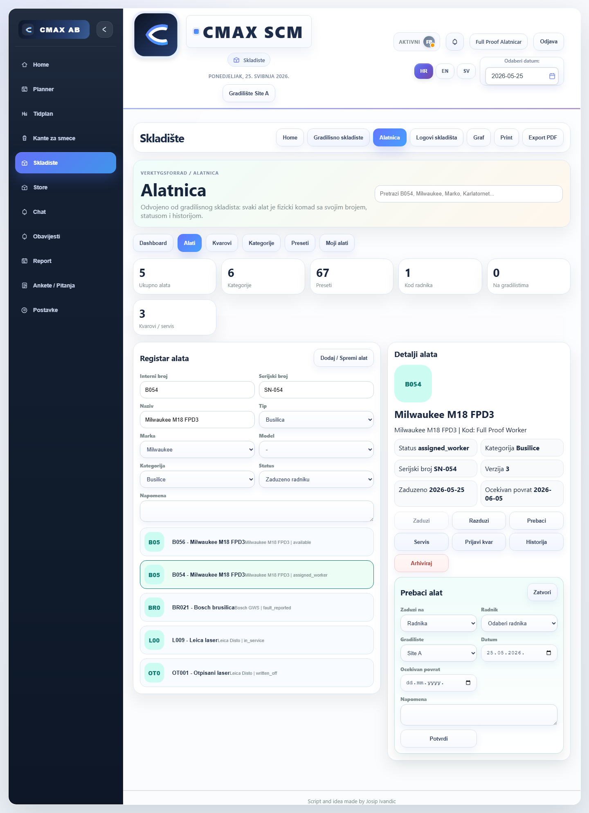

```json
{
  "horizontalOverflow": false,
  "toolroomVisible": true,
  "cards": 2,
  "actionPanel": 1,
  "faultCards": 0,
  "myCards": 0,
  "accountBadge": "0"
}
```

## GOOD - desktop-1440 - fault-service-replacement

Fault queue with service and replacement request.

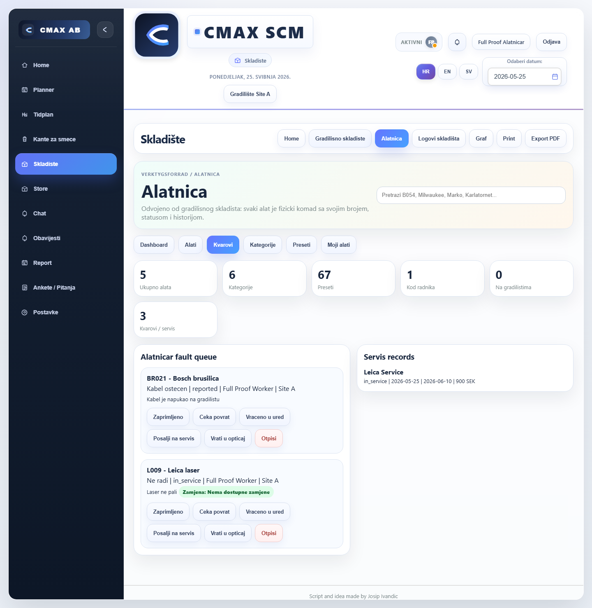

```json
{
  "horizontalOverflow": false,
  "toolroomVisible": true,
  "cards": 2,
  "actionPanel": 0,
  "faultCards": 2,
  "myCards": 0,
  "accountBadge": "0"
}
```

## GOOD - desktop-1440 - service-flow

Service form.

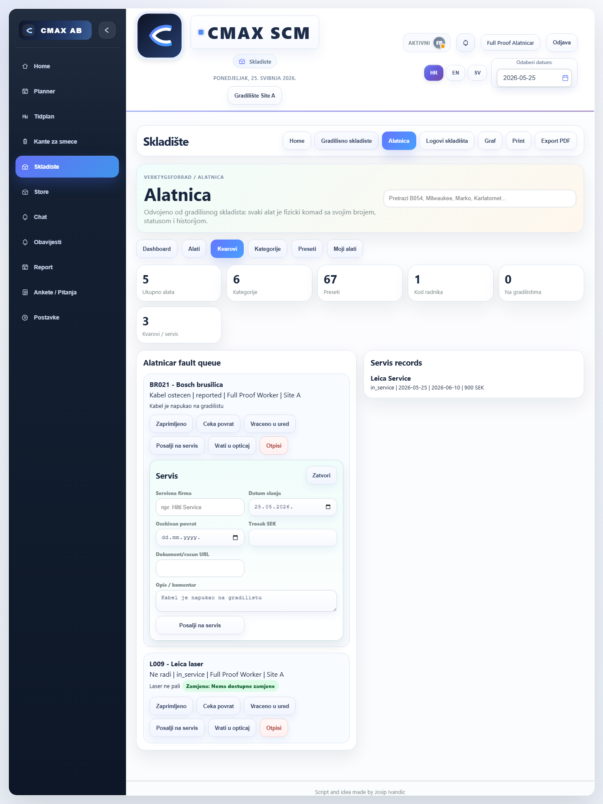

```json
{
  "horizontalOverflow": false,
  "toolroomVisible": true,
  "cards": 2,
  "actionPanel": 1,
  "faultCards": 2,
  "myCards": 0,
  "accountBadge": "0"
}
```

## GOOD - desktop-1440 - history

History panel.

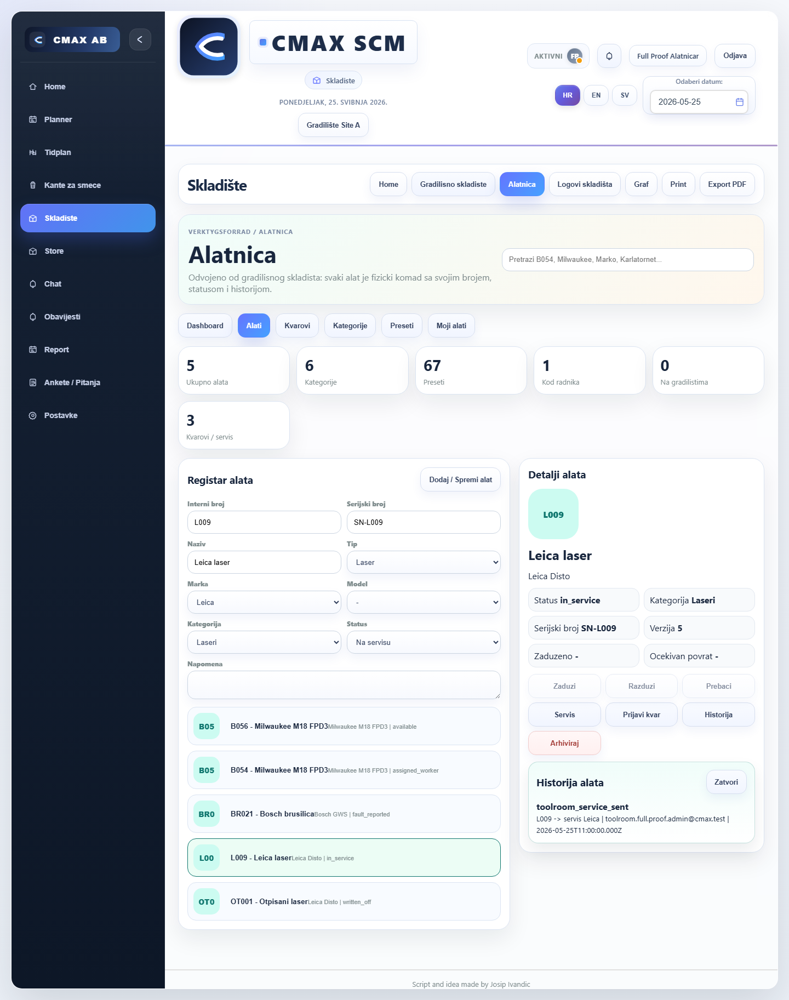

```json
{
  "horizontalOverflow": false,
  "toolroomVisible": true,
  "cards": 2,
  "actionPanel": 1,
  "faultCards": 0,
  "myCards": 0,
  "accountBadge": "0"
}
```

## GOOD - desktop-1440 - backup-restore-result

Backup/restore result proof card.

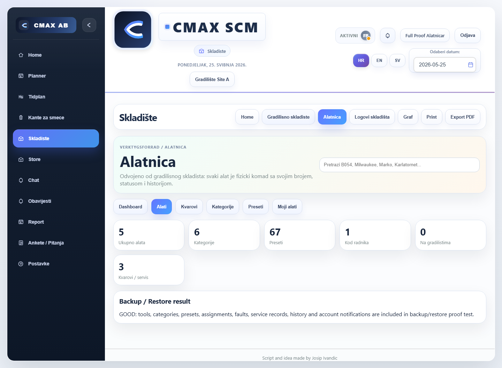

```json
{
  "horizontalOverflow": false,
  "toolroomVisible": true,
  "cards": 1,
  "actionPanel": 0,
  "faultCards": 0,
  "myCards": 0,
  "accountBadge": "0"
}
```

## GOOD - desktop-1440 - moji-alati

Worker My Tools cards.

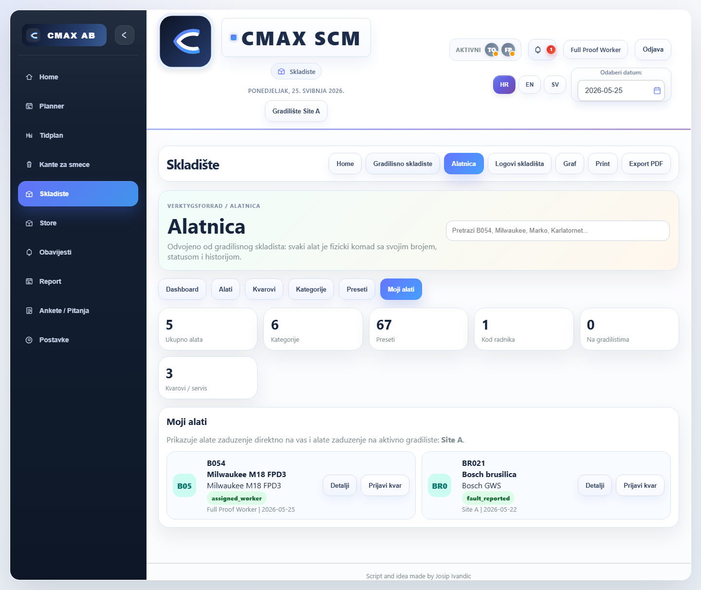

```json
{
  "horizontalOverflow": false,
  "toolroomVisible": true,
  "cards": 1,
  "actionPanel": 0,
  "faultCards": 0,
  "myCards": 2,
  "accountBadge": "1"
}
```

## GOOD - desktop-1440 - fault-report

Worker fault report form.

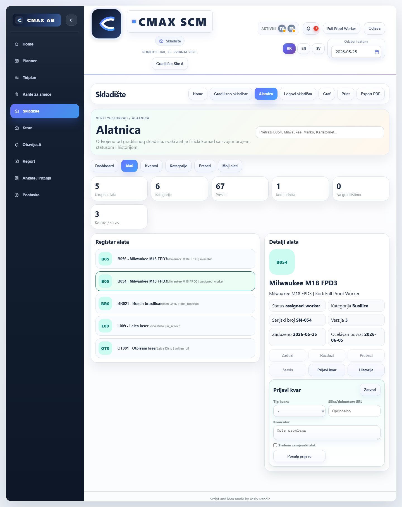

```json
{
  "horizontalOverflow": false,
  "toolroomVisible": true,
  "cards": 2,
  "actionPanel": 1,
  "faultCards": 0,
  "myCards": 0,
  "accountBadge": "1"
}
```

## GOOD - desktop-1440 - permission-denied

Worker cannot access service/writeoff controls.

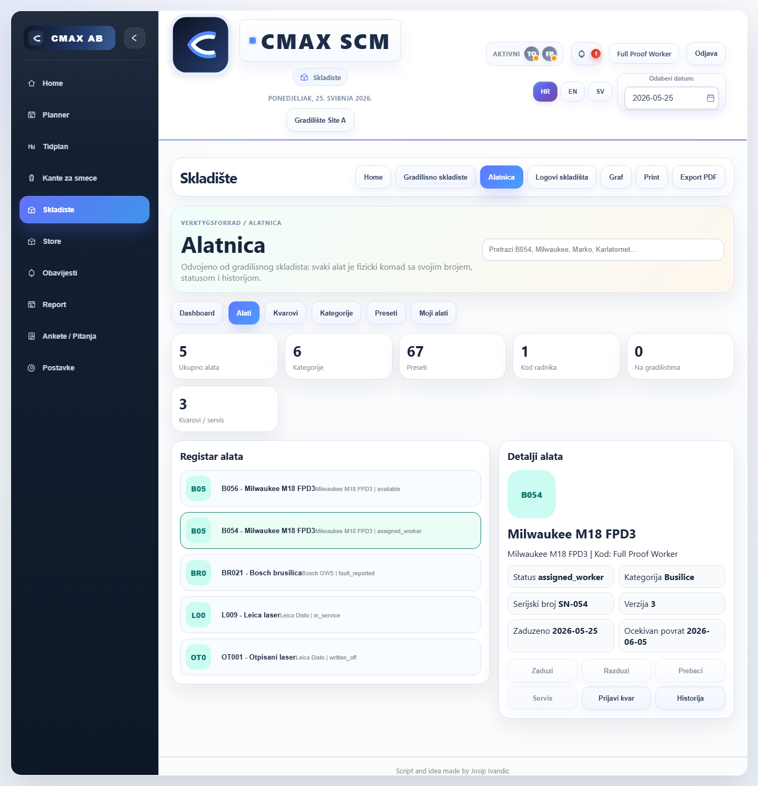

```json
{
  "horizontalOverflow": false,
  "toolroomVisible": true,
  "cards": 2,
  "actionPanel": 0,
  "faultCards": 0,
  "myCards": 0,
  "accountBadge": "1"
}
```

## GOOD - desktop-1440 - notifications

Account notification badge for Toolroom notification.


```json
{
  "horizontalOverflow": false,
  "toolroomVisible": true,
  "cards": 2,
  "actionPanel": 0,
  "faultCards": 0,
  "myCards": 0,
  "accountBadge": "1"
}
```

## GOOD - tablet-768 - dashboard

Dashboard with registry, assignments, faults and service counts.

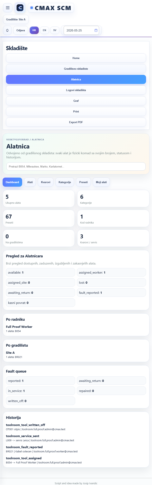

```json
{
  "horizontalOverflow": false,
  "toolroomVisible": true,
  "cards": 5,
  "actionPanel": 0,
  "faultCards": 0,
  "myCards": 0,
  "accountBadge": "0"
}
```

## GOOD - tablet-768 - alati

Tool registry with multiple statuses.

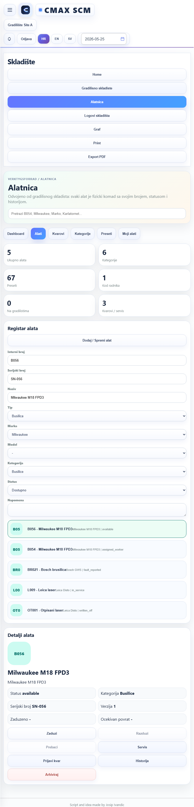

```json
{
  "horizontalOverflow": false,
  "toolroomVisible": true,
  "cards": 2,
  "actionPanel": 0,
  "faultCards": 0,
  "myCards": 0,
  "accountBadge": "0"
}
```

## GOOD - tablet-768 - preseti

Editable presets panel.

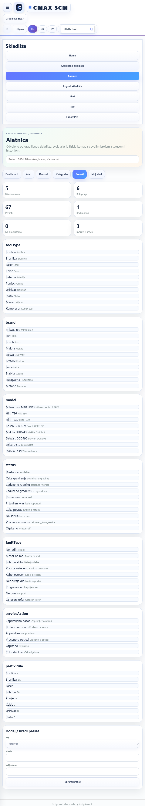

```json
{
  "horizontalOverflow": false,
  "toolroomVisible": true,
  "cards": 8,
  "actionPanel": 0,
  "faultCards": 0,
  "myCards": 0,
  "accountBadge": "0"
}
```

## GOOD - tablet-768 - assign-flow

Assign flow.

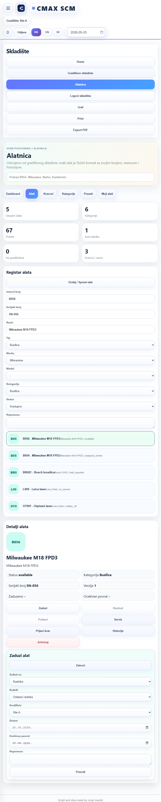

```json
{
  "horizontalOverflow": false,
  "toolroomVisible": true,
  "cards": 2,
  "actionPanel": 1,
  "faultCards": 0,
  "myCards": 0,
  "accountBadge": "0"
}
```

## GOOD - tablet-768 - return-flow

Return flow.

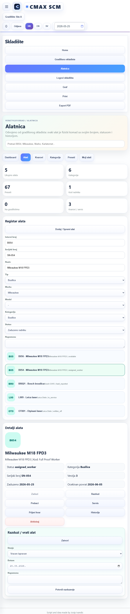

```json
{
  "horizontalOverflow": false,
  "toolroomVisible": true,
  "cards": 2,
  "actionPanel": 1,
  "faultCards": 0,
  "myCards": 0,
  "accountBadge": "0"
}
```

## GOOD - tablet-768 - transfer-flow

Transfer flow.

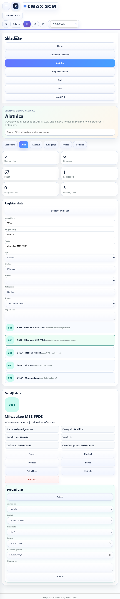

```json
{
  "horizontalOverflow": false,
  "toolroomVisible": true,
  "cards": 2,
  "actionPanel": 1,
  "faultCards": 0,
  "myCards": 0,
  "accountBadge": "0"
}
```

## GOOD - tablet-768 - fault-service-replacement

Fault queue with service and replacement request.

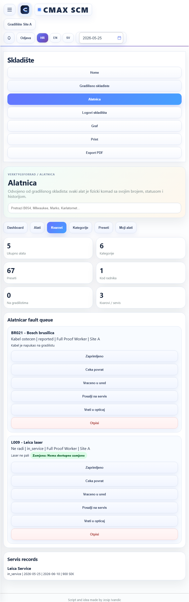

```json
{
  "horizontalOverflow": false,
  "toolroomVisible": true,
  "cards": 2,
  "actionPanel": 0,
  "faultCards": 2,
  "myCards": 0,
  "accountBadge": "0"
}
```

## GOOD - tablet-768 - service-flow

Service form.

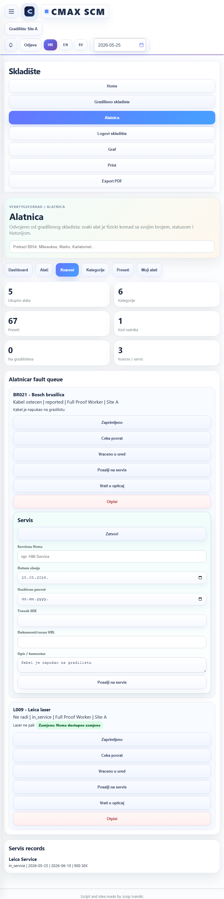

```json
{
  "horizontalOverflow": false,
  "toolroomVisible": true,
  "cards": 2,
  "actionPanel": 1,
  "faultCards": 2,
  "myCards": 0,
  "accountBadge": "0"
}
```

## GOOD - tablet-768 - history

History panel.

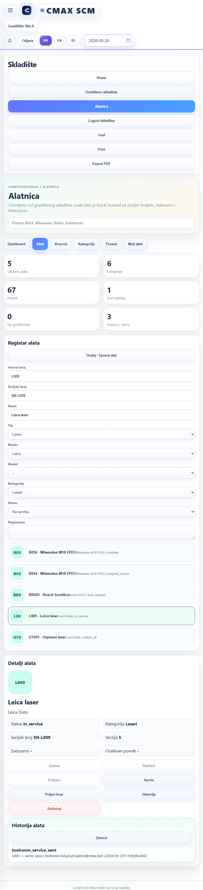

```json
{
  "horizontalOverflow": false,
  "toolroomVisible": true,
  "cards": 2,
  "actionPanel": 1,
  "faultCards": 0,
  "myCards": 0,
  "accountBadge": "0"
}
```

## GOOD - tablet-768 - backup-restore-result

Backup/restore result proof card.

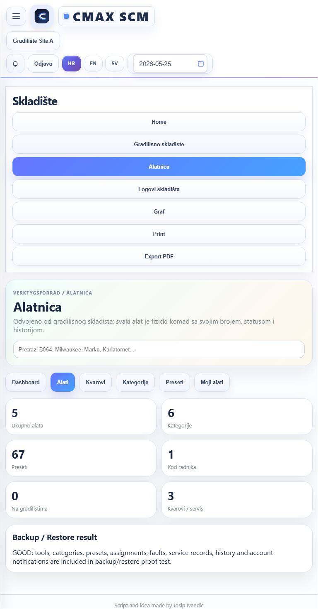

```json
{
  "horizontalOverflow": false,
  "toolroomVisible": true,
  "cards": 1,
  "actionPanel": 0,
  "faultCards": 0,
  "myCards": 0,
  "accountBadge": "0"
}
```

## GOOD - tablet-768 - moji-alati

Worker My Tools cards.

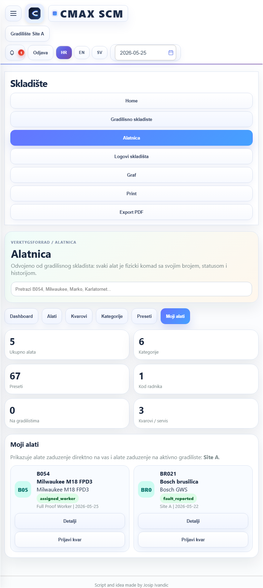

```json
{
  "horizontalOverflow": false,
  "toolroomVisible": true,
  "cards": 1,
  "actionPanel": 0,
  "faultCards": 0,
  "myCards": 2,
  "accountBadge": "1"
}
```

## GOOD - tablet-768 - fault-report

Worker fault report form.

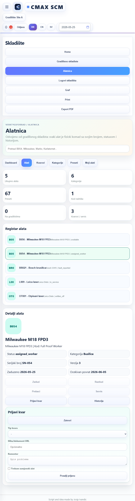

```json
{
  "horizontalOverflow": false,
  "toolroomVisible": true,
  "cards": 2,
  "actionPanel": 1,
  "faultCards": 0,
  "myCards": 0,
  "accountBadge": "1"
}
```

## GOOD - tablet-768 - permission-denied

Worker cannot access service/writeoff controls.


```json
{
  "horizontalOverflow": false,
  "toolroomVisible": true,
  "cards": 2,
  "actionPanel": 0,
  "faultCards": 0,
  "myCards": 0,
  "accountBadge": "1"
}
```

## GOOD - tablet-768 - notifications

Account notification badge for Toolroom notification.

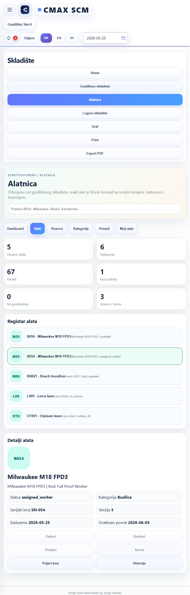

```json
{
  "horizontalOverflow": false,
  "toolroomVisible": true,
  "cards": 2,
  "actionPanel": 0,
  "faultCards": 0,
  "myCards": 0,
  "accountBadge": "1"
}
```

## GOOD - mobile-390 - dashboard

Dashboard with registry, assignments, faults and service counts.

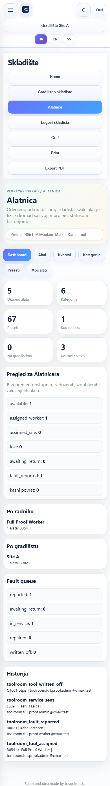

```json
{
  "horizontalOverflow": false,
  "toolroomVisible": true,
  "cards": 5,
  "actionPanel": 0,
  "faultCards": 0,
  "myCards": 0,
  "accountBadge": "0"
}
```

## GOOD - mobile-390 - alati

Tool registry with multiple statuses.

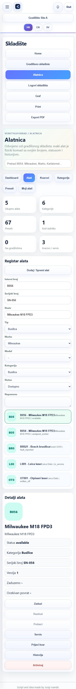

```json
{
  "horizontalOverflow": false,
  "toolroomVisible": true,
  "cards": 2,
  "actionPanel": 0,
  "faultCards": 0,
  "myCards": 0,
  "accountBadge": "0"
}
```

## GOOD - mobile-390 - preseti

Editable presets panel.

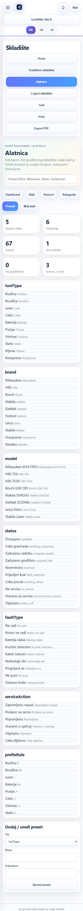

```json
{
  "horizontalOverflow": false,
  "toolroomVisible": true,
  "cards": 8,
  "actionPanel": 0,
  "faultCards": 0,
  "myCards": 0,
  "accountBadge": "0"
}
```

## GOOD - mobile-390 - assign-flow

Assign flow.

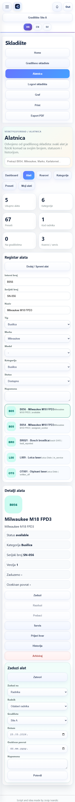

```json
{
  "horizontalOverflow": false,
  "toolroomVisible": true,
  "cards": 2,
  "actionPanel": 1,
  "faultCards": 0,
  "myCards": 0,
  "accountBadge": "0"
}
```

## GOOD - mobile-390 - return-flow

Return flow.

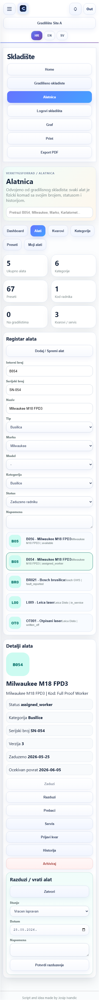

```json
{
  "horizontalOverflow": false,
  "toolroomVisible": true,
  "cards": 2,
  "actionPanel": 1,
  "faultCards": 0,
  "myCards": 0,
  "accountBadge": "0"
}
```

## GOOD - mobile-390 - transfer-flow

Transfer flow.

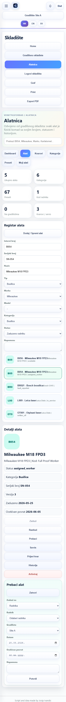

```json
{
  "horizontalOverflow": false,
  "toolroomVisible": true,
  "cards": 2,
  "actionPanel": 1,
  "faultCards": 0,
  "myCards": 0,
  "accountBadge": "0"
}
```

## GOOD - mobile-390 - fault-service-replacement

Fault queue with service and replacement request.

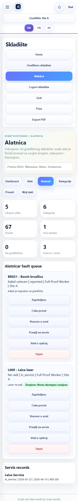

```json
{
  "horizontalOverflow": false,
  "toolroomVisible": true,
  "cards": 2,
  "actionPanel": 0,
  "faultCards": 2,
  "myCards": 0,
  "accountBadge": "0"
}
```

## GOOD - mobile-390 - service-flow

Service form.

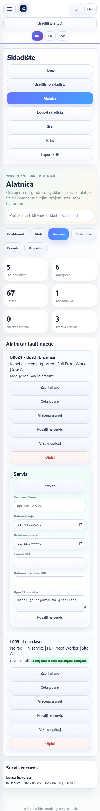

```json
{
  "horizontalOverflow": false,
  "toolroomVisible": true,
  "cards": 2,
  "actionPanel": 1,
  "faultCards": 2,
  "myCards": 0,
  "accountBadge": "0"
}
```

## GOOD - mobile-390 - history

History panel.

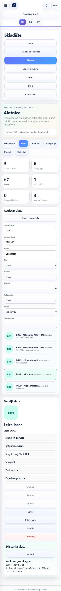

```json
{
  "horizontalOverflow": false,
  "toolroomVisible": true,
  "cards": 2,
  "actionPanel": 1,
  "faultCards": 0,
  "myCards": 0,
  "accountBadge": "0"
}
```

## GOOD - mobile-390 - backup-restore-result

Backup/restore result proof card.

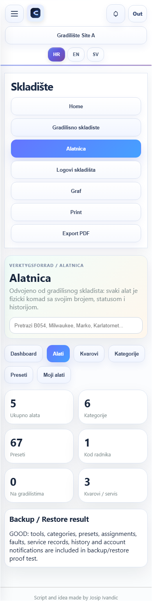

```json
{
  "horizontalOverflow": false,
  "toolroomVisible": true,
  "cards": 1,
  "actionPanel": 0,
  "faultCards": 0,
  "myCards": 0,
  "accountBadge": "0"
}
```

## GOOD - mobile-390 - moji-alati

Worker My Tools cards.

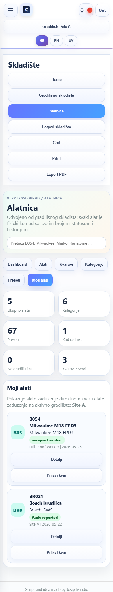

```json
{
  "horizontalOverflow": false,
  "toolroomVisible": true,
  "cards": 1,
  "actionPanel": 0,
  "faultCards": 0,
  "myCards": 2,
  "accountBadge": "1"
}
```

## GOOD - mobile-390 - fault-report

Worker fault report form.

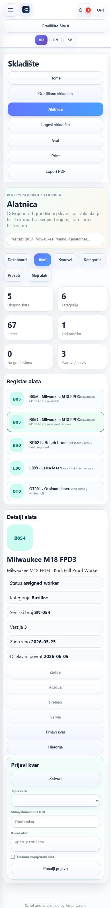

```json
{
  "horizontalOverflow": false,
  "toolroomVisible": true,
  "cards": 2,
  "actionPanel": 1,
  "faultCards": 0,
  "myCards": 0,
  "accountBadge": "1"
}
```

## GOOD - mobile-390 - permission-denied

Worker cannot access service/writeoff controls.


```json
{
  "horizontalOverflow": false,
  "toolroomVisible": true,
  "cards": 2,
  "actionPanel": 0,
  "faultCards": 0,
  "myCards": 0,
  "accountBadge": "1"
}
```

## GOOD - mobile-390 - notifications

Account notification badge for Toolroom notification.

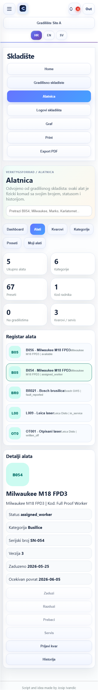

```json
{
  "horizontalOverflow": false,
  "toolroomVisible": true,
  "cards": 2,
  "actionPanel": 0,
  "faultCards": 0,
  "myCards": 0,
  "accountBadge": "1"
}
```

## GOOD - mobile-430 - dashboard

Dashboard with registry, assignments, faults and service counts.

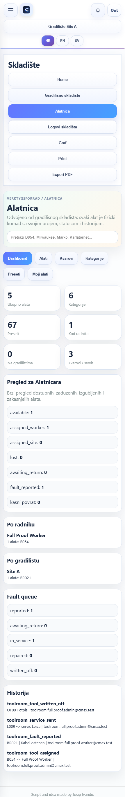

```json
{
  "horizontalOverflow": false,
  "toolroomVisible": true,
  "cards": 5,
  "actionPanel": 0,
  "faultCards": 0,
  "myCards": 0,
  "accountBadge": "0"
}
```

## GOOD - mobile-430 - alati

Tool registry with multiple statuses.

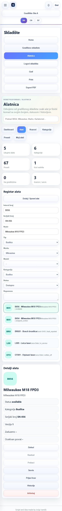

```json
{
  "horizontalOverflow": false,
  "toolroomVisible": true,
  "cards": 2,
  "actionPanel": 0,
  "faultCards": 0,
  "myCards": 0,
  "accountBadge": "0"
}
```

## GOOD - mobile-430 - preseti

Editable presets panel.

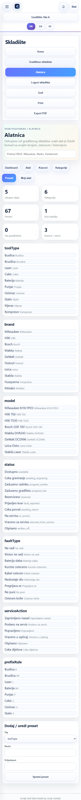

```json
{
  "horizontalOverflow": false,
  "toolroomVisible": true,
  "cards": 8,
  "actionPanel": 0,
  "faultCards": 0,
  "myCards": 0,
  "accountBadge": "0"
}
```

## GOOD - mobile-430 - assign-flow

Assign flow.

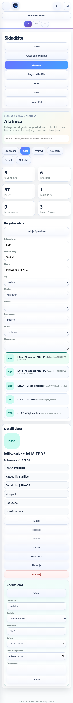

```json
{
  "horizontalOverflow": false,
  "toolroomVisible": true,
  "cards": 2,
  "actionPanel": 1,
  "faultCards": 0,
  "myCards": 0,
  "accountBadge": "0"
}
```

## GOOD - mobile-430 - return-flow

Return flow.

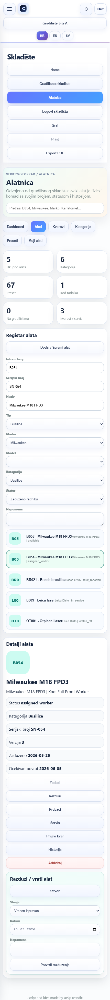

```json
{
  "horizontalOverflow": false,
  "toolroomVisible": true,
  "cards": 2,
  "actionPanel": 1,
  "faultCards": 0,
  "myCards": 0,
  "accountBadge": "0"
}
```

## GOOD - mobile-430 - transfer-flow

Transfer flow.

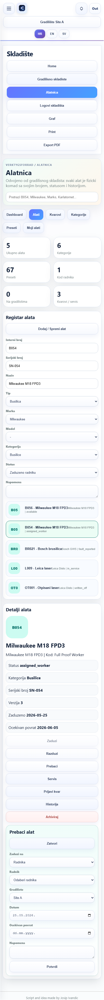

```json
{
  "horizontalOverflow": false,
  "toolroomVisible": true,
  "cards": 2,
  "actionPanel": 1,
  "faultCards": 0,
  "myCards": 0,
  "accountBadge": "0"
}
```

## GOOD - mobile-430 - fault-service-replacement

Fault queue with service and replacement request.

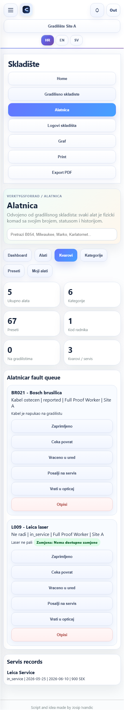

```json
{
  "horizontalOverflow": false,
  "toolroomVisible": true,
  "cards": 2,
  "actionPanel": 0,
  "faultCards": 2,
  "myCards": 0,
  "accountBadge": "0"
}
```

## GOOD - mobile-430 - service-flow

Service form.

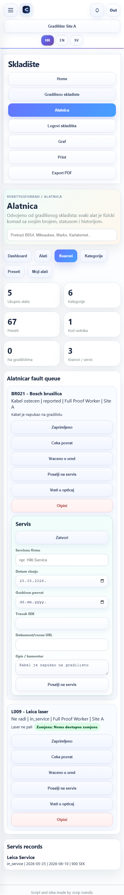

```json
{
  "horizontalOverflow": false,
  "toolroomVisible": true,
  "cards": 2,
  "actionPanel": 1,
  "faultCards": 2,
  "myCards": 0,
  "accountBadge": "0"
}
```

## GOOD - mobile-430 - history

History panel.

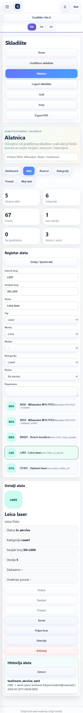

```json
{
  "horizontalOverflow": false,
  "toolroomVisible": true,
  "cards": 2,
  "actionPanel": 1,
  "faultCards": 0,
  "myCards": 0,
  "accountBadge": "0"
}
```

## GOOD - mobile-430 - backup-restore-result

Backup/restore result proof card.

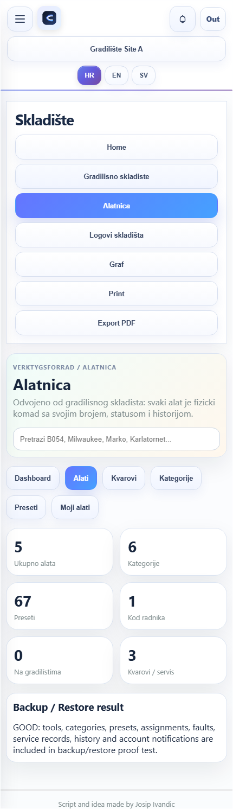

```json
{
  "horizontalOverflow": false,
  "toolroomVisible": true,
  "cards": 1,
  "actionPanel": 0,
  "faultCards": 0,
  "myCards": 0,
  "accountBadge": "0"
}
```

## GOOD - mobile-430 - moji-alati

Worker My Tools cards.

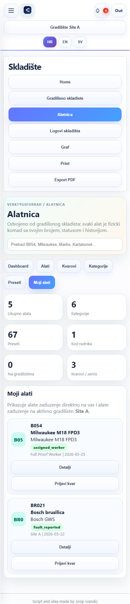

```json
{
  "horizontalOverflow": false,
  "toolroomVisible": true,
  "cards": 1,
  "actionPanel": 0,
  "faultCards": 0,
  "myCards": 2,
  "accountBadge": "1"
}
```

## GOOD - mobile-430 - fault-report

Worker fault report form.

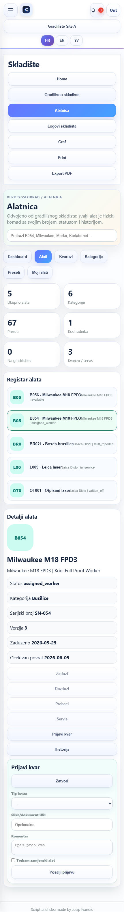

```json
{
  "horizontalOverflow": false,
  "toolroomVisible": true,
  "cards": 2,
  "actionPanel": 1,
  "faultCards": 0,
  "myCards": 0,
  "accountBadge": "1"
}
```

## GOOD - mobile-430 - permission-denied

Worker cannot access service/writeoff controls.

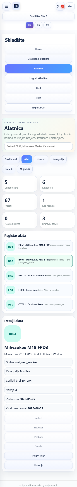

```json
{
  "horizontalOverflow": false,
  "toolroomVisible": true,
  "cards": 2,
  "actionPanel": 0,
  "faultCards": 0,
  "myCards": 0,
  "accountBadge": "1"
}
```

## GOOD - mobile-430 - notifications

Account notification badge for Toolroom notification.


```json
{
  "horizontalOverflow": false,
  "toolroomVisible": true,
  "cards": 2,
  "actionPanel": 0,
  "faultCards": 0,
  "myCards": 0,
  "accountBadge": "1"
}
```
