# Toolroom Phase 1 Proof

Run: toolroom-phase1-proof-1779575733578

## GOOD - desktop-1440 - dashboard

Dashboard skeleton and empty history.

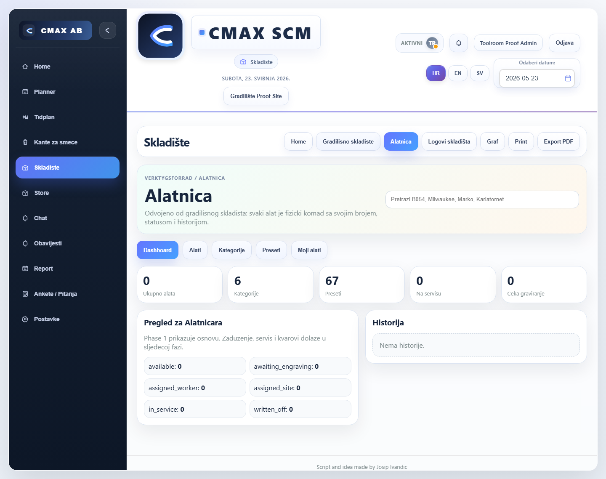

```json
{
  "horizontalOverflow": false,
  "toolroomVisible": true,
  "statCount": 5,
  "quickActions": 0,
  "emptyStates": 1
}
```

## GOOD - desktop-1440 - categories

Category tree and breadcrumb.

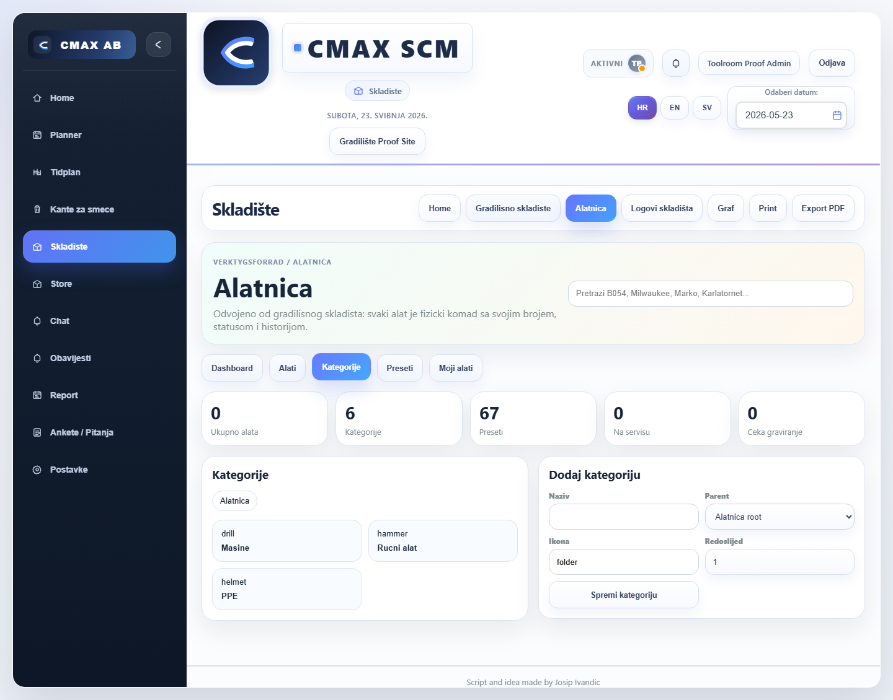

```json
{
  "horizontalOverflow": false,
  "toolroomVisible": true,
  "statCount": 5,
  "quickActions": 0,
  "emptyStates": 0
}
```

## GOOD - desktop-1440 - presets

Preset editor groups.

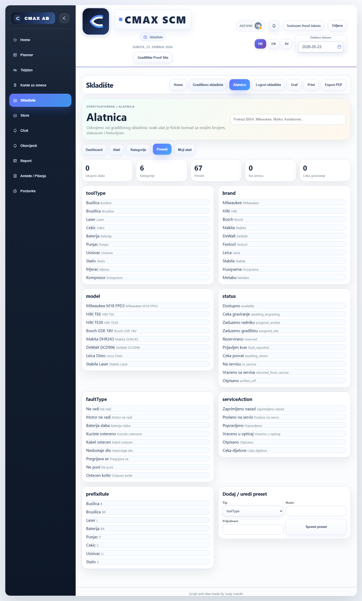

```json
{
  "horizontalOverflow": false,
  "toolroomVisible": true,
  "statCount": 5,
  "quickActions": 0,
  "emptyStates": 0
}
```

## GOOD - desktop-1440 - items-empty-add

Tool registry empty state and add form.

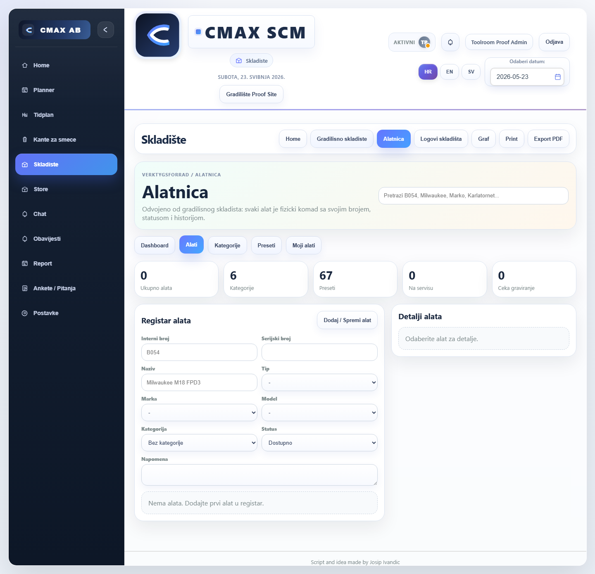

```json
{
  "horizontalOverflow": false,
  "toolroomVisible": true,
  "statCount": 5,
  "quickActions": 0,
  "emptyStates": 2
}
```

## GOOD - desktop-1440 - item-detail

Saved tool and detail view with Phase 1 quick action placeholders.

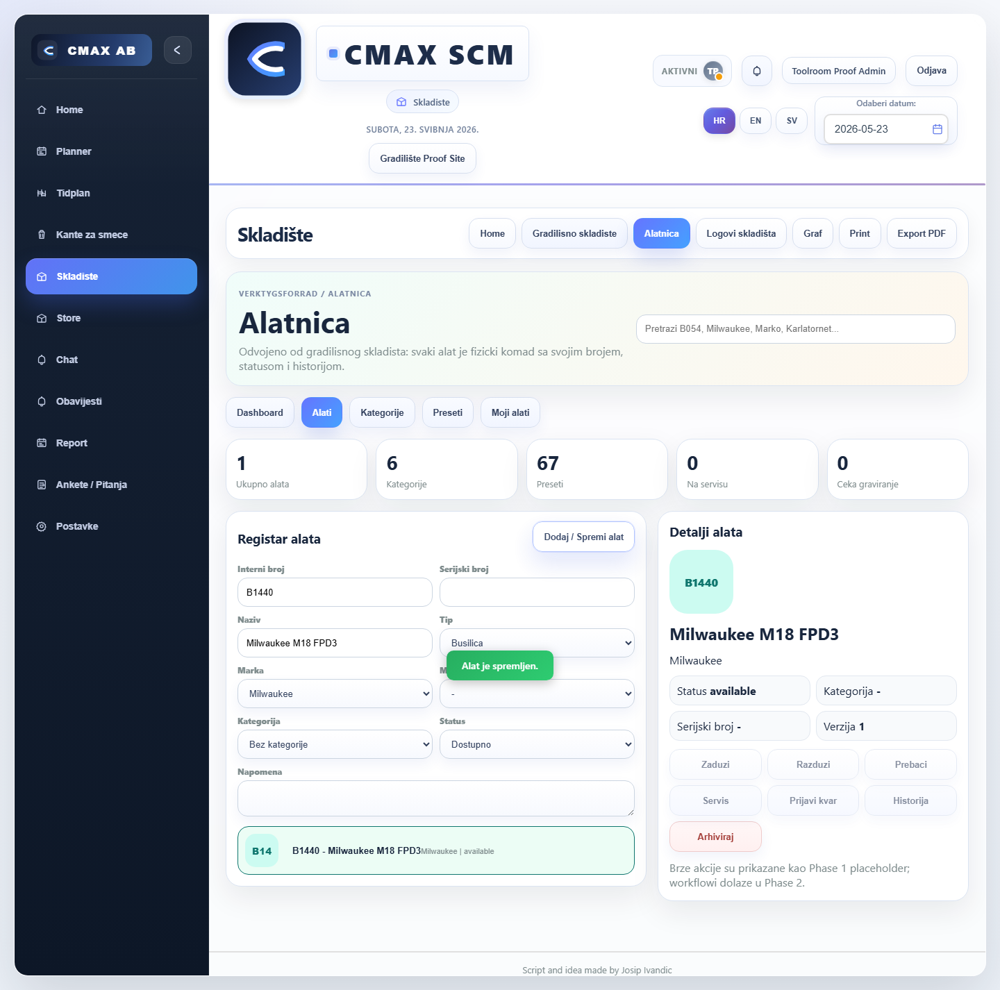

```json
{
  "horizontalOverflow": false,
  "toolroomVisible": true,
  "statCount": 5,
  "quickActions": 7,
  "emptyStates": 0
}
```

## GOOD - desktop-1440 - my-tools-empty

My Tools Phase 1 empty state.

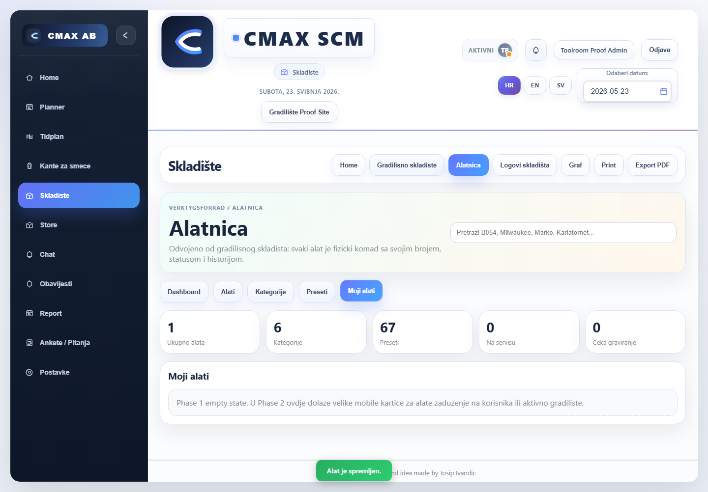

```json
{
  "horizontalOverflow": false,
  "toolroomVisible": true,
  "statCount": 5,
  "quickActions": 0,
  "emptyStates": 1
}
```

## GOOD - tablet-768 - dashboard

Dashboard skeleton and empty history.

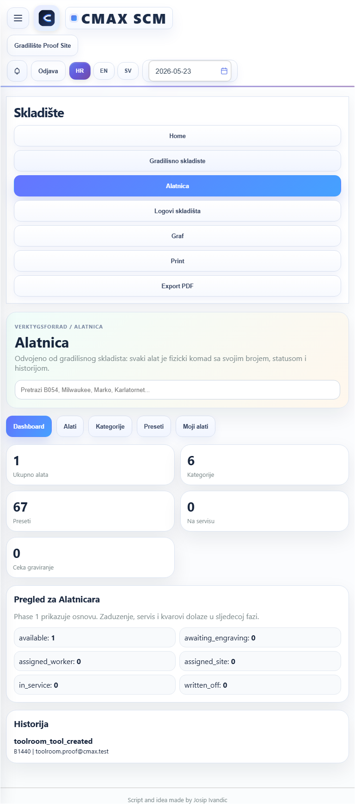

```json
{
  "horizontalOverflow": false,
  "toolroomVisible": true,
  "statCount": 5,
  "quickActions": 0,
  "emptyStates": 0
}
```

## GOOD - tablet-768 - categories

Category tree and breadcrumb.

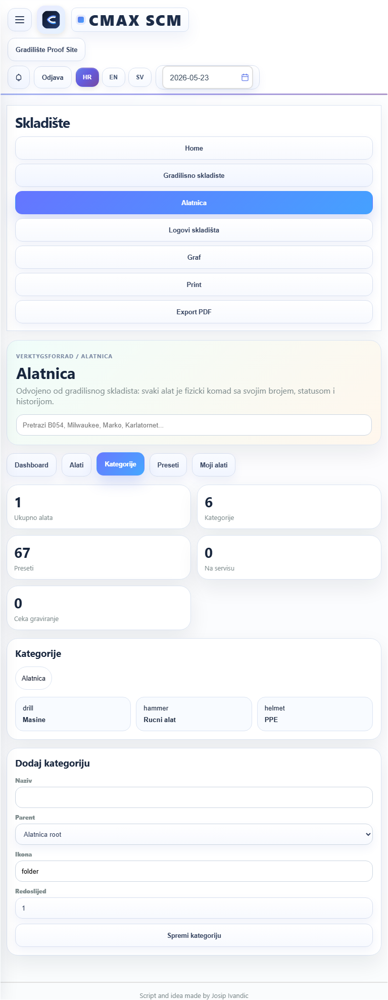

```json
{
  "horizontalOverflow": false,
  "toolroomVisible": true,
  "statCount": 5,
  "quickActions": 0,
  "emptyStates": 0
}
```

## GOOD - tablet-768 - presets

Preset editor groups.

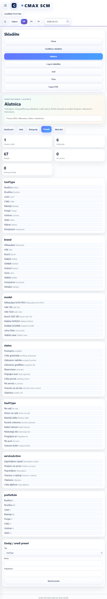

```json
{
  "horizontalOverflow": false,
  "toolroomVisible": true,
  "statCount": 5,
  "quickActions": 0,
  "emptyStates": 0
}
```

## GOOD - tablet-768 - items-empty-add

Tool registry empty state and add form.

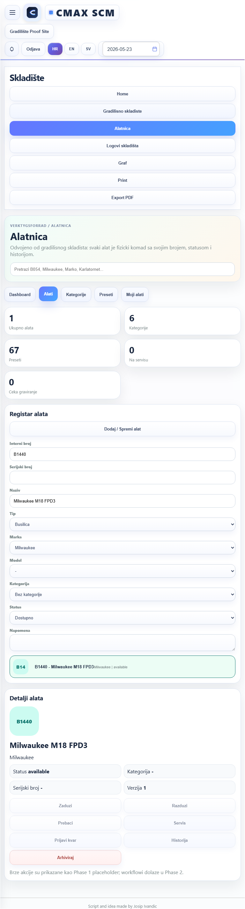

```json
{
  "horizontalOverflow": false,
  "toolroomVisible": true,
  "statCount": 5,
  "quickActions": 7,
  "emptyStates": 0
}
```

## GOOD - tablet-768 - item-detail

Saved tool and detail view with Phase 1 quick action placeholders.

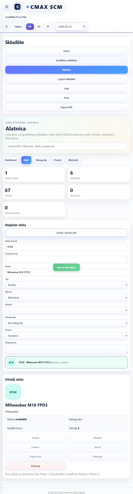

```json
{
  "horizontalOverflow": false,
  "toolroomVisible": true,
  "statCount": 5,
  "quickActions": 7,
  "emptyStates": 0
}
```

## GOOD - tablet-768 - my-tools-empty

My Tools Phase 1 empty state.

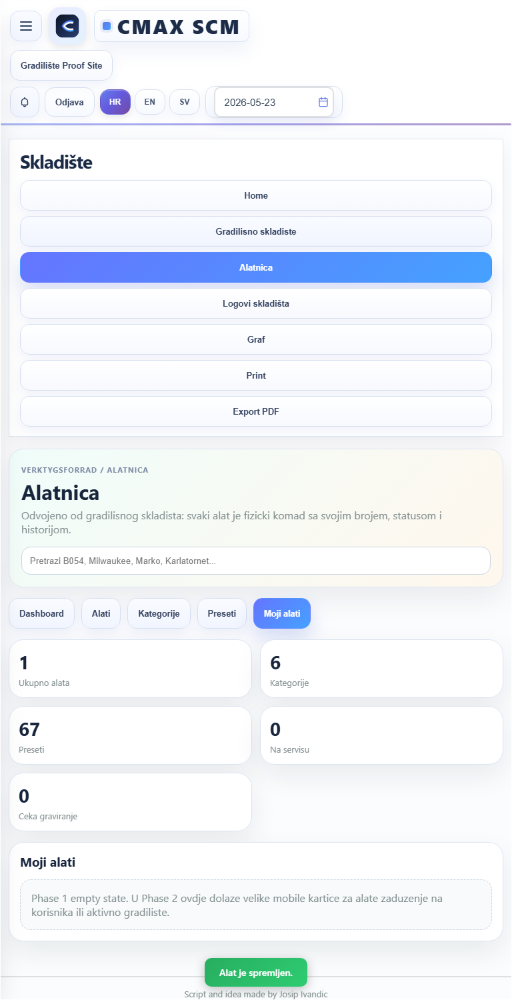

```json
{
  "horizontalOverflow": false,
  "toolroomVisible": true,
  "statCount": 5,
  "quickActions": 0,
  "emptyStates": 1
}
```

## GOOD - mobile-390 - dashboard

Dashboard skeleton and empty history.

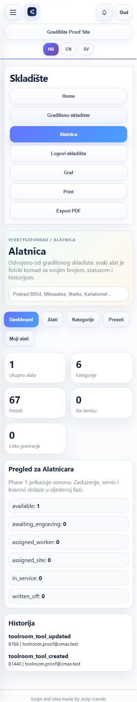

```json
{
  "horizontalOverflow": false,
  "toolroomVisible": true,
  "statCount": 5,
  "quickActions": 0,
  "emptyStates": 0
}
```

## GOOD - mobile-390 - categories

Category tree and breadcrumb.

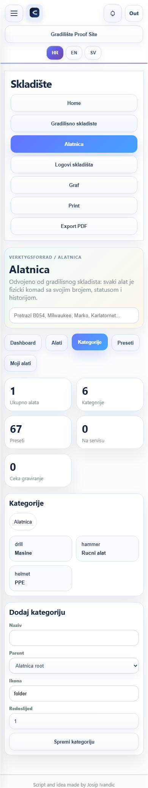

```json
{
  "horizontalOverflow": false,
  "toolroomVisible": true,
  "statCount": 5,
  "quickActions": 0,
  "emptyStates": 0
}
```

## GOOD - mobile-390 - presets

Preset editor groups.

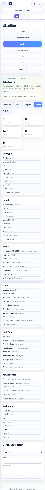

```json
{
  "horizontalOverflow": false,
  "toolroomVisible": true,
  "statCount": 5,
  "quickActions": 0,
  "emptyStates": 0
}
```

## GOOD - mobile-390 - items-empty-add

Tool registry empty state and add form.

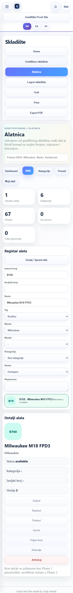

```json
{
  "horizontalOverflow": false,
  "toolroomVisible": true,
  "statCount": 5,
  "quickActions": 7,
  "emptyStates": 0
}
```

## GOOD - mobile-390 - item-detail

Saved tool and detail view with Phase 1 quick action placeholders.

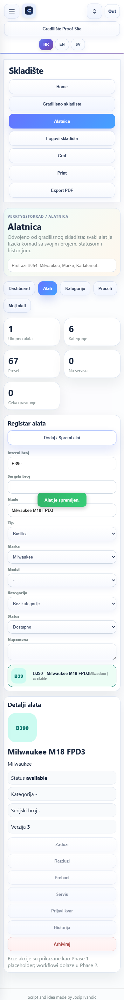

```json
{
  "horizontalOverflow": false,
  "toolroomVisible": true,
  "statCount": 5,
  "quickActions": 7,
  "emptyStates": 0
}
```

## GOOD - mobile-390 - my-tools-empty

My Tools Phase 1 empty state.

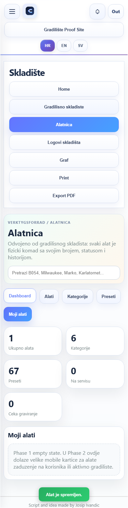

```json
{
  "horizontalOverflow": false,
  "toolroomVisible": true,
  "statCount": 5,
  "quickActions": 0,
  "emptyStates": 1
}
```

## GOOD - mobile-430 - dashboard

Dashboard skeleton and empty history.

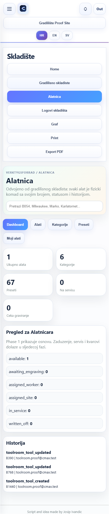

```json
{
  "horizontalOverflow": false,
  "toolroomVisible": true,
  "statCount": 5,
  "quickActions": 0,
  "emptyStates": 0
}
```

## GOOD - mobile-430 - categories

Category tree and breadcrumb.

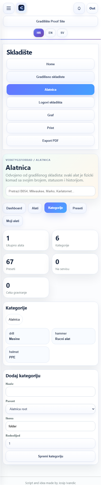

```json
{
  "horizontalOverflow": false,
  "toolroomVisible": true,
  "statCount": 5,
  "quickActions": 0,
  "emptyStates": 0
}
```

## GOOD - mobile-430 - presets

Preset editor groups.

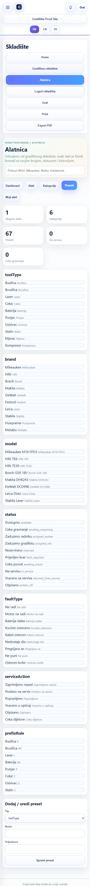

```json
{
  "horizontalOverflow": false,
  "toolroomVisible": true,
  "statCount": 5,
  "quickActions": 0,
  "emptyStates": 0
}
```

## GOOD - mobile-430 - items-empty-add

Tool registry empty state and add form.

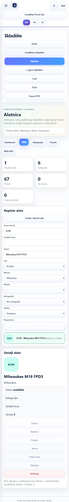

```json
{
  "horizontalOverflow": false,
  "toolroomVisible": true,
  "statCount": 5,
  "quickActions": 7,
  "emptyStates": 0
}
```

## GOOD - mobile-430 - item-detail

Saved tool and detail view with Phase 1 quick action placeholders.

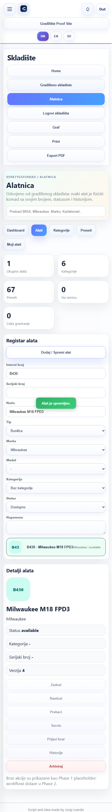

```json
{
  "horizontalOverflow": false,
  "toolroomVisible": true,
  "statCount": 5,
  "quickActions": 7,
  "emptyStates": 0
}
```

## GOOD - mobile-430 - my-tools-empty

My Tools Phase 1 empty state.

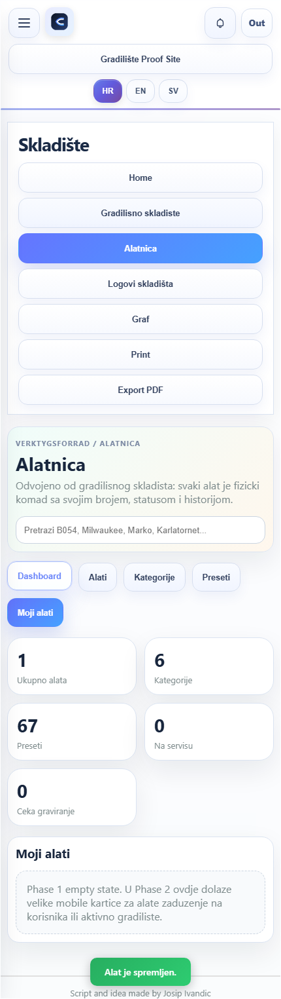

```json
{
  "horizontalOverflow": false,
  "toolroomVisible": true,
  "statCount": 5,
  "quickActions": 0,
  "emptyStates": 1
}
```
