# Toolroom Phase 2 Proof

Run: toolroom-phase2-proof-1779576775761

## GOOD - desktop-1440 - dashboard-worker-site

Dashboard with worker/site assignment summaries and history.

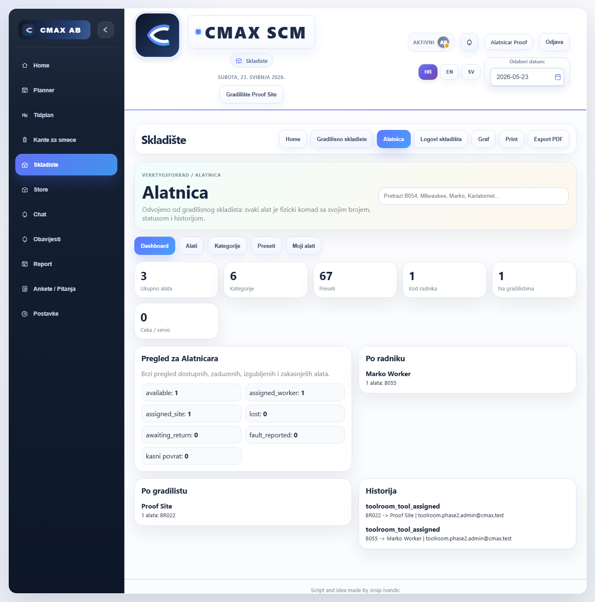

```json
{
  "horizontalOverflow": false,
  "toolroomVisible": true,
  "actionPanel": 0,
  "myCards": 0,
  "quickActions": 0
}
```

## GOOD - desktop-1440 - assign-wizard

Assign wizard for available B054.

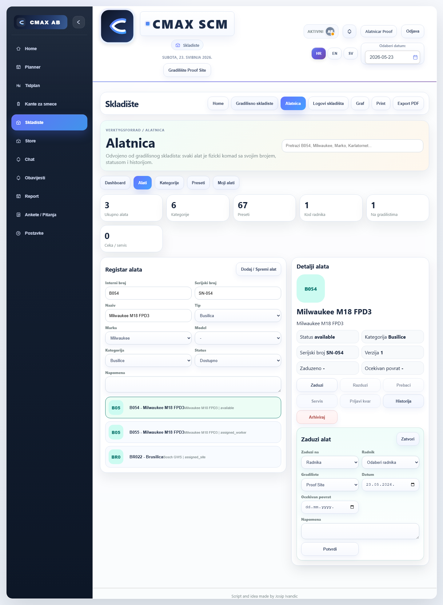

```json
{
  "horizontalOverflow": false,
  "toolroomVisible": true,
  "actionPanel": 1,
  "myCards": 0,
  "quickActions": 7
}
```

## GOOD - desktop-1440 - return-wizard

Return wizard for worker-assigned B055.

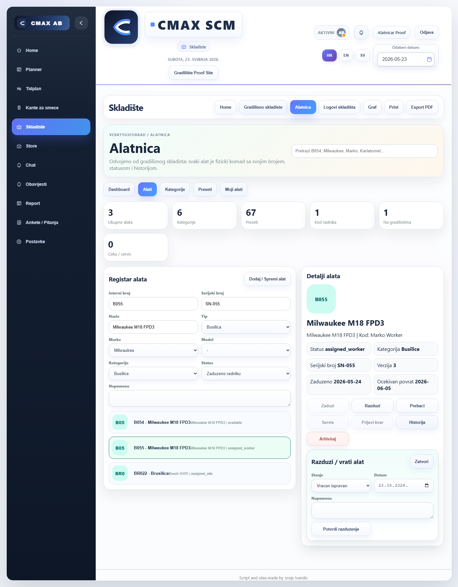

```json
{
  "horizontalOverflow": false,
  "toolroomVisible": true,
  "actionPanel": 1,
  "myCards": 0,
  "quickActions": 7
}
```

## GOOD - desktop-1440 - transfer-wizard

Transfer wizard for site-assigned BR022.

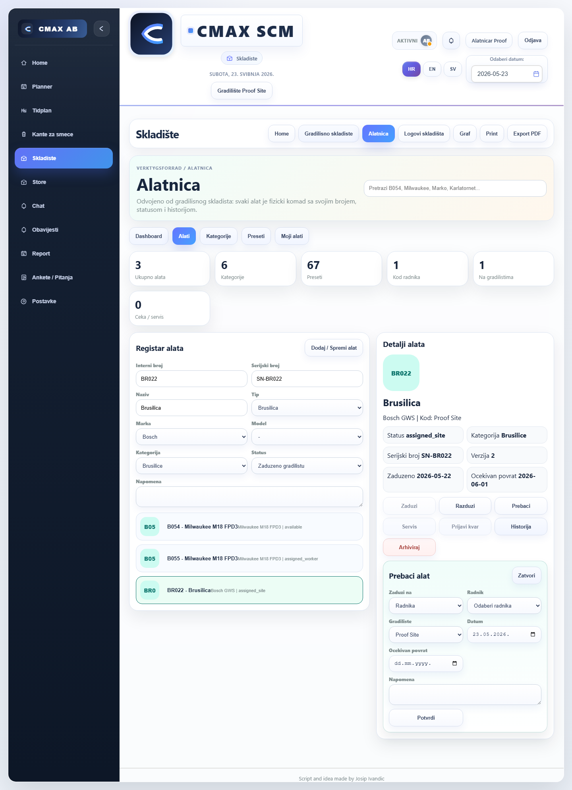

```json
{
  "horizontalOverflow": false,
  "toolroomVisible": true,
  "actionPanel": 1,
  "myCards": 0,
  "quickActions": 7
}
```

## GOOD - desktop-1440 - history

Tool history panel.

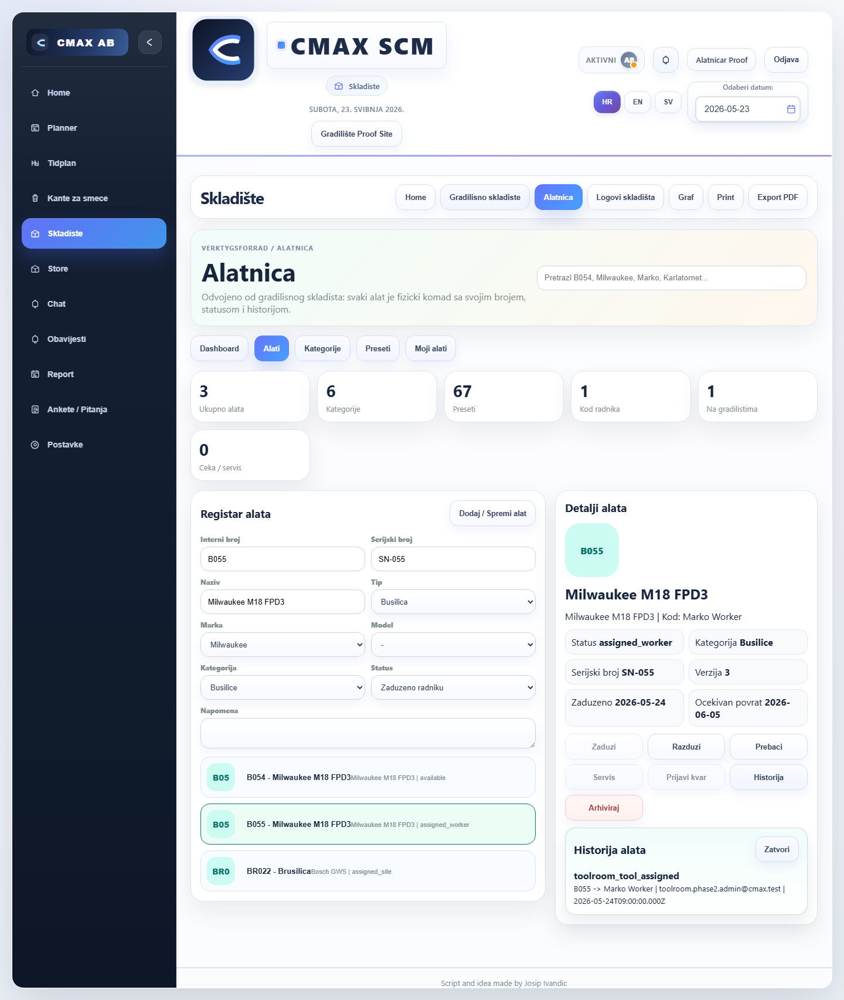

```json
{
  "horizontalOverflow": false,
  "toolroomVisible": true,
  "actionPanel": 1,
  "myCards": 0,
  "quickActions": 7
}
```

## GOOD - desktop-1440 - my-tools-cards

My Tools mobile cards for active site tools.

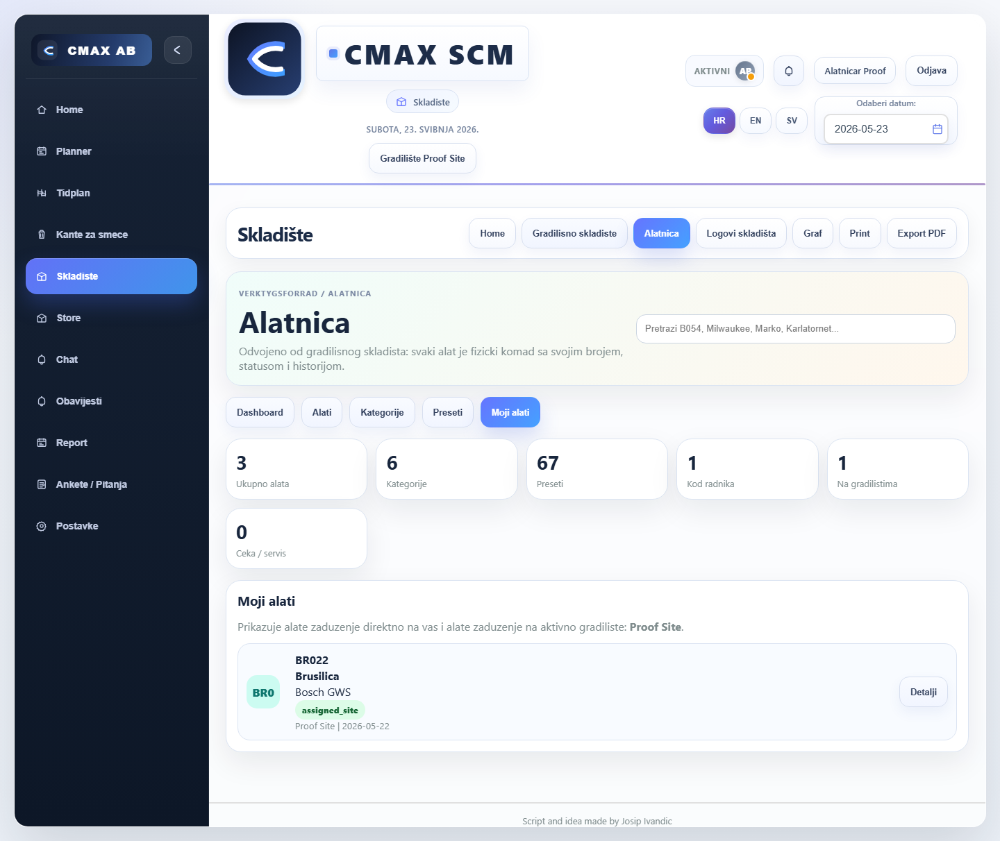

```json
{
  "horizontalOverflow": false,
  "toolroomVisible": true,
  "actionPanel": 0,
  "myCards": 1,
  "quickActions": 0
}
```

## GOOD - tablet-768 - dashboard-worker-site

Dashboard with worker/site assignment summaries and history.

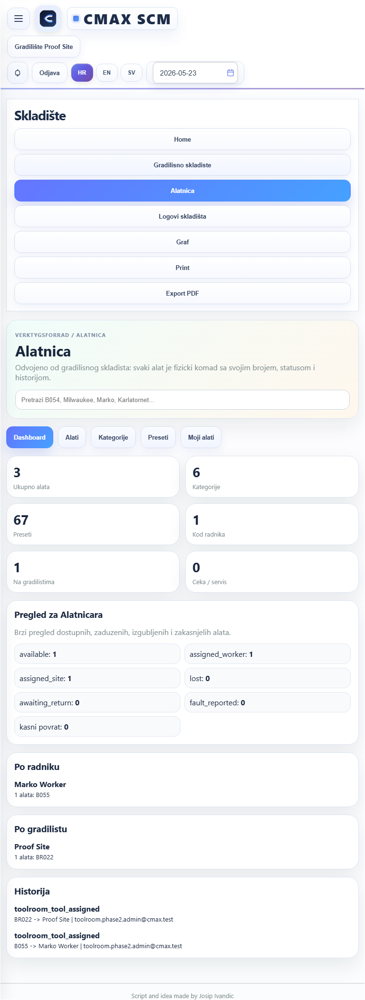

```json
{
  "horizontalOverflow": false,
  "toolroomVisible": true,
  "actionPanel": 0,
  "myCards": 0,
  "quickActions": 0
}
```

## GOOD - tablet-768 - assign-wizard

Assign wizard for available B054.

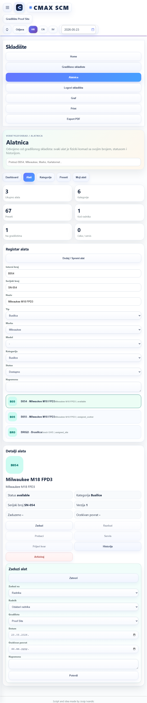

```json
{
  "horizontalOverflow": false,
  "toolroomVisible": true,
  "actionPanel": 1,
  "myCards": 0,
  "quickActions": 7
}
```

## GOOD - tablet-768 - return-wizard

Return wizard for worker-assigned B055.

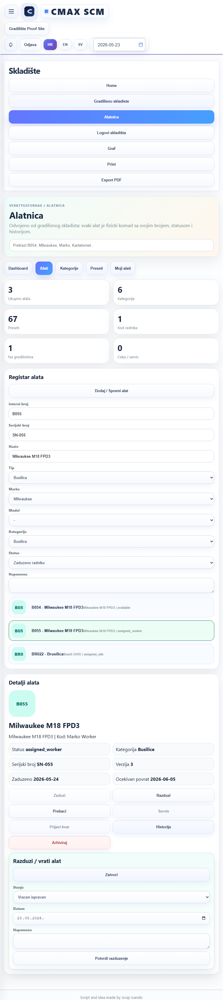

```json
{
  "horizontalOverflow": false,
  "toolroomVisible": true,
  "actionPanel": 1,
  "myCards": 0,
  "quickActions": 7
}
```

## GOOD - tablet-768 - transfer-wizard

Transfer wizard for site-assigned BR022.

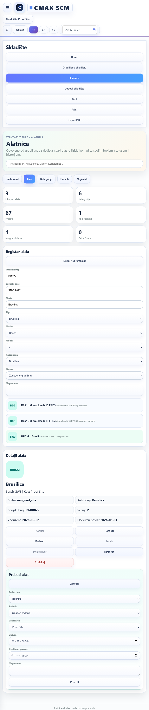

```json
{
  "horizontalOverflow": false,
  "toolroomVisible": true,
  "actionPanel": 1,
  "myCards": 0,
  "quickActions": 7
}
```

## GOOD - tablet-768 - history

Tool history panel.

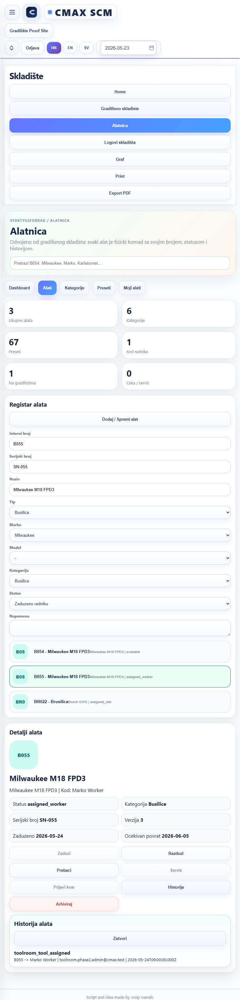

```json
{
  "horizontalOverflow": false,
  "toolroomVisible": true,
  "actionPanel": 1,
  "myCards": 0,
  "quickActions": 7
}
```

## GOOD - tablet-768 - my-tools-cards

My Tools mobile cards for active site tools.

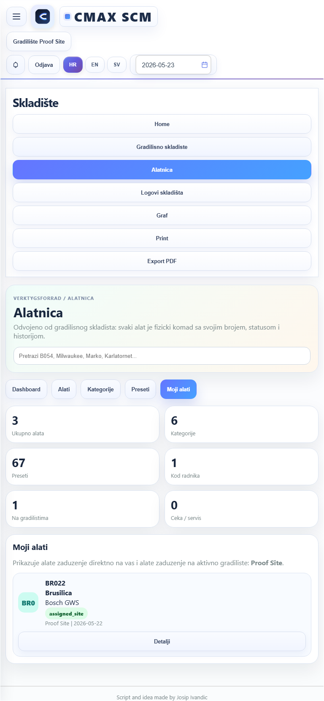

```json
{
  "horizontalOverflow": false,
  "toolroomVisible": true,
  "actionPanel": 0,
  "myCards": 1,
  "quickActions": 0
}
```

## GOOD - mobile-390 - dashboard-worker-site

Dashboard with worker/site assignment summaries and history.

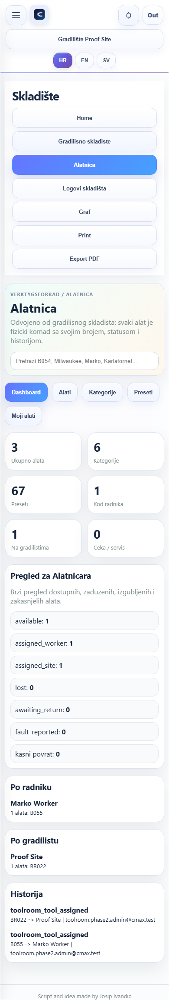

```json
{
  "horizontalOverflow": false,
  "toolroomVisible": true,
  "actionPanel": 0,
  "myCards": 0,
  "quickActions": 0
}
```

## GOOD - mobile-390 - assign-wizard

Assign wizard for available B054.

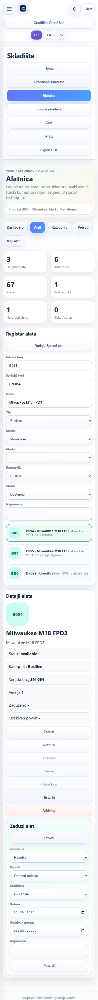

```json
{
  "horizontalOverflow": false,
  "toolroomVisible": true,
  "actionPanel": 1,
  "myCards": 0,
  "quickActions": 7
}
```

## GOOD - mobile-390 - return-wizard

Return wizard for worker-assigned B055.

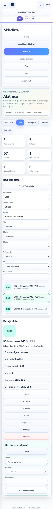

```json
{
  "horizontalOverflow": false,
  "toolroomVisible": true,
  "actionPanel": 1,
  "myCards": 0,
  "quickActions": 7
}
```

## GOOD - mobile-390 - transfer-wizard

Transfer wizard for site-assigned BR022.

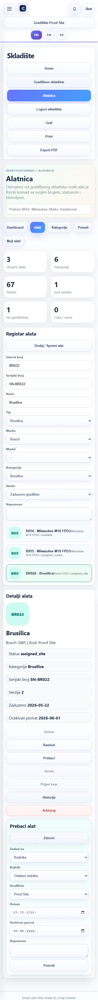

```json
{
  "horizontalOverflow": false,
  "toolroomVisible": true,
  "actionPanel": 1,
  "myCards": 0,
  "quickActions": 7
}
```

## GOOD - mobile-390 - history

Tool history panel.

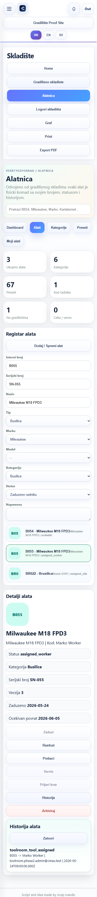

```json
{
  "horizontalOverflow": false,
  "toolroomVisible": true,
  "actionPanel": 1,
  "myCards": 0,
  "quickActions": 7
}
```

## GOOD - mobile-390 - my-tools-cards

My Tools mobile cards for active site tools.

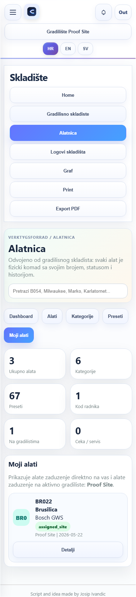

```json
{
  "horizontalOverflow": false,
  "toolroomVisible": true,
  "actionPanel": 0,
  "myCards": 1,
  "quickActions": 0
}
```

## GOOD - mobile-430 - dashboard-worker-site

Dashboard with worker/site assignment summaries and history.

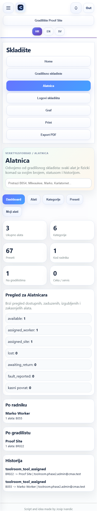

```json
{
  "horizontalOverflow": false,
  "toolroomVisible": true,
  "actionPanel": 0,
  "myCards": 0,
  "quickActions": 0
}
```

## GOOD - mobile-430 - assign-wizard

Assign wizard for available B054.

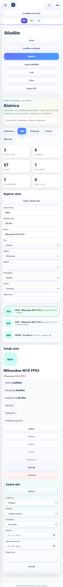

```json
{
  "horizontalOverflow": false,
  "toolroomVisible": true,
  "actionPanel": 1,
  "myCards": 0,
  "quickActions": 7
}
```

## GOOD - mobile-430 - return-wizard

Return wizard for worker-assigned B055.

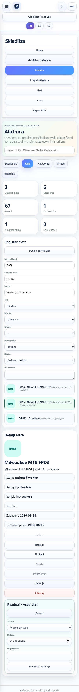

```json
{
  "horizontalOverflow": false,
  "toolroomVisible": true,
  "actionPanel": 1,
  "myCards": 0,
  "quickActions": 7
}
```

## GOOD - mobile-430 - transfer-wizard

Transfer wizard for site-assigned BR022.

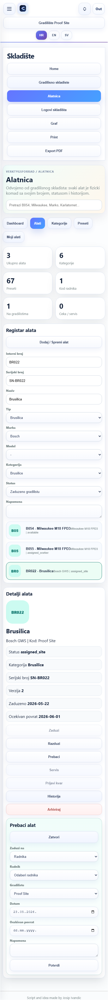

```json
{
  "horizontalOverflow": false,
  "toolroomVisible": true,
  "actionPanel": 1,
  "myCards": 0,
  "quickActions": 7
}
```

## GOOD - mobile-430 - history

Tool history panel.

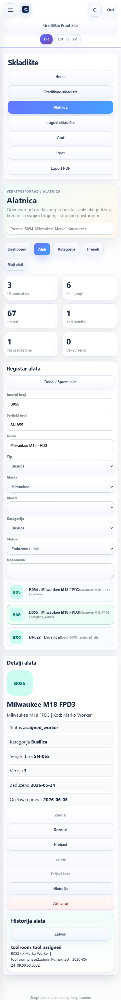

```json
{
  "horizontalOverflow": false,
  "toolroomVisible": true,
  "actionPanel": 1,
  "myCards": 0,
  "quickActions": 7
}
```

## GOOD - mobile-430 - my-tools-cards

My Tools mobile cards for active site tools.

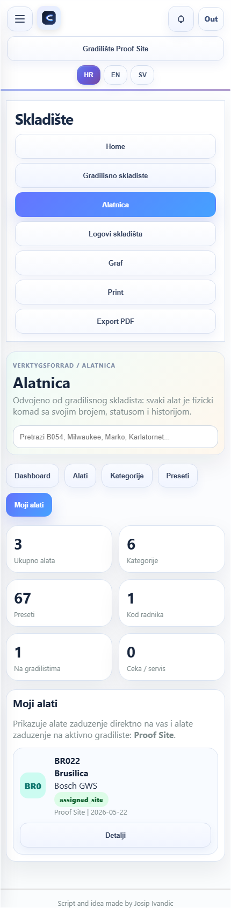

```json
{
  "horizontalOverflow": false,
  "toolroomVisible": true,
  "actionPanel": 0,
  "myCards": 1,
  "quickActions": 0
}
```
