# Toolroom Phase 3 Service Proof

Run: toolroom-phase3-proof-1779578162960

## GOOD - desktop-1440 - alatnicar-fault-queue

Alatnicar fault queue with replacement request and service records.

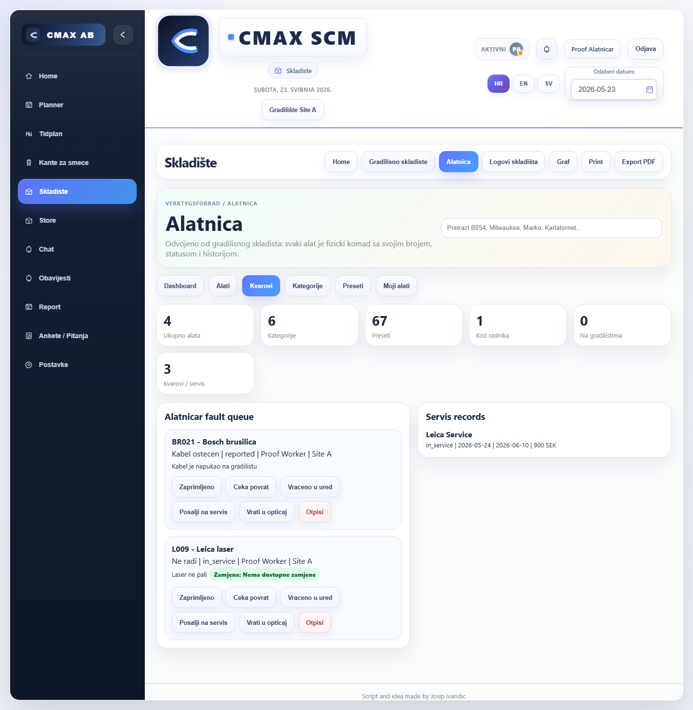

```json
{
  "horizontalOverflow": false,
  "toolroomVisible": true,
  "actionPanel": 0,
  "faultCards": 2,
  "myCards": 0,
  "accountBadge": "0"
}
```

## GOOD - desktop-1440 - service-form

Service form with company/date/cost/document/comment fields.

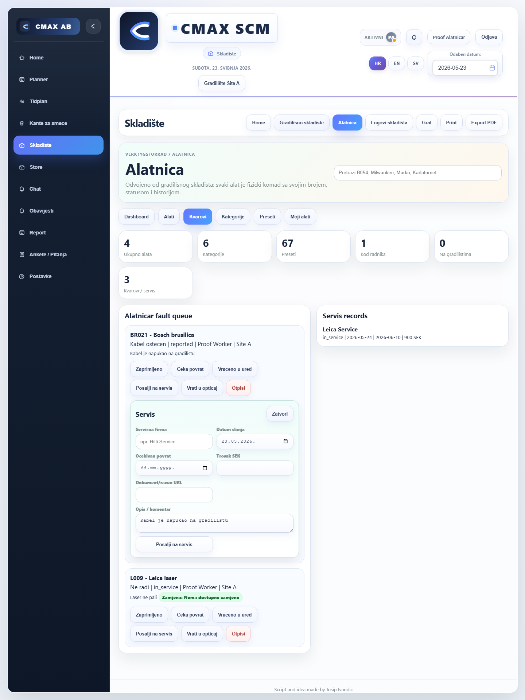

```json
{
  "horizontalOverflow": false,
  "toolroomVisible": true,
  "actionPanel": 1,
  "faultCards": 2,
  "myCards": 0,
  "accountBadge": "0"
}
```

## GOOD - desktop-1440 - service-history

History panel for service workflow.

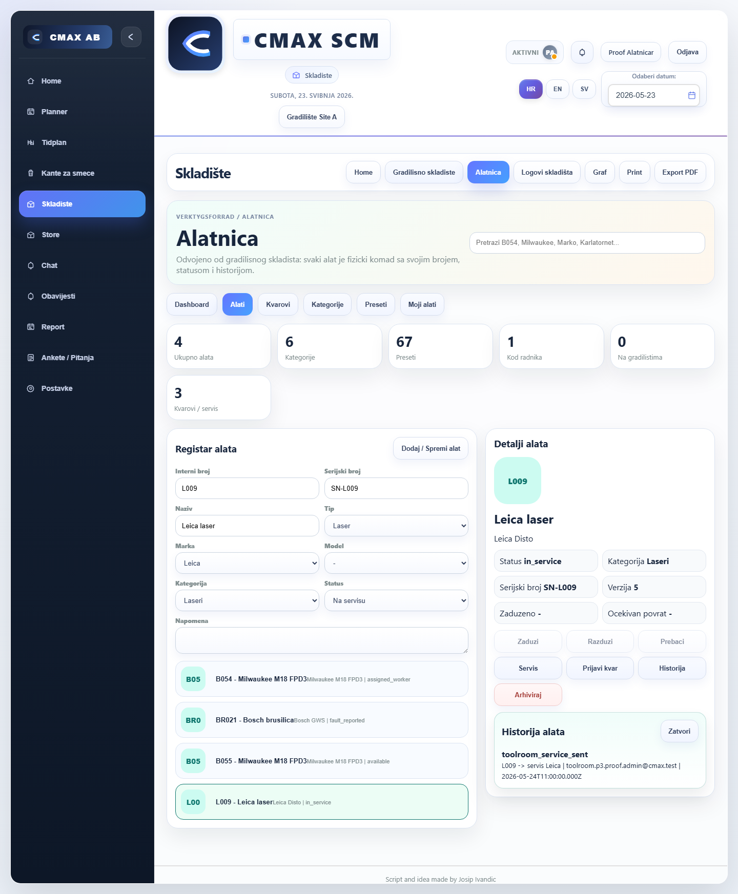

```json
{
  "horizontalOverflow": false,
  "toolroomVisible": true,
  "actionPanel": 1,
  "faultCards": 0,
  "myCards": 0,
  "accountBadge": "0"
}
```

## GOOD - desktop-1440 - worker-my-tools-fault

Mobile My Tools cards include Prijavi kvar action.

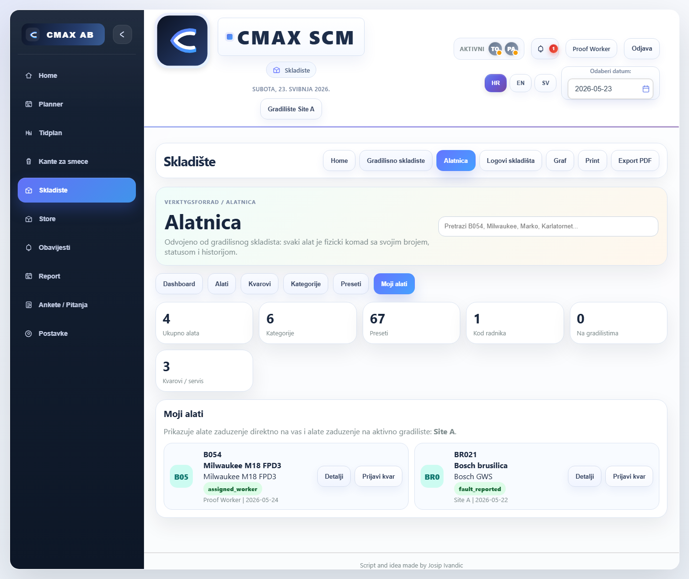

```json
{
  "horizontalOverflow": false,
  "toolroomVisible": true,
  "actionPanel": 0,
  "faultCards": 0,
  "myCards": 2,
  "accountBadge": "1"
}
```

## GOOD - desktop-1440 - worker-fault-report

Worker fault report form with replacement checkbox.

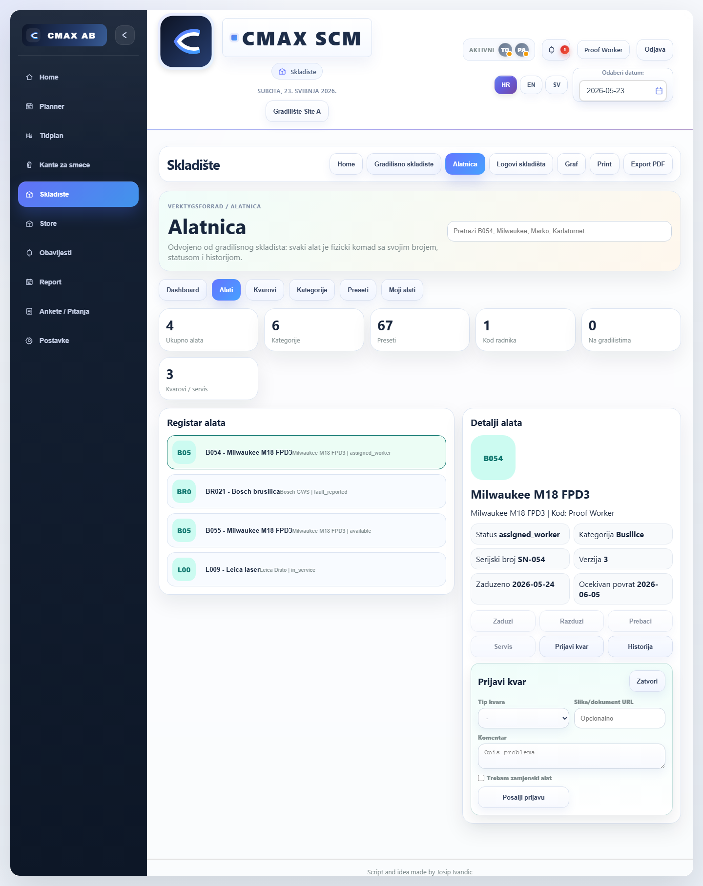

```json
{
  "horizontalOverflow": false,
  "toolroomVisible": true,
  "actionPanel": 1,
  "faultCards": 0,
  "myCards": 0,
  "accountBadge": "1"
}
```

## GOOD - desktop-1440 - notifications-badge

Worker topbar account badge shows Toolroom account notification.


```json
{
  "horizontalOverflow": false,
  "toolroomVisible": true,
  "actionPanel": 1,
  "faultCards": 0,
  "myCards": 0,
  "accountBadge": "1"
}
```

## GOOD - tablet-768 - alatnicar-fault-queue

Alatnicar fault queue with replacement request and service records.

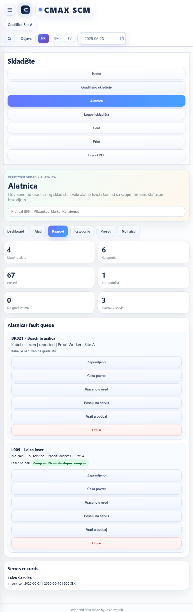

```json
{
  "horizontalOverflow": false,
  "toolroomVisible": true,
  "actionPanel": 0,
  "faultCards": 2,
  "myCards": 0,
  "accountBadge": "0"
}
```

## GOOD - tablet-768 - service-form

Service form with company/date/cost/document/comment fields.

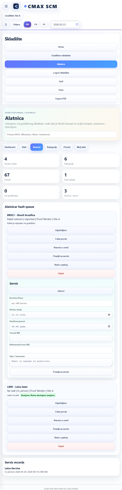

```json
{
  "horizontalOverflow": false,
  "toolroomVisible": true,
  "actionPanel": 1,
  "faultCards": 2,
  "myCards": 0,
  "accountBadge": "0"
}
```

## GOOD - tablet-768 - service-history

History panel for service workflow.

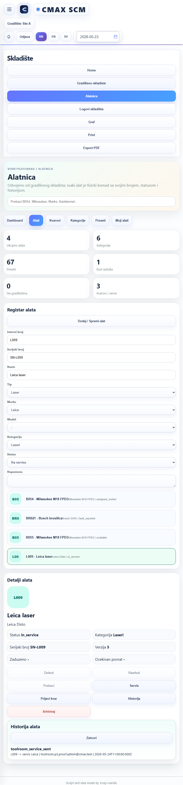

```json
{
  "horizontalOverflow": false,
  "toolroomVisible": true,
  "actionPanel": 1,
  "faultCards": 0,
  "myCards": 0,
  "accountBadge": "0"
}
```

## GOOD - tablet-768 - worker-my-tools-fault

Mobile My Tools cards include Prijavi kvar action.

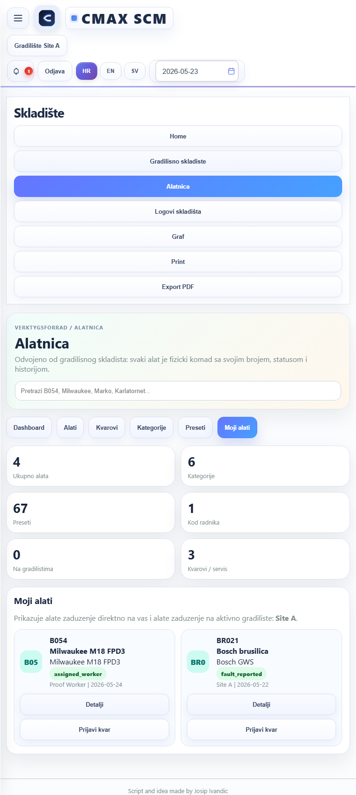

```json
{
  "horizontalOverflow": false,
  "toolroomVisible": true,
  "actionPanel": 0,
  "faultCards": 0,
  "myCards": 2,
  "accountBadge": "1"
}
```

## GOOD - tablet-768 - worker-fault-report

Worker fault report form with replacement checkbox.

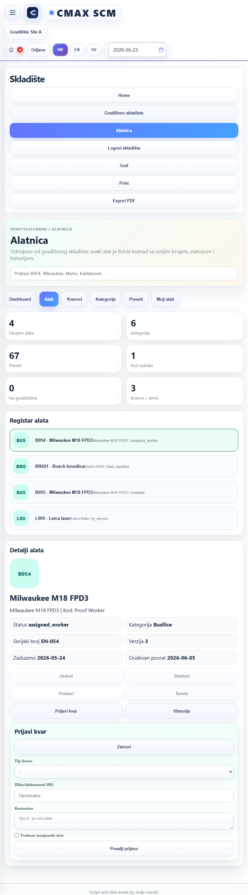

```json
{
  "horizontalOverflow": false,
  "toolroomVisible": true,
  "actionPanel": 1,
  "faultCards": 0,
  "myCards": 0,
  "accountBadge": "1"
}
```

## GOOD - tablet-768 - notifications-badge

Worker topbar account badge shows Toolroom account notification.


```json
{
  "horizontalOverflow": false,
  "toolroomVisible": true,
  "actionPanel": 1,
  "faultCards": 0,
  "myCards": 0,
  "accountBadge": "1"
}
```

## GOOD - mobile-390 - alatnicar-fault-queue

Alatnicar fault queue with replacement request and service records.

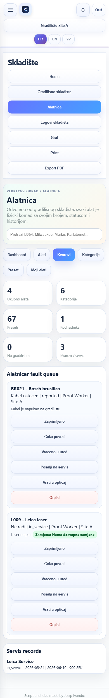

```json
{
  "horizontalOverflow": false,
  "toolroomVisible": true,
  "actionPanel": 0,
  "faultCards": 2,
  "myCards": 0,
  "accountBadge": "0"
}
```

## GOOD - mobile-390 - service-form

Service form with company/date/cost/document/comment fields.

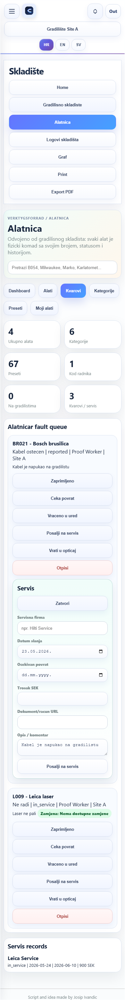

```json
{
  "horizontalOverflow": false,
  "toolroomVisible": true,
  "actionPanel": 1,
  "faultCards": 2,
  "myCards": 0,
  "accountBadge": "0"
}
```

## GOOD - mobile-390 - service-history

History panel for service workflow.

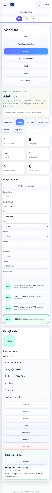

```json
{
  "horizontalOverflow": false,
  "toolroomVisible": true,
  "actionPanel": 1,
  "faultCards": 0,
  "myCards": 0,
  "accountBadge": "0"
}
```

## GOOD - mobile-390 - worker-my-tools-fault

Mobile My Tools cards include Prijavi kvar action.

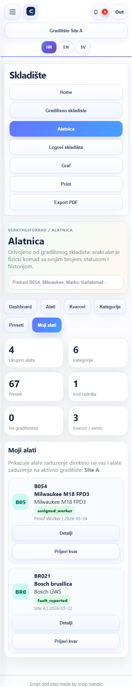

```json
{
  "horizontalOverflow": false,
  "toolroomVisible": true,
  "actionPanel": 0,
  "faultCards": 0,
  "myCards": 2,
  "accountBadge": "1"
}
```

## GOOD - mobile-390 - worker-fault-report

Worker fault report form with replacement checkbox.


```json
{
  "horizontalOverflow": false,
  "toolroomVisible": true,
  "actionPanel": 1,
  "faultCards": 0,
  "myCards": 0,
  "accountBadge": "1"
}
```

## GOOD - mobile-390 - notifications-badge

Worker topbar account badge shows Toolroom account notification.

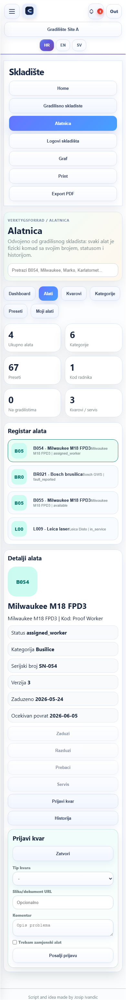

```json
{
  "horizontalOverflow": false,
  "toolroomVisible": true,
  "actionPanel": 1,
  "faultCards": 0,
  "myCards": 0,
  "accountBadge": "1"
}
```

## GOOD - mobile-430 - alatnicar-fault-queue

Alatnicar fault queue with replacement request and service records.

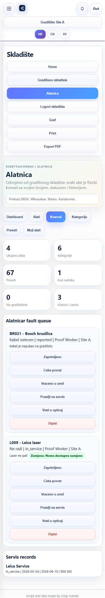

```json
{
  "horizontalOverflow": false,
  "toolroomVisible": true,
  "actionPanel": 0,
  "faultCards": 2,
  "myCards": 0,
  "accountBadge": "0"
}
```

## GOOD - mobile-430 - service-form

Service form with company/date/cost/document/comment fields.

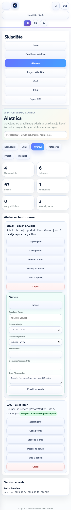

```json
{
  "horizontalOverflow": false,
  "toolroomVisible": true,
  "actionPanel": 1,
  "faultCards": 2,
  "myCards": 0,
  "accountBadge": "0"
}
```

## GOOD - mobile-430 - service-history

History panel for service workflow.

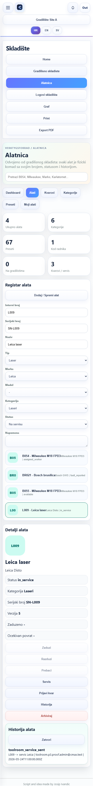

```json
{
  "horizontalOverflow": false,
  "toolroomVisible": true,
  "actionPanel": 1,
  "faultCards": 0,
  "myCards": 0,
  "accountBadge": "0"
}
```

## GOOD - mobile-430 - worker-my-tools-fault

Mobile My Tools cards include Prijavi kvar action.

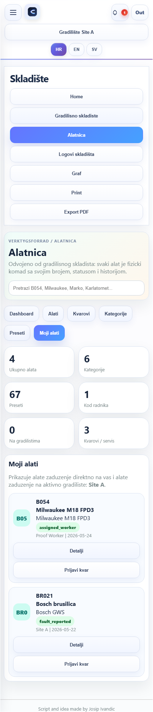

```json
{
  "horizontalOverflow": false,
  "toolroomVisible": true,
  "actionPanel": 0,
  "faultCards": 0,
  "myCards": 2,
  "accountBadge": "1"
}
```

## GOOD - mobile-430 - worker-fault-report

Worker fault report form with replacement checkbox.


```json
{
  "horizontalOverflow": false,
  "toolroomVisible": true,
  "actionPanel": 1,
  "faultCards": 0,
  "myCards": 0,
  "accountBadge": "1"
}
```

## GOOD - mobile-430 - notifications-badge

Worker topbar account badge shows Toolroom account notification.

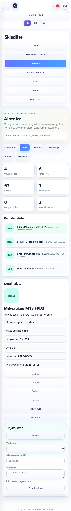

```json
{
  "horizontalOverflow": false,
  "toolroomVisible": true,
  "actionPanel": 1,
  "faultCards": 0,
  "myCards": 0,
  "accountBadge": "1"
}
```
