# Toolroom Phase 4 Bulk Add + Export Proof

Run: toolroom-phase4-proof-1779732129967

Coverage: bulk wizard, internal number preview, serial paste, duplicate warning, created tools, export wizard, CSV/PDF/XLSX proof, permission denied export.

## GOOD - desktop-1440 - bulk-step-basic

Bulk add wizard basic step.

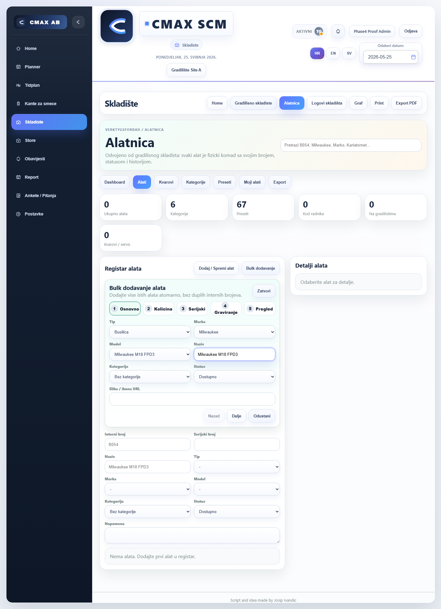

```json
{
  "horizontalOverflow": false,
  "toolroomVisible": true,
  "actionPanel": 1,
  "stepper": 5,
  "rows": 0,
  "empty": 2
}
```

## GOOD - desktop-1440 - bulk-preview-numbers

Preview B054-B073.

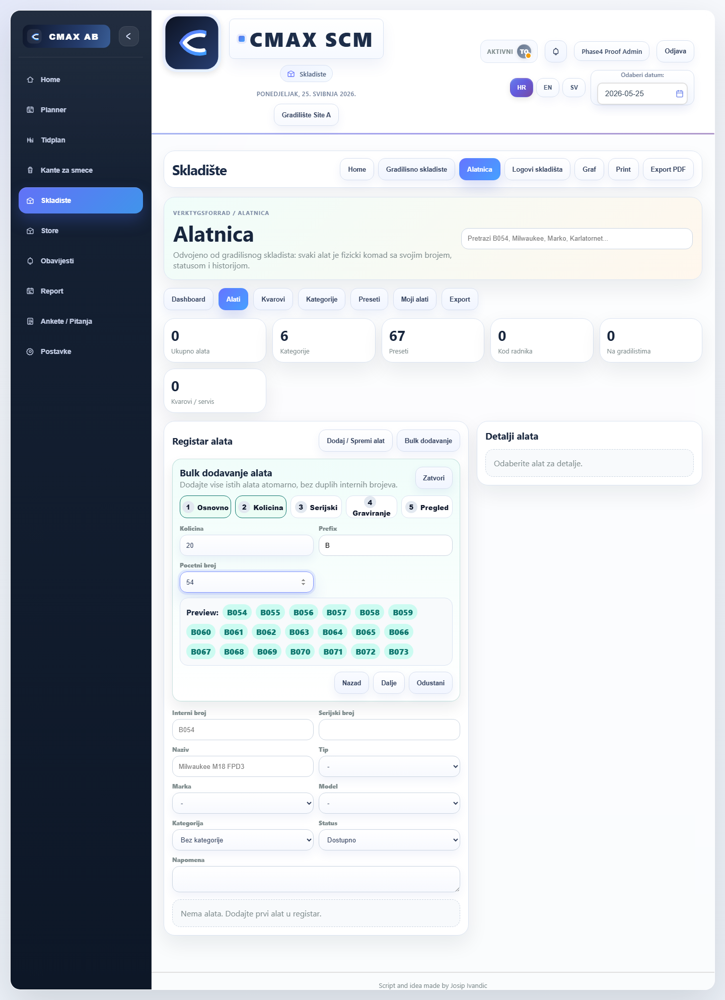

```json
{
  "horizontalOverflow": false,
  "toolroomVisible": true,
  "actionPanel": 1,
  "stepper": 5,
  "rows": 0,
  "empty": 2
}
```

## GOOD - desktop-1440 - bulk-serial-paste

Serial paste list.

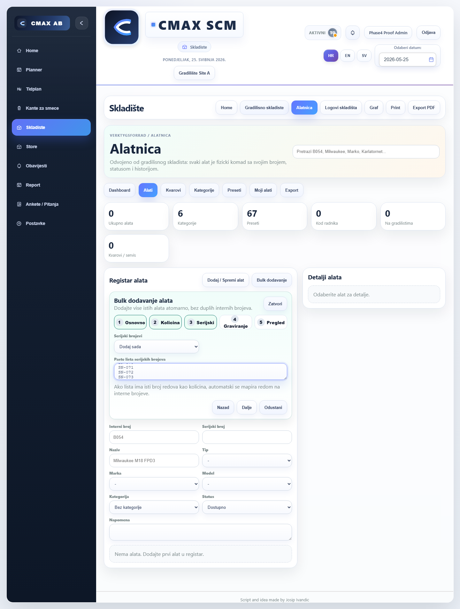

```json
{
  "horizontalOverflow": false,
  "toolroomVisible": true,
  "actionPanel": 1,
  "stepper": 5,
  "rows": 0,
  "empty": 2
}
```

## GOOD - desktop-1440 - bulk-review

Bulk review with missing serial count.

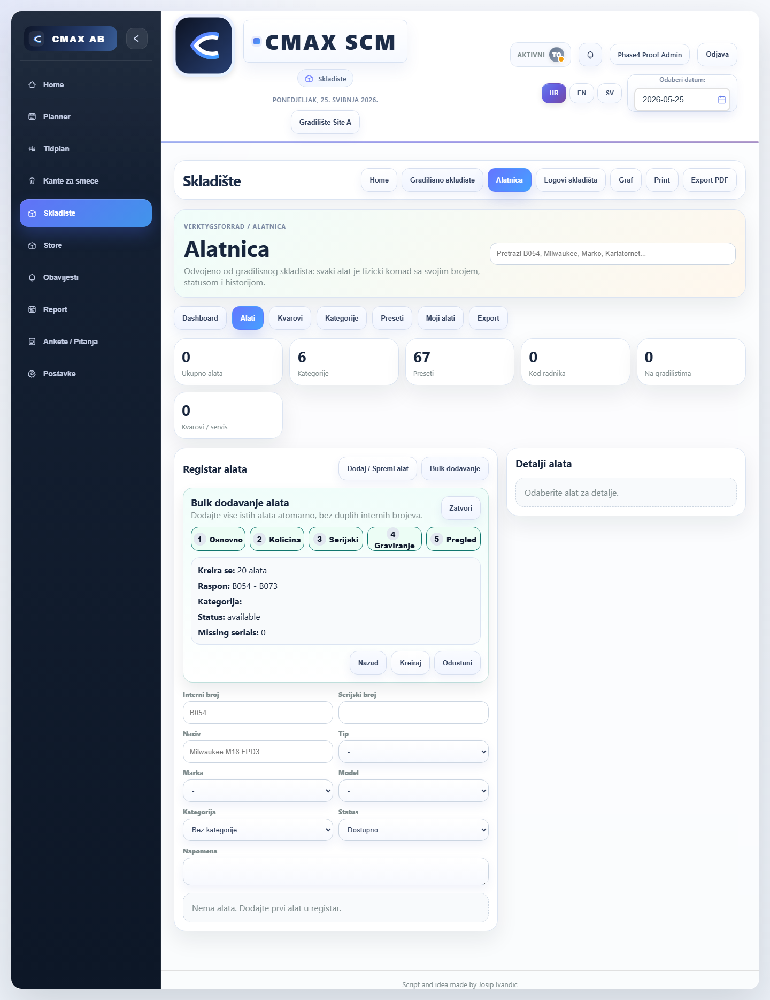

```json
{
  "horizontalOverflow": false,
  "toolroomVisible": true,
  "actionPanel": 1,
  "stepper": 5,
  "rows": 0,
  "empty": 2
}
```

## GOOD - desktop-1440 - created-tools-list

Created tools list after bulk add.

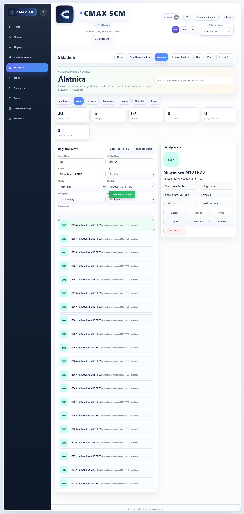

```json
{
  "horizontalOverflow": false,
  "toolroomVisible": true,
  "actionPanel": 0,
  "stepper": 0,
  "rows": 20,
  "empty": 0
}
```

## GOOD - desktop-1440 - duplicate-warning

Duplicate range warning from backend conflict.

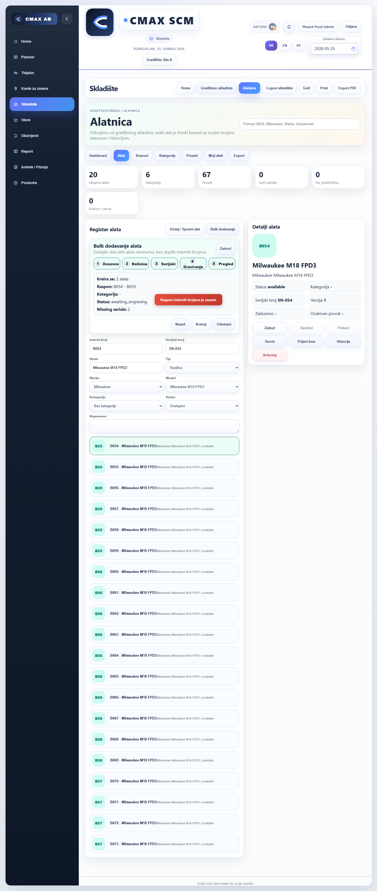

```json
{
  "horizontalOverflow": false,
  "toolroomVisible": true,
  "actionPanel": 1,
  "stepper": 5,
  "rows": 20,
  "empty": 0
}
```

## GOOD - desktop-1440 - export-wizard

Toolroom export filters.

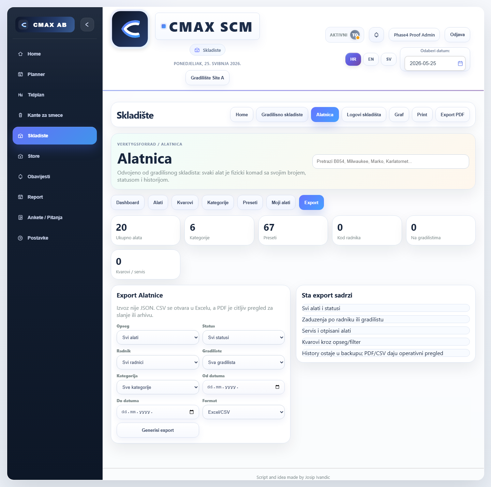

```json
{
  "horizontalOverflow": false,
  "toolroomVisible": true,
  "actionPanel": 0,
  "stepper": 0,
  "rows": 0,
  "empty": 0
}
```

## GOOD - desktop-1440 - export-file-proof

CSV/PDF/XLSX proof is not JSON.

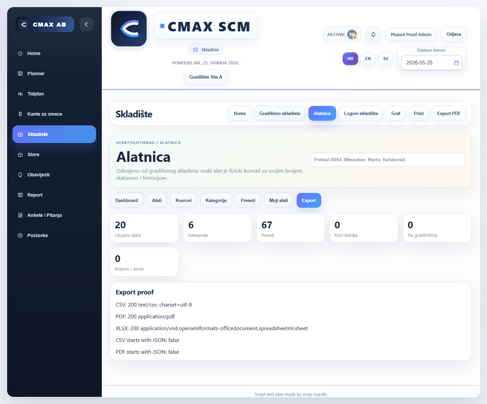

```json
{
  "horizontalOverflow": false,
  "toolroomVisible": true,
  "actionPanel": 0,
  "stepper": 0,
  "rows": 0,
  "empty": 0
}
```

## GOOD - desktop-1440 - permission-denied-export

Worker cannot export all Toolroom data.

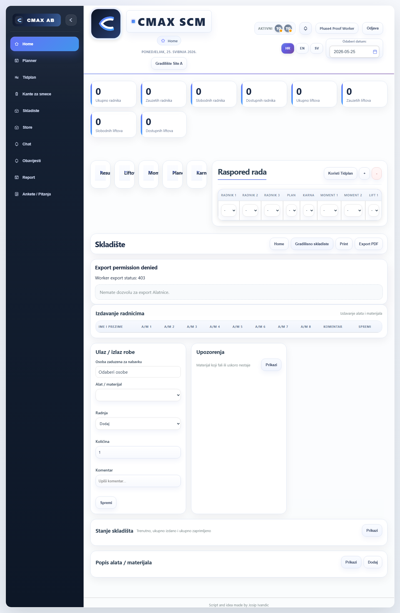

```json
{
  "horizontalOverflow": false,
  "toolroomVisible": true,
  "actionPanel": 0,
  "stepper": 0,
  "rows": 0,
  "empty": 1
}
```

## GOOD - tablet-768 - bulk-step-basic

Bulk add wizard basic step.

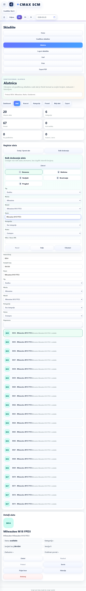

```json
{
  "horizontalOverflow": false,
  "toolroomVisible": true,
  "actionPanel": 1,
  "stepper": 5,
  "rows": 20,
  "empty": 0
}
```

## GOOD - tablet-768 - bulk-preview-numbers

Preview B054-B073.

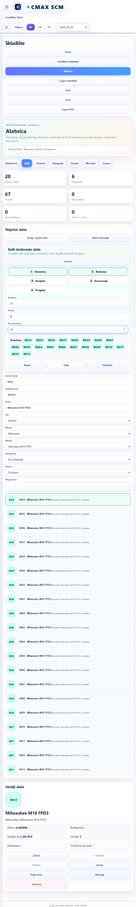

```json
{
  "horizontalOverflow": false,
  "toolroomVisible": true,
  "actionPanel": 1,
  "stepper": 5,
  "rows": 20,
  "empty": 0
}
```

## GOOD - tablet-768 - bulk-serial-paste

Serial paste list.

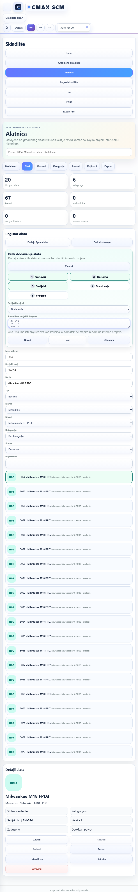

```json
{
  "horizontalOverflow": false,
  "toolroomVisible": true,
  "actionPanel": 1,
  "stepper": 5,
  "rows": 20,
  "empty": 0
}
```

## GOOD - tablet-768 - bulk-review

Bulk review with missing serial count.

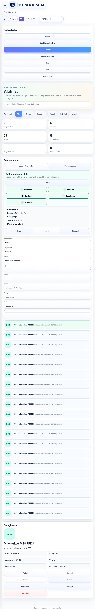

```json
{
  "horizontalOverflow": false,
  "toolroomVisible": true,
  "actionPanel": 1,
  "stepper": 5,
  "rows": 20,
  "empty": 0
}
```

## GOOD - tablet-768 - created-tools-list

Created tools list after bulk add.

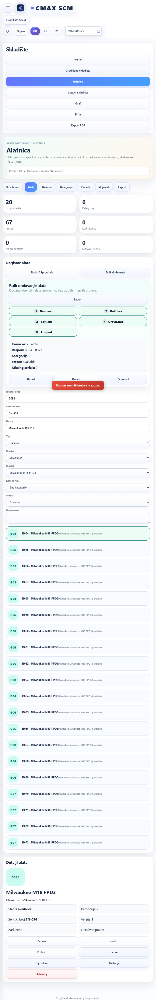

```json
{
  "horizontalOverflow": false,
  "toolroomVisible": true,
  "actionPanel": 1,
  "stepper": 5,
  "rows": 20,
  "empty": 0
}
```

## GOOD - tablet-768 - duplicate-warning

Duplicate range warning from backend conflict.

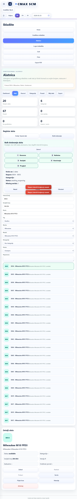

```json
{
  "horizontalOverflow": false,
  "toolroomVisible": true,
  "actionPanel": 1,
  "stepper": 5,
  "rows": 20,
  "empty": 0
}
```

## GOOD - tablet-768 - export-wizard

Toolroom export filters.

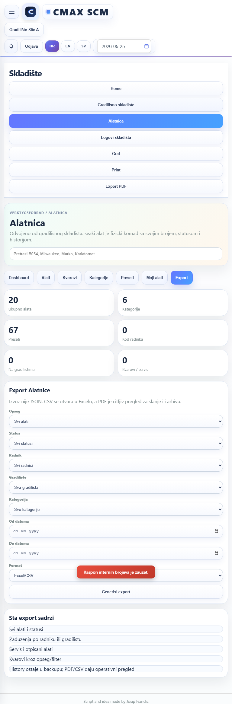

```json
{
  "horizontalOverflow": false,
  "toolroomVisible": true,
  "actionPanel": 0,
  "stepper": 0,
  "rows": 0,
  "empty": 0
}
```

## GOOD - tablet-768 - export-file-proof

CSV/PDF/XLSX proof is not JSON.

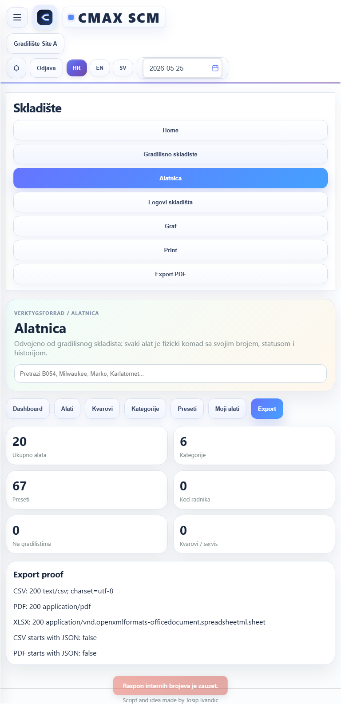

```json
{
  "horizontalOverflow": false,
  "toolroomVisible": true,
  "actionPanel": 0,
  "stepper": 0,
  "rows": 0,
  "empty": 0
}
```

## GOOD - tablet-768 - permission-denied-export

Worker cannot export all Toolroom data.

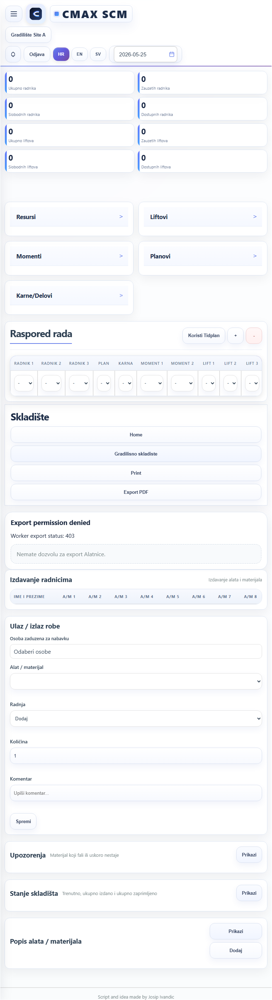

```json
{
  "horizontalOverflow": false,
  "toolroomVisible": true,
  "actionPanel": 0,
  "stepper": 0,
  "rows": 0,
  "empty": 1
}
```

## GOOD - mobile-390 - bulk-step-basic

Bulk add wizard basic step.

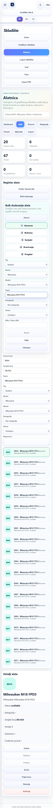

```json
{
  "horizontalOverflow": false,
  "toolroomVisible": true,
  "actionPanel": 1,
  "stepper": 5,
  "rows": 20,
  "empty": 0
}
```

## GOOD - mobile-390 - bulk-preview-numbers

Preview B054-B073.

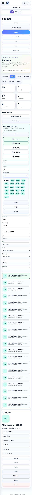

```json
{
  "horizontalOverflow": false,
  "toolroomVisible": true,
  "actionPanel": 1,
  "stepper": 5,
  "rows": 20,
  "empty": 0
}
```

## GOOD - mobile-390 - bulk-serial-paste

Serial paste list.

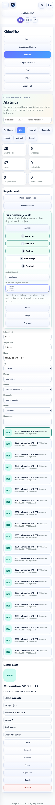

```json
{
  "horizontalOverflow": false,
  "toolroomVisible": true,
  "actionPanel": 1,
  "stepper": 5,
  "rows": 20,
  "empty": 0
}
```

## GOOD - mobile-390 - bulk-review

Bulk review with missing serial count.

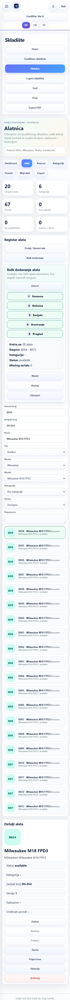

```json
{
  "horizontalOverflow": false,
  "toolroomVisible": true,
  "actionPanel": 1,
  "stepper": 5,
  "rows": 20,
  "empty": 0
}
```

## GOOD - mobile-390 - created-tools-list

Created tools list after bulk add.

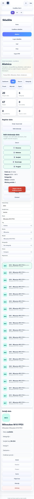

```json
{
  "horizontalOverflow": false,
  "toolroomVisible": true,
  "actionPanel": 1,
  "stepper": 5,
  "rows": 20,
  "empty": 0
}
```

## GOOD - mobile-390 - duplicate-warning

Duplicate range warning from backend conflict.

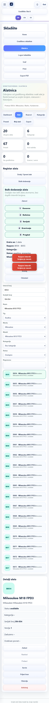

```json
{
  "horizontalOverflow": false,
  "toolroomVisible": true,
  "actionPanel": 1,
  "stepper": 5,
  "rows": 20,
  "empty": 0
}
```

## GOOD - mobile-390 - export-wizard

Toolroom export filters.

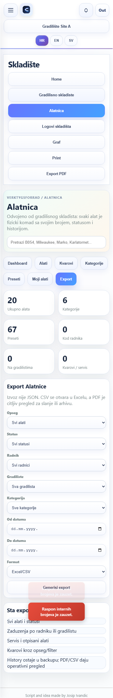

```json
{
  "horizontalOverflow": false,
  "toolroomVisible": true,
  "actionPanel": 0,
  "stepper": 0,
  "rows": 0,
  "empty": 0
}
```

## GOOD - mobile-390 - export-file-proof

CSV/PDF/XLSX proof is not JSON.

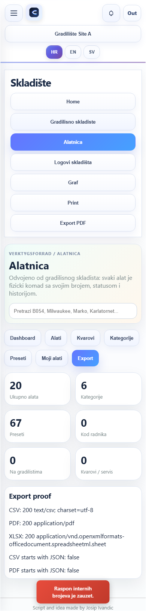

```json
{
  "horizontalOverflow": false,
  "toolroomVisible": true,
  "actionPanel": 0,
  "stepper": 0,
  "rows": 0,
  "empty": 0
}
```

## GOOD - mobile-390 - permission-denied-export

Worker cannot export all Toolroom data.

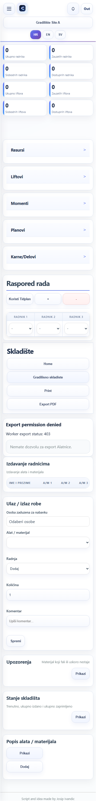

```json
{
  "horizontalOverflow": false,
  "toolroomVisible": true,
  "actionPanel": 0,
  "stepper": 0,
  "rows": 0,
  "empty": 1
}
```

## GOOD - mobile-430 - bulk-step-basic

Bulk add wizard basic step.

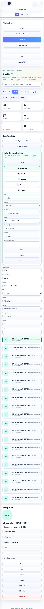

```json
{
  "horizontalOverflow": false,
  "toolroomVisible": true,
  "actionPanel": 1,
  "stepper": 5,
  "rows": 20,
  "empty": 0
}
```

## GOOD - mobile-430 - bulk-preview-numbers

Preview B054-B073.

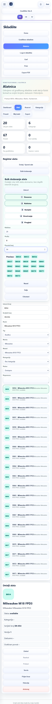

```json
{
  "horizontalOverflow": false,
  "toolroomVisible": true,
  "actionPanel": 1,
  "stepper": 5,
  "rows": 20,
  "empty": 0
}
```

## GOOD - mobile-430 - bulk-serial-paste

Serial paste list.

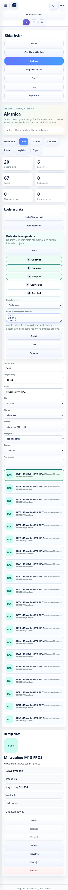

```json
{
  "horizontalOverflow": false,
  "toolroomVisible": true,
  "actionPanel": 1,
  "stepper": 5,
  "rows": 20,
  "empty": 0
}
```

## GOOD - mobile-430 - bulk-review

Bulk review with missing serial count.

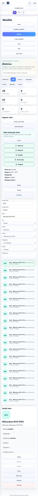

```json
{
  "horizontalOverflow": false,
  "toolroomVisible": true,
  "actionPanel": 1,
  "stepper": 5,
  "rows": 20,
  "empty": 0
}
```

## GOOD - mobile-430 - created-tools-list

Created tools list after bulk add.

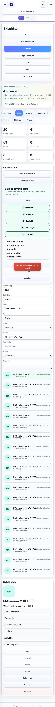

```json
{
  "horizontalOverflow": false,
  "toolroomVisible": true,
  "actionPanel": 1,
  "stepper": 5,
  "rows": 20,
  "empty": 0
}
```

## GOOD - mobile-430 - duplicate-warning

Duplicate range warning from backend conflict.

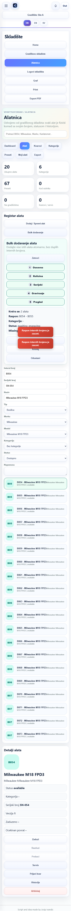

```json
{
  "horizontalOverflow": false,
  "toolroomVisible": true,
  "actionPanel": 1,
  "stepper": 5,
  "rows": 20,
  "empty": 0
}
```

## GOOD - mobile-430 - export-wizard

Toolroom export filters.

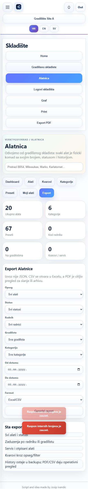

```json
{
  "horizontalOverflow": false,
  "toolroomVisible": true,
  "actionPanel": 0,
  "stepper": 0,
  "rows": 0,
  "empty": 0
}
```

## GOOD - mobile-430 - export-file-proof

CSV/PDF/XLSX proof is not JSON.

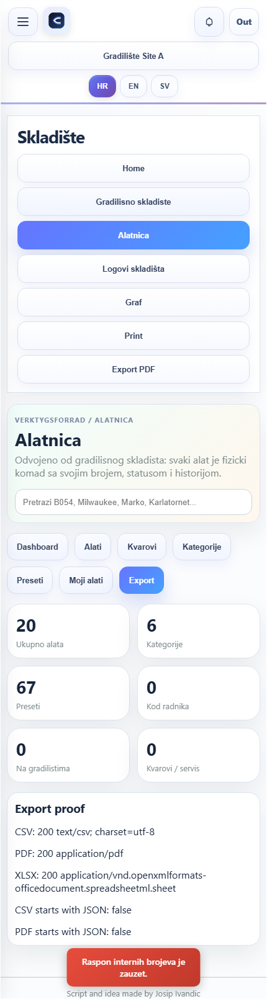

```json
{
  "horizontalOverflow": false,
  "toolroomVisible": true,
  "actionPanel": 0,
  "stepper": 0,
  "rows": 0,
  "empty": 0
}
```

## GOOD - mobile-430 - permission-denied-export

Worker cannot export all Toolroom data.

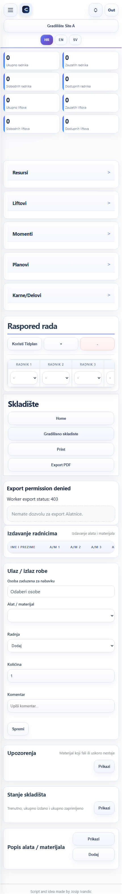

```json
{
  "horizontalOverflow": false,
  "toolroomVisible": true,
  "actionPanel": 0,
  "stepper": 0,
  "rows": 0,
  "empty": 1
}
```
