# Real-world Toolroom Proof

Run: toolroom-real-world-proof-1779577431108

Summary: GOOD means no viewport overflow and Toolroom panel visible. MINOR/MAJOR/BLOCKER would be listed per screenshot.

## GOOD - desktop-1440 - alatnicar-dashboard

Alatnicar dashboard with by-worker/by-site state and lost tool status.

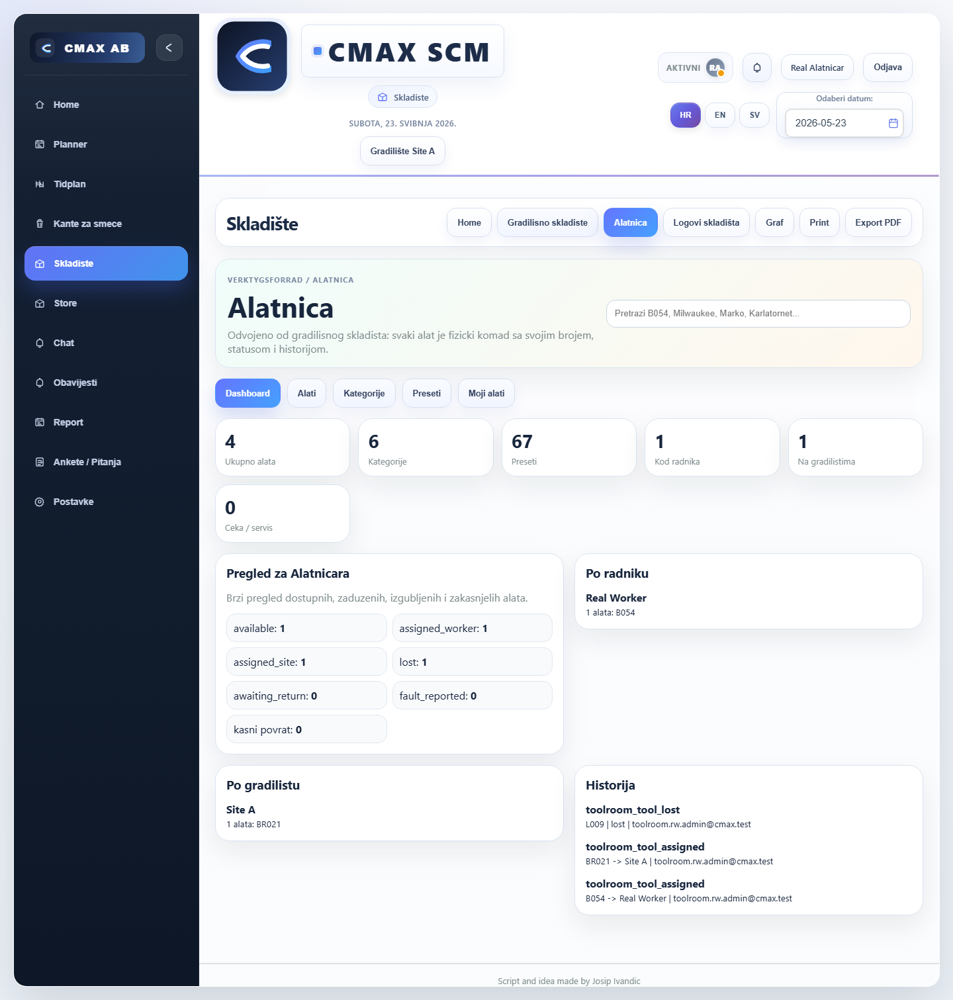

```json
{
  "horizontalOverflow": false,
  "toolroomVisible": true,
  "actionPanel": 0,
  "myCards": 0,
  "accountBadge": "0",
  "disabledQuickActions": 0
}
```

## GOOD - desktop-1440 - assign-flow

Assign flow for available tool B056.

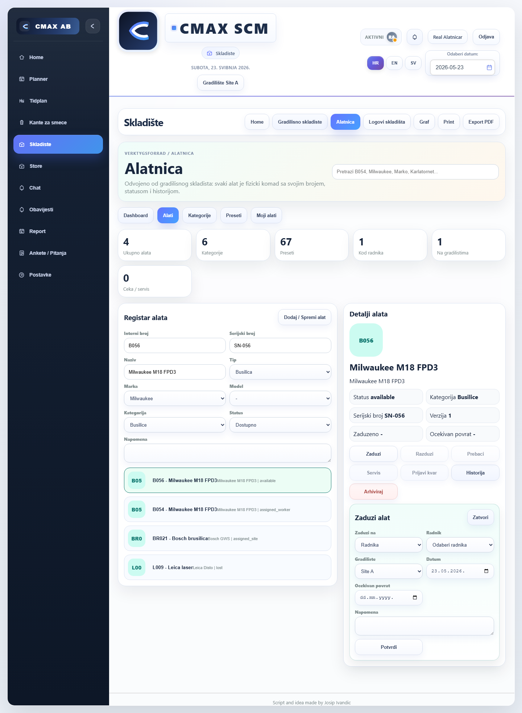

```json
{
  "horizontalOverflow": false,
  "toolroomVisible": true,
  "actionPanel": 1,
  "myCards": 0,
  "accountBadge": "0",
  "disabledQuickActions": 4
}
```

## GOOD - desktop-1440 - transfer-flow

Transfer flow for worker-assigned B054.

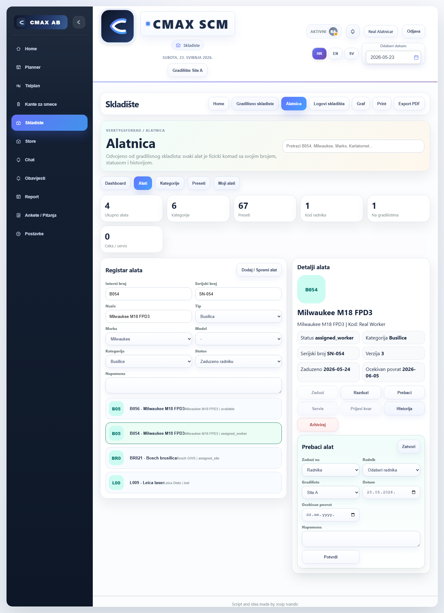

```json
{
  "horizontalOverflow": false,
  "toolroomVisible": true,
  "actionPanel": 1,
  "myCards": 0,
  "accountBadge": "0",
  "disabledQuickActions": 3
}
```

## GOOD - desktop-1440 - return-flow

Return flow for site-assigned BR021.

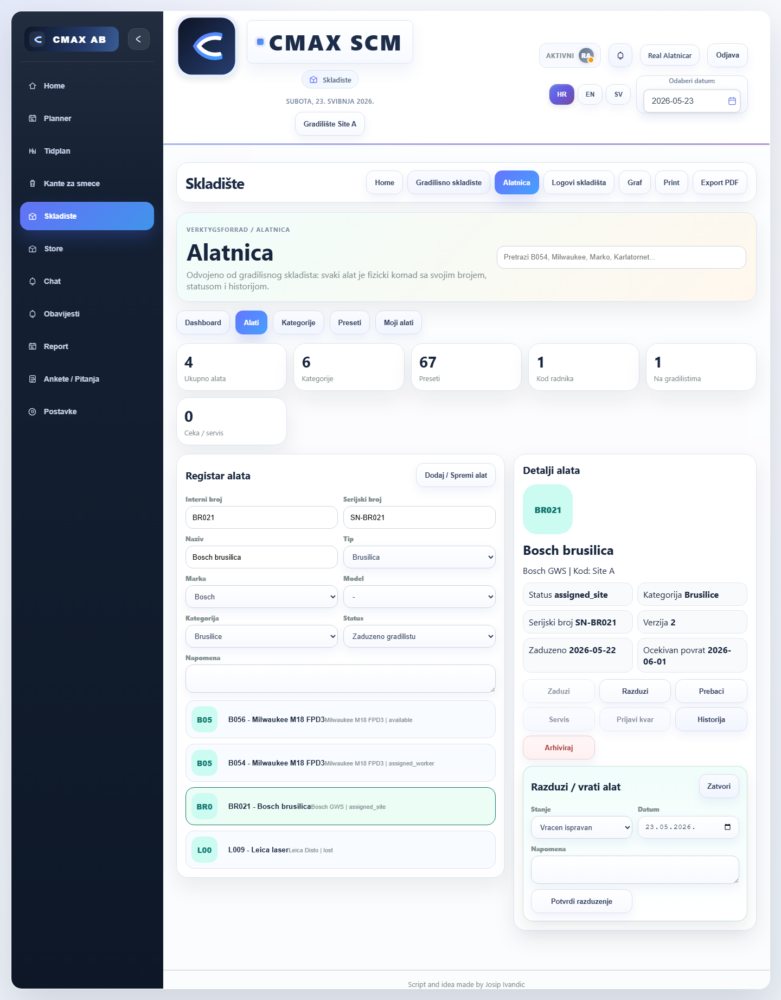

```json
{
  "horizontalOverflow": false,
  "toolroomVisible": true,
  "actionPanel": 1,
  "myCards": 0,
  "accountBadge": "0",
  "disabledQuickActions": 3
}
```

## GOOD - desktop-1440 - history-lost

History panel with actor/timestamp/before/after for lost tool.

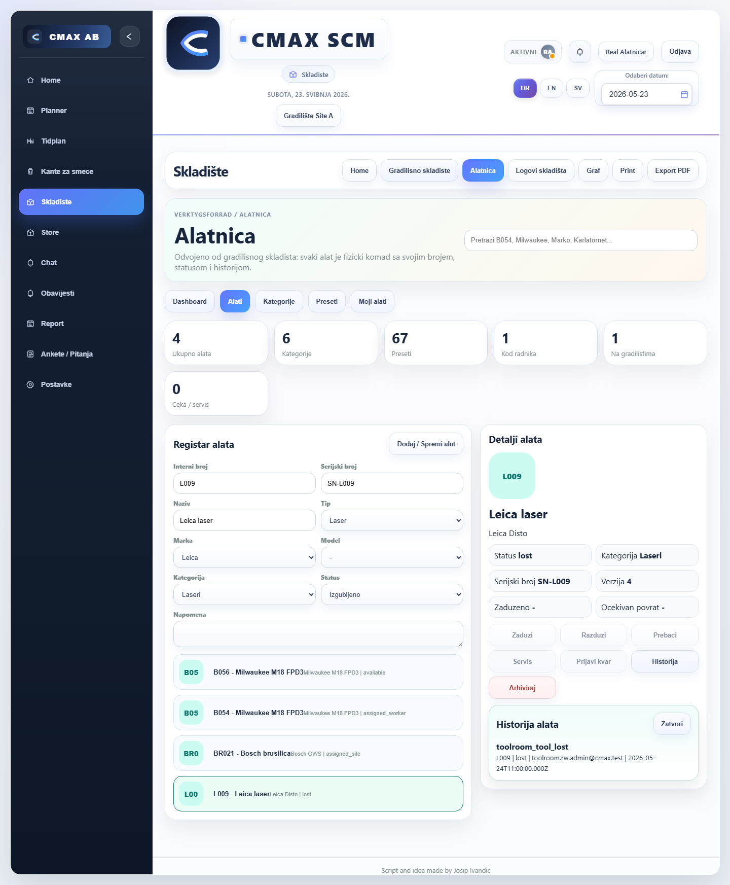

```json
{
  "horizontalOverflow": false,
  "toolroomVisible": true,
  "actionPanel": 1,
  "myCards": 0,
  "accountBadge": "0",
  "disabledQuickActions": 5
}
```

## GOOD - desktop-1440 - worker-my-tools

Worker My Tools cards show direct and active-site tools.

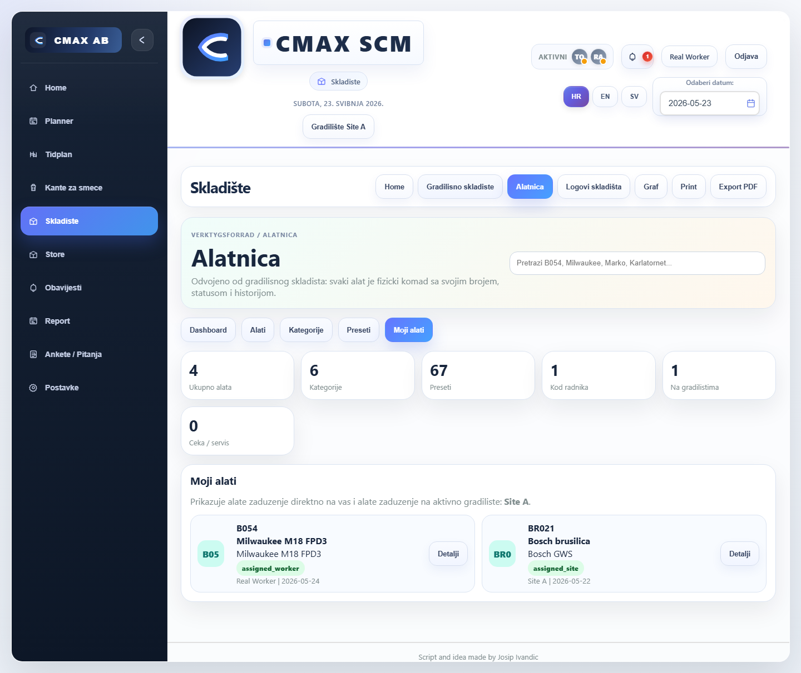

```json
{
  "horizontalOverflow": false,
  "toolroomVisible": true,
  "actionPanel": 0,
  "myCards": 2,
  "accountBadge": "1",
  "disabledQuickActions": 0
}
```

## GOOD - desktop-1440 - permission-denied-worker

Worker detail view has assign/return/transfer disabled without permission.

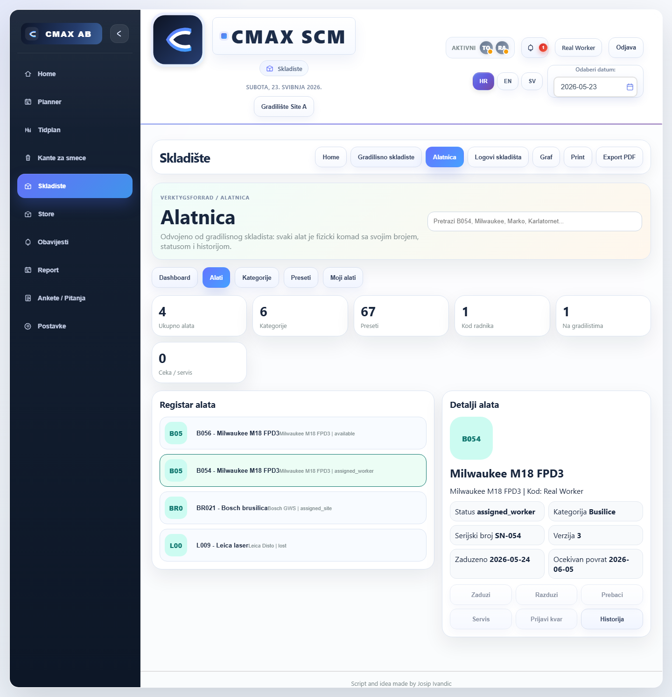

```json
{
  "horizontalOverflow": false,
  "toolroomVisible": true,
  "actionPanel": 0,
  "myCards": 0,
  "accountBadge": "1",
  "disabledQuickActions": 5
}
```

## GOOD - tablet-768 - alatnicar-dashboard

Alatnicar dashboard with by-worker/by-site state and lost tool status.

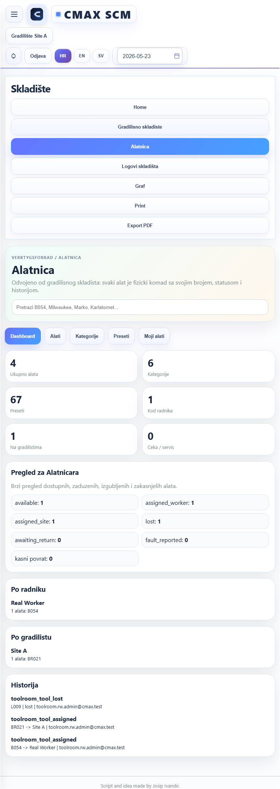

```json
{
  "horizontalOverflow": false,
  "toolroomVisible": true,
  "actionPanel": 0,
  "myCards": 0,
  "accountBadge": "0",
  "disabledQuickActions": 0
}
```

## GOOD - tablet-768 - assign-flow

Assign flow for available tool B056.

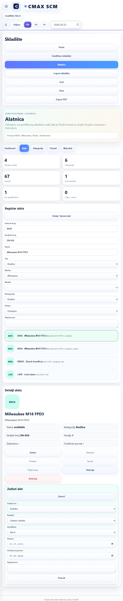

```json
{
  "horizontalOverflow": false,
  "toolroomVisible": true,
  "actionPanel": 1,
  "myCards": 0,
  "accountBadge": "0",
  "disabledQuickActions": 4
}
```

## GOOD - tablet-768 - transfer-flow

Transfer flow for worker-assigned B054.

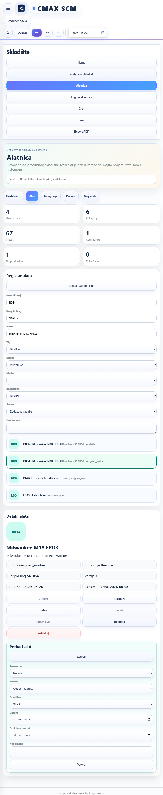

```json
{
  "horizontalOverflow": false,
  "toolroomVisible": true,
  "actionPanel": 1,
  "myCards": 0,
  "accountBadge": "0",
  "disabledQuickActions": 3
}
```

## GOOD - tablet-768 - return-flow

Return flow for site-assigned BR021.

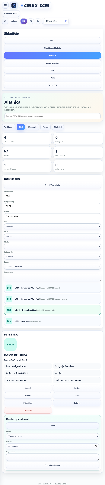

```json
{
  "horizontalOverflow": false,
  "toolroomVisible": true,
  "actionPanel": 1,
  "myCards": 0,
  "accountBadge": "0",
  "disabledQuickActions": 3
}
```

## GOOD - tablet-768 - history-lost

History panel with actor/timestamp/before/after for lost tool.

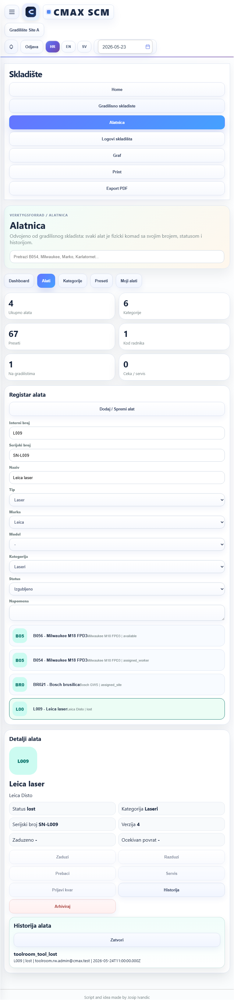

```json
{
  "horizontalOverflow": false,
  "toolroomVisible": true,
  "actionPanel": 1,
  "myCards": 0,
  "accountBadge": "0",
  "disabledQuickActions": 5
}
```

## GOOD - tablet-768 - worker-my-tools

Worker My Tools cards show direct and active-site tools.

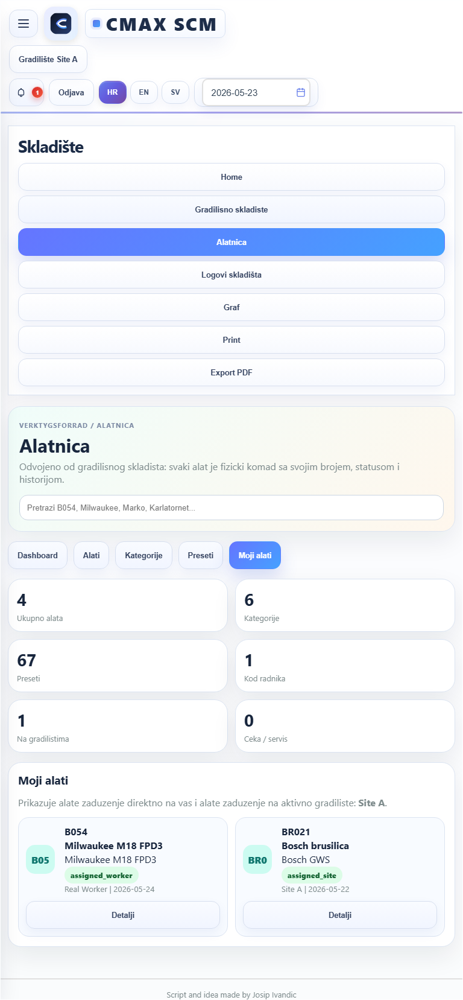

```json
{
  "horizontalOverflow": false,
  "toolroomVisible": true,
  "actionPanel": 0,
  "myCards": 2,
  "accountBadge": "1",
  "disabledQuickActions": 0
}
```

## GOOD - tablet-768 - permission-denied-worker

Worker detail view has assign/return/transfer disabled without permission.

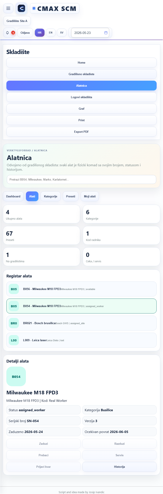

```json
{
  "horizontalOverflow": false,
  "toolroomVisible": true,
  "actionPanel": 0,
  "myCards": 0,
  "accountBadge": "1",
  "disabledQuickActions": 5
}
```

## GOOD - mobile-390 - alatnicar-dashboard

Alatnicar dashboard with by-worker/by-site state and lost tool status.

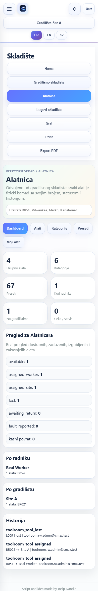

```json
{
  "horizontalOverflow": false,
  "toolroomVisible": true,
  "actionPanel": 0,
  "myCards": 0,
  "accountBadge": "0",
  "disabledQuickActions": 0
}
```

## GOOD - mobile-390 - assign-flow

Assign flow for available tool B056.

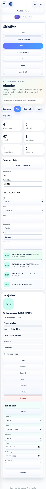

```json
{
  "horizontalOverflow": false,
  "toolroomVisible": true,
  "actionPanel": 1,
  "myCards": 0,
  "accountBadge": "0",
  "disabledQuickActions": 4
}
```

## GOOD - mobile-390 - transfer-flow

Transfer flow for worker-assigned B054.

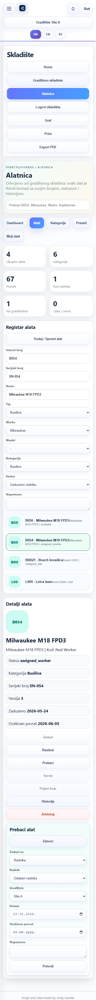

```json
{
  "horizontalOverflow": false,
  "toolroomVisible": true,
  "actionPanel": 1,
  "myCards": 0,
  "accountBadge": "0",
  "disabledQuickActions": 3
}
```

## GOOD - mobile-390 - return-flow

Return flow for site-assigned BR021.

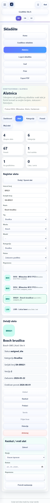

```json
{
  "horizontalOverflow": false,
  "toolroomVisible": true,
  "actionPanel": 1,
  "myCards": 0,
  "accountBadge": "0",
  "disabledQuickActions": 3
}
```

## GOOD - mobile-390 - history-lost

History panel with actor/timestamp/before/after for lost tool.

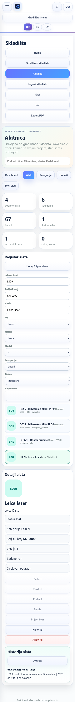

```json
{
  "horizontalOverflow": false,
  "toolroomVisible": true,
  "actionPanel": 1,
  "myCards": 0,
  "accountBadge": "0",
  "disabledQuickActions": 5
}
```

## GOOD - mobile-390 - worker-my-tools

Worker My Tools cards show direct and active-site tools.

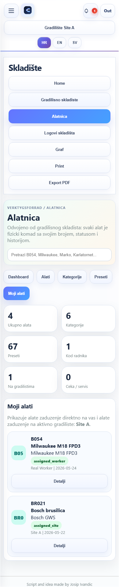

```json
{
  "horizontalOverflow": false,
  "toolroomVisible": true,
  "actionPanel": 0,
  "myCards": 2,
  "accountBadge": "1",
  "disabledQuickActions": 0
}
```

## GOOD - mobile-390 - permission-denied-worker

Worker detail view has assign/return/transfer disabled without permission.

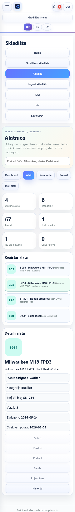

```json
{
  "horizontalOverflow": false,
  "toolroomVisible": true,
  "actionPanel": 0,
  "myCards": 0,
  "accountBadge": "1",
  "disabledQuickActions": 5
}
```

## GOOD - mobile-430 - alatnicar-dashboard

Alatnicar dashboard with by-worker/by-site state and lost tool status.

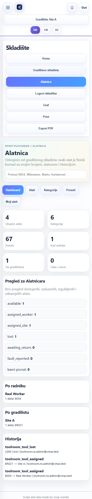

```json
{
  "horizontalOverflow": false,
  "toolroomVisible": true,
  "actionPanel": 0,
  "myCards": 0,
  "accountBadge": "0",
  "disabledQuickActions": 0
}
```

## GOOD - mobile-430 - assign-flow

Assign flow for available tool B056.

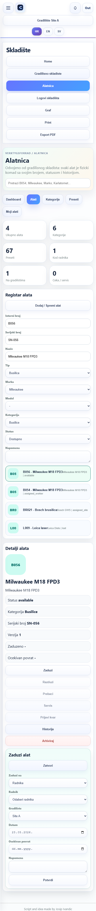

```json
{
  "horizontalOverflow": false,
  "toolroomVisible": true,
  "actionPanel": 1,
  "myCards": 0,
  "accountBadge": "0",
  "disabledQuickActions": 4
}
```

## GOOD - mobile-430 - transfer-flow

Transfer flow for worker-assigned B054.

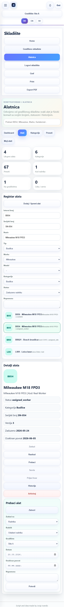

```json
{
  "horizontalOverflow": false,
  "toolroomVisible": true,
  "actionPanel": 1,
  "myCards": 0,
  "accountBadge": "0",
  "disabledQuickActions": 3
}
```

## GOOD - mobile-430 - return-flow

Return flow for site-assigned BR021.

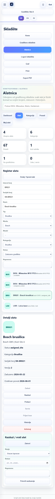

```json
{
  "horizontalOverflow": false,
  "toolroomVisible": true,
  "actionPanel": 1,
  "myCards": 0,
  "accountBadge": "0",
  "disabledQuickActions": 3
}
```

## GOOD - mobile-430 - history-lost

History panel with actor/timestamp/before/after for lost tool.

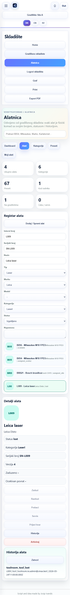

```json
{
  "horizontalOverflow": false,
  "toolroomVisible": true,
  "actionPanel": 1,
  "myCards": 0,
  "accountBadge": "0",
  "disabledQuickActions": 5
}
```

## GOOD - mobile-430 - worker-my-tools

Worker My Tools cards show direct and active-site tools.

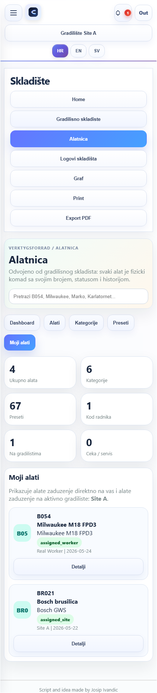

```json
{
  "horizontalOverflow": false,
  "toolroomVisible": true,
  "actionPanel": 0,
  "myCards": 2,
  "accountBadge": "1",
  "disabledQuickActions": 0
}
```

## GOOD - mobile-430 - permission-denied-worker

Worker detail view has assign/return/transfer disabled without permission.

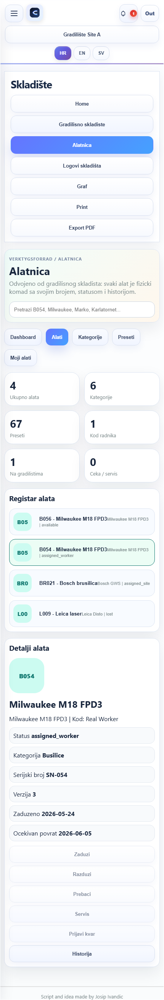

```json
{
  "horizontalOverflow": false,
  "toolroomVisible": true,
  "actionPanel": 0,
  "myCards": 0,
  "accountBadge": "1",
  "disabledQuickActions": 5
}
```
