# Toolroom Release Proof

Run: toolroom-release-proof-1779732856955

Coverage: dashboard, categories, presets, single/bulk registry, assign, return, transfer, fault, service, replacement, history, export, backup/restore result, permission denied, mobile My Tools.

JS errors: 0

Site close blocker: not implemented / not verifiable in current release.

## GOOD - desktop-1440 - dashboard

Dashboard with all release states.

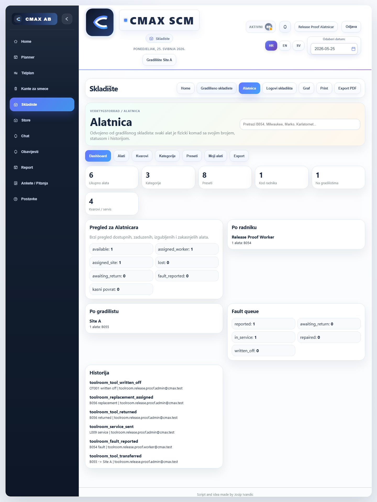

```json
{
  "horizontalOverflow": false,
  "domNodes": 1720,
  "heap": 6900201,
  "toolroomVisible": true,
  "rows": 0,
  "actionPanels": 0,
  "accountBadge": "0"
}
```

## GOOD - desktop-1440 - categories

Category tree and breadcrumb.

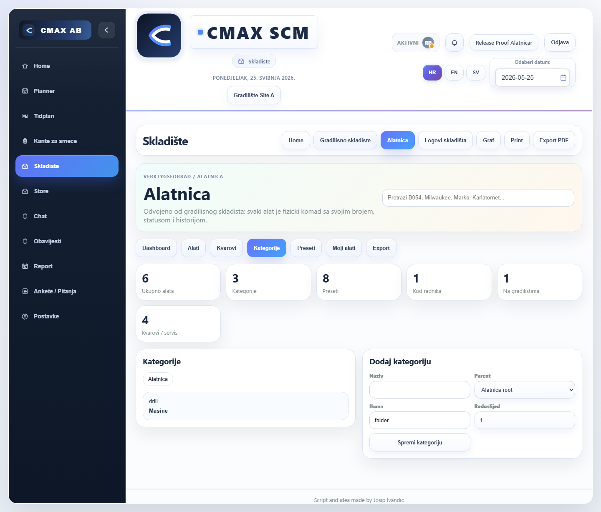

```json
{
  "horizontalOverflow": false,
  "domNodes": 1677,
  "heap": 7056821,
  "toolroomVisible": true,
  "rows": 0,
  "actionPanels": 0,
  "accountBadge": "0"
}
```

## GOOD - desktop-1440 - presets

Editable presets.

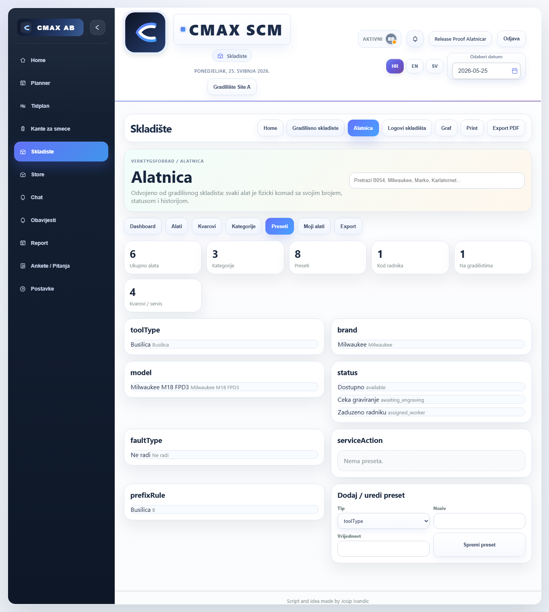

```json
{
  "horizontalOverflow": false,
  "domNodes": 1706,
  "heap": 7172468,
  "toolroomVisible": true,
  "rows": 0,
  "actionPanels": 0,
  "accountBadge": "0"
}
```

## GOOD - desktop-1440 - bulk-add

Bulk add wizard.

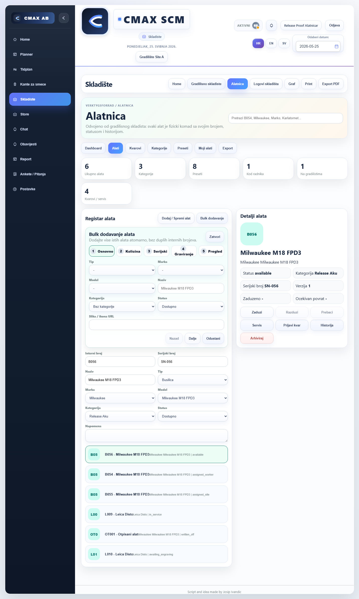

```json
{
  "horizontalOverflow": false,
  "domNodes": 1798,
  "heap": 7374666,
  "toolroomVisible": true,
  "rows": 6,
  "actionPanels": 1,
  "accountBadge": "0"
}
```

## GOOD - desktop-1440 - assign

Assign flow.

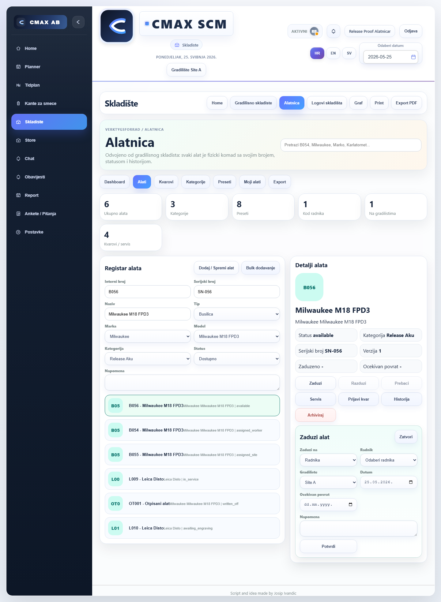

```json
{
  "horizontalOverflow": false,
  "domNodes": 1775,
  "heap": 7578353,
  "toolroomVisible": true,
  "rows": 6,
  "actionPanels": 1,
  "accountBadge": "0"
}
```

## GOOD - desktop-1440 - return

Return flow.

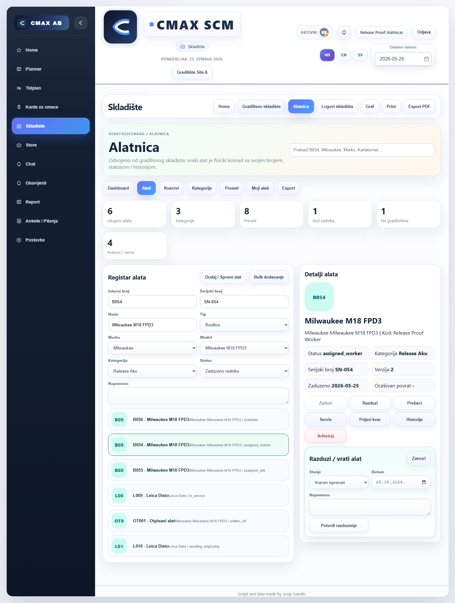

```json
{
  "horizontalOverflow": false,
  "domNodes": 1765,
  "heap": 7744456,
  "toolroomVisible": true,
  "rows": 6,
  "actionPanels": 1,
  "accountBadge": "0"
}
```

## GOOD - desktop-1440 - transfer

Transfer flow.

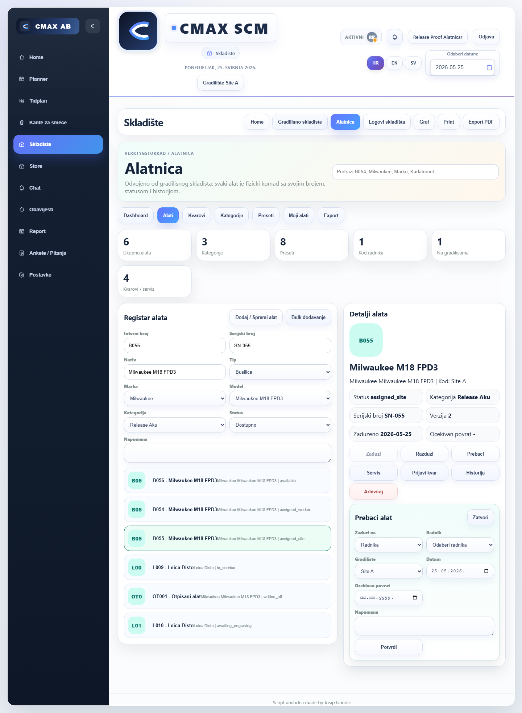

```json
{
  "horizontalOverflow": false,
  "domNodes": 1775,
  "heap": 7928068,
  "toolroomVisible": true,
  "rows": 6,
  "actionPanels": 1,
  "accountBadge": "0"
}
```

## GOOD - desktop-1440 - fault-replacement

Fault queue with replacement suggestion.

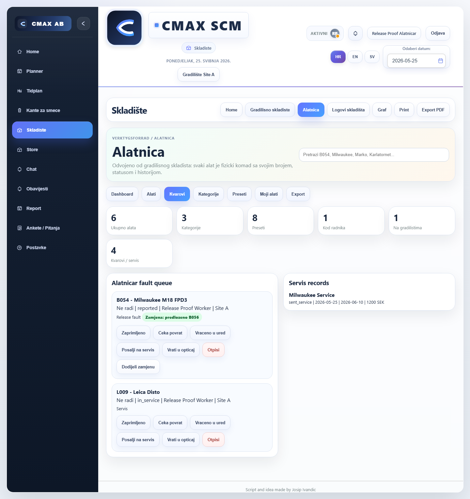

```json
{
  "horizontalOverflow": false,
  "domNodes": 1685,
  "heap": 8074111,
  "toolroomVisible": true,
  "rows": 0,
  "actionPanels": 0,
  "accountBadge": "0"
}
```

## GOOD - desktop-1440 - service

Service form.

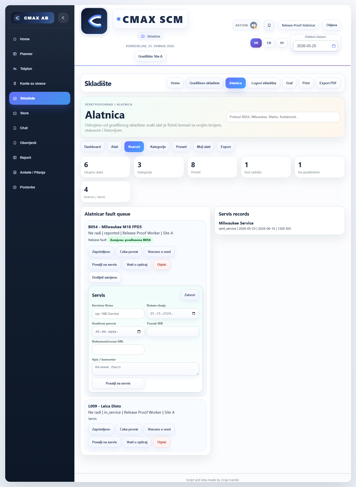

```json
{
  "horizontalOverflow": false,
  "domNodes": 1703,
  "heap": 7116170,
  "toolroomVisible": true,
  "rows": 0,
  "actionPanels": 1,
  "accountBadge": "0"
}
```

## GOOD - desktop-1440 - history

History panel.

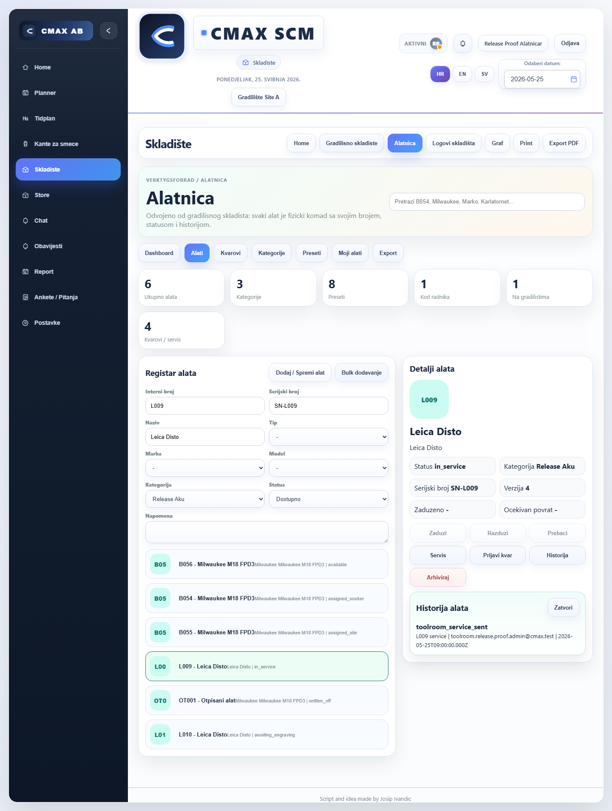

```json
{
  "horizontalOverflow": false,
  "domNodes": 1757,
  "heap": 7296429,
  "toolroomVisible": true,
  "rows": 6,
  "actionPanels": 1,
  "accountBadge": "0"
}
```

## GOOD - desktop-1440 - export

Export filters.

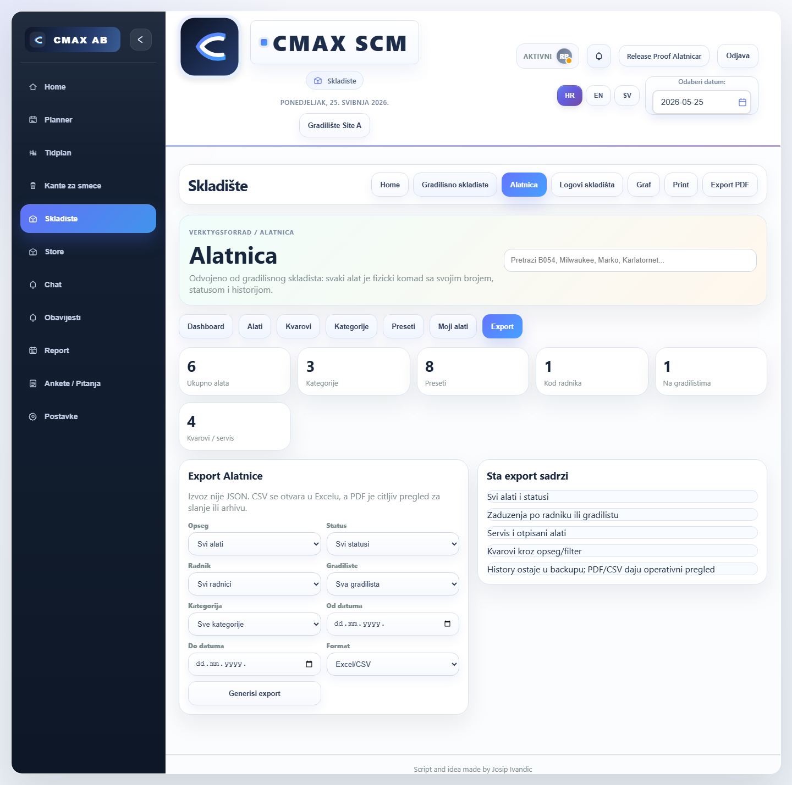

```json
{
  "horizontalOverflow": false,
  "domNodes": 1701,
  "heap": 7426354,
  "toolroomVisible": true,
  "rows": 0,
  "actionPanels": 0,
  "accountBadge": "0"
}
```

## GOOD - desktop-1440 - backup-export-result

Backup/restore and export proof card.

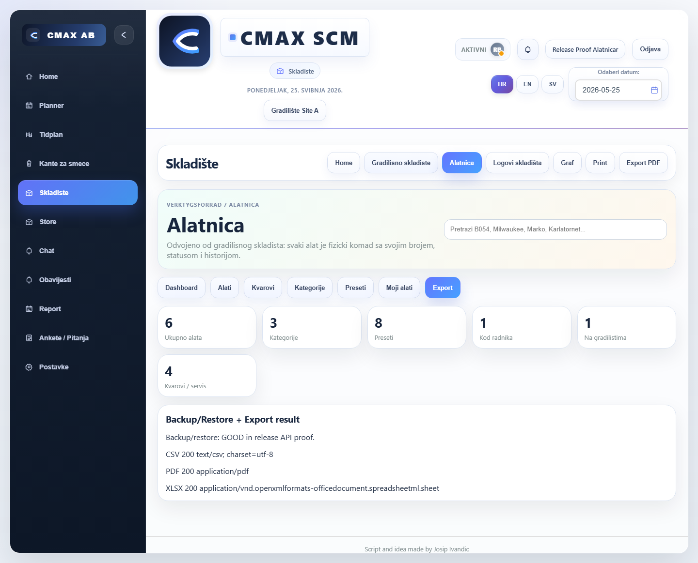

```json
{
  "horizontalOverflow": false,
  "domNodes": 1656,
  "heap": 7593638,
  "toolroomVisible": true,
  "rows": 0,
  "actionPanels": 0,
  "accountBadge": "0"
}
```

## GOOD - desktop-1440 - mobile-my-tools

Worker My Tools cards.

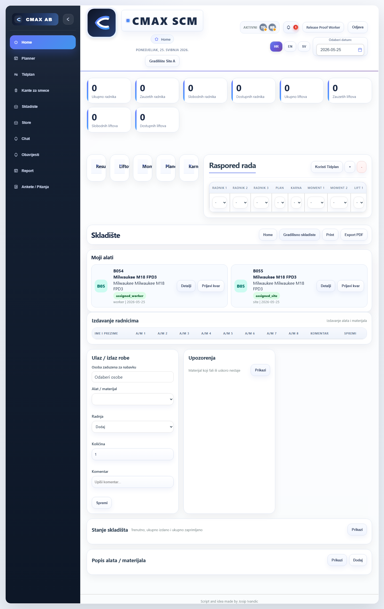

```json
{
  "horizontalOverflow": false,
  "domNodes": 1632,
  "heap": 6635031,
  "toolroomVisible": true,
  "rows": 0,
  "actionPanels": 0,
  "accountBadge": "1"
}
```

## GOOD - desktop-1440 - permission-denied

Worker export denied.

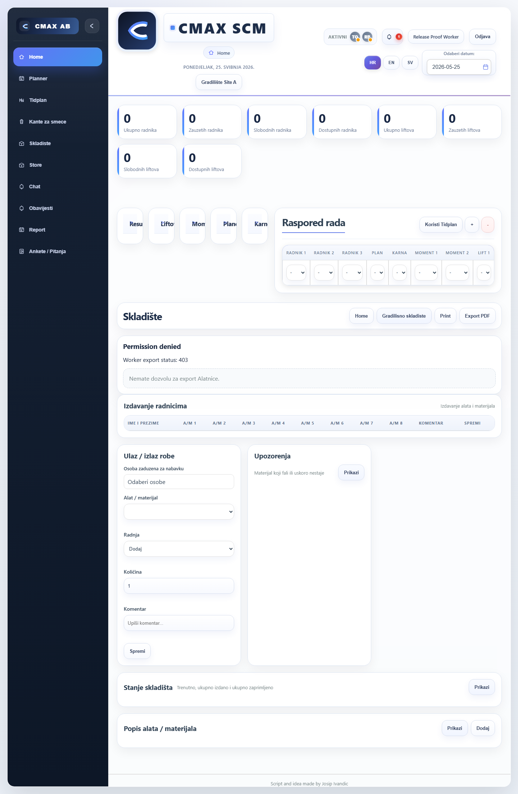

```json
{
  "horizontalOverflow": false,
  "domNodes": 1611,
  "heap": 6708942,
  "toolroomVisible": true,
  "rows": 0,
  "actionPanels": 0,
  "accountBadge": "1"
}
```

## GOOD - tablet-768 - dashboard

Dashboard with all release states.

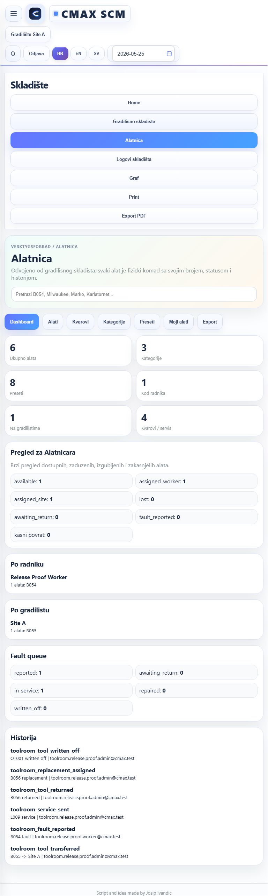

```json
{
  "horizontalOverflow": false,
  "domNodes": 1722,
  "heap": 6904530,
  "toolroomVisible": true,
  "rows": 0,
  "actionPanels": 0,
  "accountBadge": "0"
}
```

## GOOD - tablet-768 - categories

Category tree and breadcrumb.

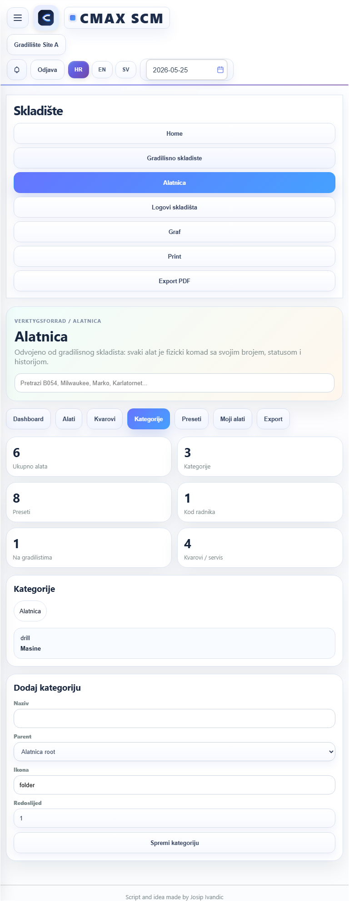

```json
{
  "horizontalOverflow": false,
  "domNodes": 1679,
  "heap": 7045046,
  "toolroomVisible": true,
  "rows": 0,
  "actionPanels": 0,
  "accountBadge": "0"
}
```

## GOOD - tablet-768 - presets

Editable presets.

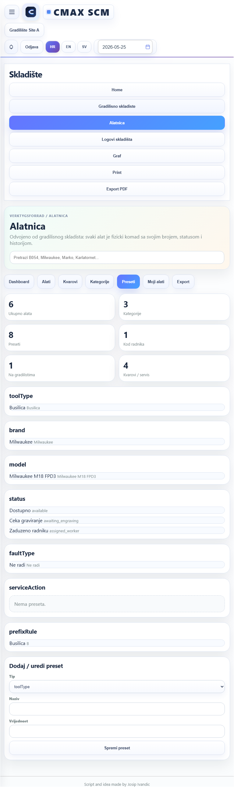

```json
{
  "horizontalOverflow": false,
  "domNodes": 1708,
  "heap": 7161081,
  "toolroomVisible": true,
  "rows": 0,
  "actionPanels": 0,
  "accountBadge": "0"
}
```

## GOOD - tablet-768 - bulk-add

Bulk add wizard.

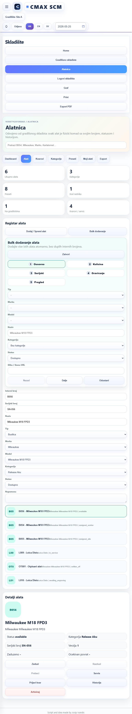

```json
{
  "horizontalOverflow": false,
  "domNodes": 1800,
  "heap": 7378659,
  "toolroomVisible": true,
  "rows": 6,
  "actionPanels": 1,
  "accountBadge": "0"
}
```

## GOOD - tablet-768 - assign

Assign flow.

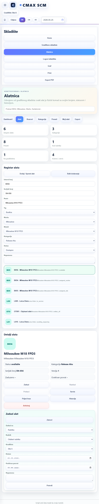

```json
{
  "horizontalOverflow": false,
  "domNodes": 1777,
  "heap": 7569656,
  "toolroomVisible": true,
  "rows": 6,
  "actionPanels": 1,
  "accountBadge": "0"
}
```

## GOOD - tablet-768 - return

Return flow.

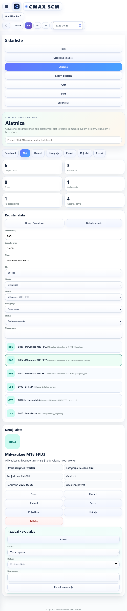

```json
{
  "horizontalOverflow": false,
  "domNodes": 1767,
  "heap": 7735035,
  "toolroomVisible": true,
  "rows": 6,
  "actionPanels": 1,
  "accountBadge": "0"
}
```

## GOOD - tablet-768 - transfer

Transfer flow.

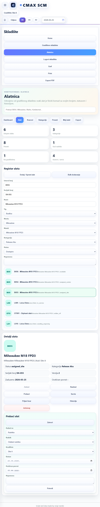

```json
{
  "horizontalOverflow": false,
  "domNodes": 1777,
  "heap": 7917609,
  "toolroomVisible": true,
  "rows": 6,
  "actionPanels": 1,
  "accountBadge": "0"
}
```

## GOOD - tablet-768 - fault-replacement

Fault queue with replacement suggestion.

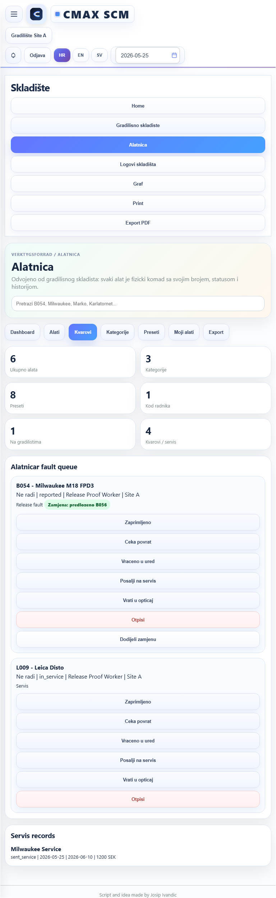

```json
{
  "horizontalOverflow": false,
  "domNodes": 1687,
  "heap": 8062672,
  "toolroomVisible": true,
  "rows": 0,
  "actionPanels": 0,
  "accountBadge": "0"
}
```

## GOOD - tablet-768 - service

Service form.

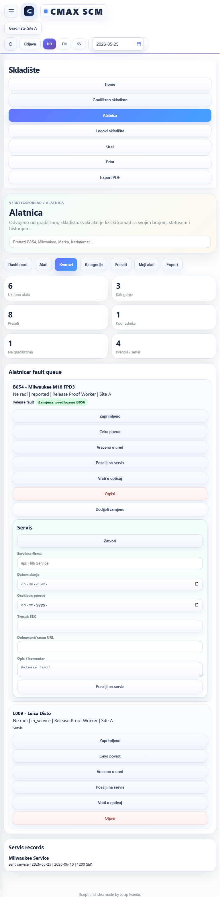

```json
{
  "horizontalOverflow": false,
  "domNodes": 1705,
  "heap": 7112175,
  "toolroomVisible": true,
  "rows": 0,
  "actionPanels": 1,
  "accountBadge": "0"
}
```

## GOOD - tablet-768 - history

History panel.

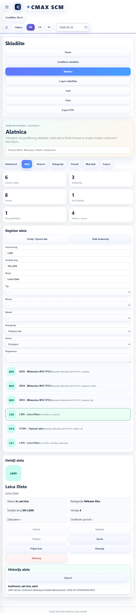

```json
{
  "horizontalOverflow": false,
  "domNodes": 1759,
  "heap": 7305600,
  "toolroomVisible": true,
  "rows": 6,
  "actionPanels": 1,
  "accountBadge": "0"
}
```

## GOOD - tablet-768 - export

Export filters.

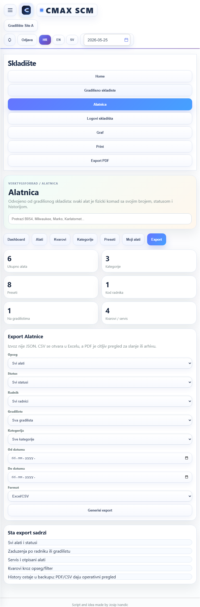

```json
{
  "horizontalOverflow": false,
  "domNodes": 1703,
  "heap": 7423549,
  "toolroomVisible": true,
  "rows": 0,
  "actionPanels": 0,
  "accountBadge": "0"
}
```

## GOOD - tablet-768 - backup-export-result

Backup/restore and export proof card.

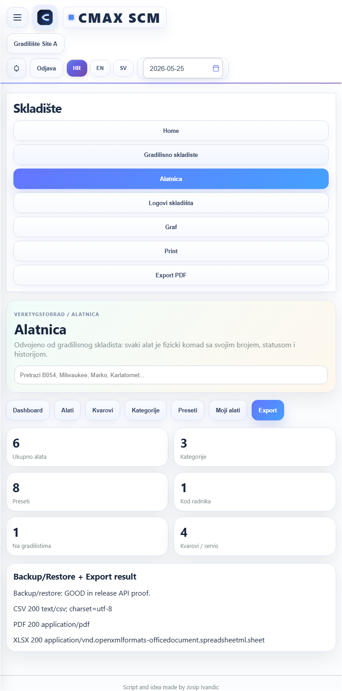

```json
{
  "horizontalOverflow": false,
  "domNodes": 1658,
  "heap": 7583988,
  "toolroomVisible": true,
  "rows": 0,
  "actionPanels": 0,
  "accountBadge": "0"
}
```

## GOOD - tablet-768 - mobile-my-tools

Worker My Tools cards.

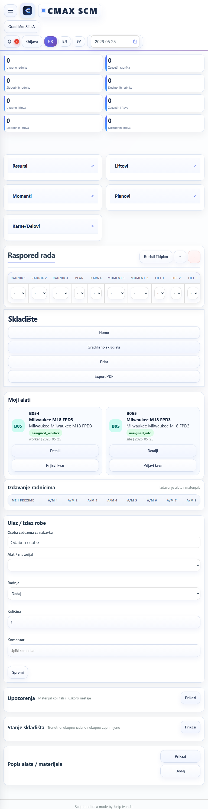

```json
{
  "horizontalOverflow": false,
  "domNodes": 1634,
  "heap": 6639334,
  "toolroomVisible": true,
  "rows": 0,
  "actionPanels": 0,
  "accountBadge": "1"
}
```

## GOOD - tablet-768 - permission-denied

Worker export denied.

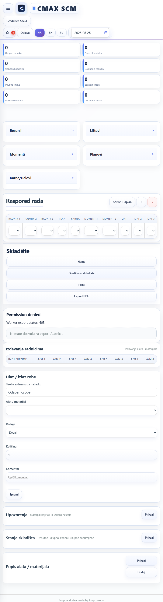

```json
{
  "horizontalOverflow": false,
  "domNodes": 1613,
  "heap": 6713241,
  "toolroomVisible": true,
  "rows": 0,
  "actionPanels": 0,
  "accountBadge": "1"
}
```

## GOOD - mobile-390 - dashboard

Dashboard with all release states.

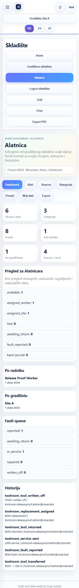

```json
{
  "horizontalOverflow": false,
  "domNodes": 1724,
  "heap": 6878521,
  "toolroomVisible": true,
  "rows": 0,
  "actionPanels": 0,
  "accountBadge": "0"
}
```

## GOOD - mobile-390 - categories

Category tree and breadcrumb.

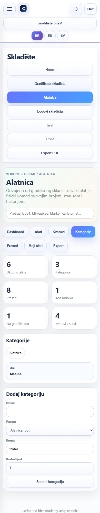

```json
{
  "horizontalOverflow": false,
  "domNodes": 1681,
  "heap": 7019077,
  "toolroomVisible": true,
  "rows": 0,
  "actionPanels": 0,
  "accountBadge": "0"
}
```

## GOOD - mobile-390 - presets

Editable presets.

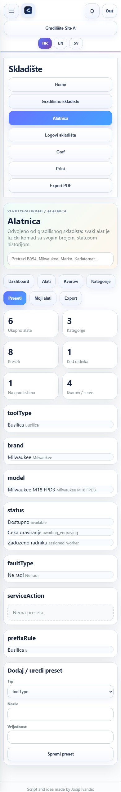

```json
{
  "horizontalOverflow": false,
  "domNodes": 1710,
  "heap": 7134808,
  "toolroomVisible": true,
  "rows": 0,
  "actionPanels": 0,
  "accountBadge": "0"
}
```

## GOOD - mobile-390 - bulk-add

Bulk add wizard.

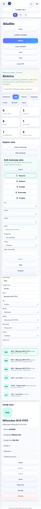

```json
{
  "horizontalOverflow": false,
  "domNodes": 1802,
  "heap": 7337734,
  "toolroomVisible": true,
  "rows": 6,
  "actionPanels": 1,
  "accountBadge": "0"
}
```

## GOOD - mobile-390 - assign

Assign flow.

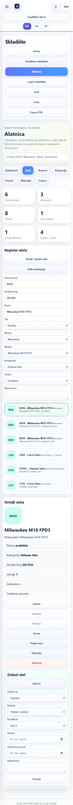

```json
{
  "horizontalOverflow": false,
  "domNodes": 1779,
  "heap": 7543471,
  "toolroomVisible": true,
  "rows": 6,
  "actionPanels": 1,
  "accountBadge": "0"
}
```

## GOOD - mobile-390 - return

Return flow.

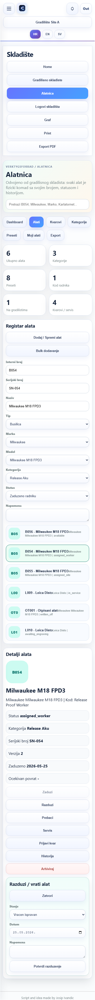

```json
{
  "horizontalOverflow": false,
  "domNodes": 1769,
  "heap": 7708886,
  "toolroomVisible": true,
  "rows": 6,
  "actionPanels": 1,
  "accountBadge": "0"
}
```

## GOOD - mobile-390 - transfer

Transfer flow.

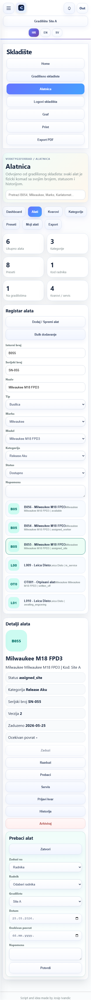

```json
{
  "horizontalOverflow": false,
  "domNodes": 1779,
  "heap": 7880054,
  "toolroomVisible": true,
  "rows": 6,
  "actionPanels": 1,
  "accountBadge": "0"
}
```

## GOOD - mobile-390 - fault-replacement

Fault queue with replacement suggestion.

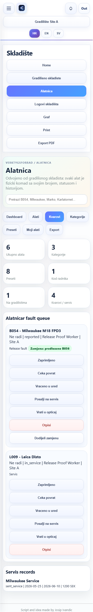

```json
{
  "horizontalOverflow": false,
  "domNodes": 1689,
  "heap": 8025093,
  "toolroomVisible": true,
  "rows": 0,
  "actionPanels": 0,
  "accountBadge": "0"
}
```

## GOOD - mobile-390 - service

Service form.

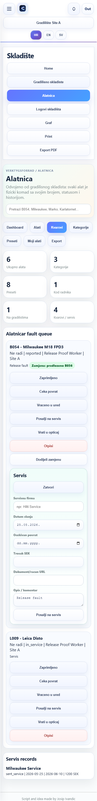

```json
{
  "horizontalOverflow": false,
  "domNodes": 1707,
  "heap": 8174554,
  "toolroomVisible": true,
  "rows": 0,
  "actionPanels": 1,
  "accountBadge": "0"
}
```

## GOOD - mobile-390 - history

History panel.

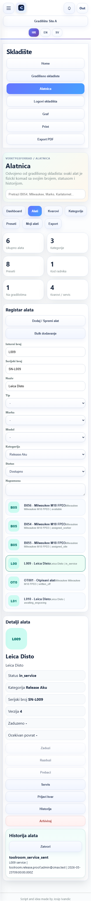

```json
{
  "horizontalOverflow": false,
  "domNodes": 1761,
  "heap": 7260423,
  "toolroomVisible": true,
  "rows": 6,
  "actionPanels": 1,
  "accountBadge": "0"
}
```

## GOOD - mobile-390 - export

Export filters.

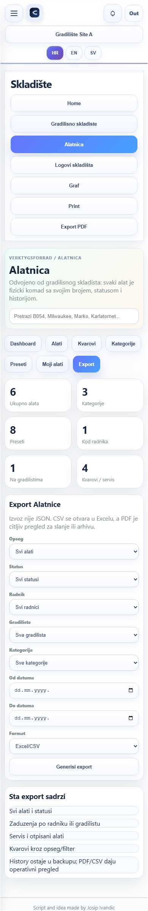

```json
{
  "horizontalOverflow": false,
  "domNodes": 1705,
  "heap": 7378444,
  "toolroomVisible": true,
  "rows": 0,
  "actionPanels": 0,
  "accountBadge": "0"
}
```

## GOOD - mobile-390 - backup-export-result

Backup/restore and export proof card.

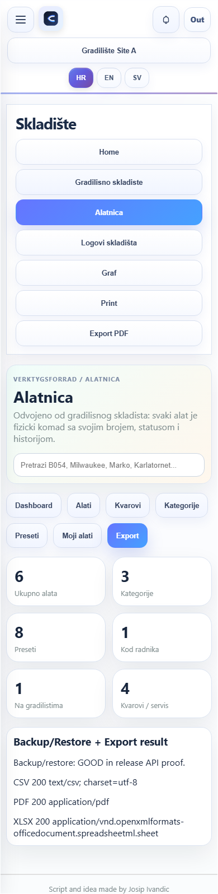

```json
{
  "horizontalOverflow": false,
  "domNodes": 1660,
  "heap": 7527626,
  "toolroomVisible": true,
  "rows": 0,
  "actionPanels": 0,
  "accountBadge": "0"
}
```

## GOOD - mobile-390 - mobile-my-tools

Worker My Tools cards.

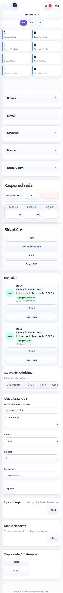

```json
{
  "horizontalOverflow": false,
  "domNodes": 1636,
  "heap": 6659497,
  "toolroomVisible": true,
  "rows": 0,
  "actionPanels": 0,
  "accountBadge": "1"
}
```

## GOOD - mobile-390 - permission-denied

Worker export denied.

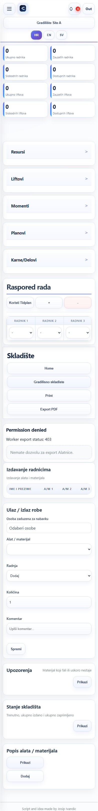

```json
{
  "horizontalOverflow": false,
  "domNodes": 1615,
  "heap": 6736668,
  "toolroomVisible": true,
  "rows": 0,
  "actionPanels": 0,
  "accountBadge": "1"
}
```

## GOOD - mobile-430 - dashboard

Dashboard with all release states.

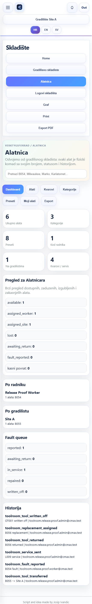

```json
{
  "horizontalOverflow": false,
  "domNodes": 1726,
  "heap": 6878456,
  "toolroomVisible": true,
  "rows": 0,
  "actionPanels": 0,
  "accountBadge": "0"
}
```

## GOOD - mobile-430 - categories

Category tree and breadcrumb.

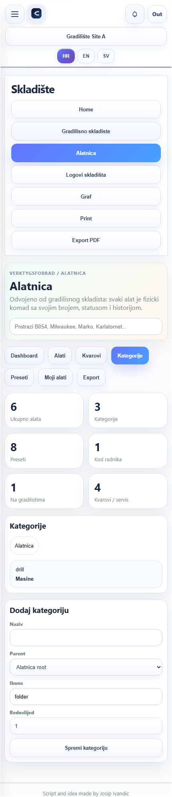

```json
{
  "horizontalOverflow": false,
  "domNodes": 1683,
  "heap": 7019052,
  "toolroomVisible": true,
  "rows": 0,
  "actionPanels": 0,
  "accountBadge": "0"
}
```

## GOOD - mobile-430 - presets

Editable presets.

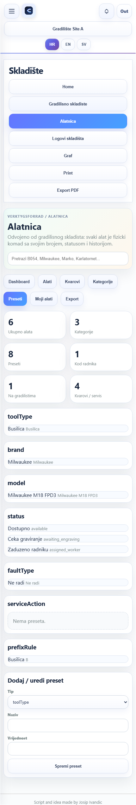

```json
{
  "horizontalOverflow": false,
  "domNodes": 1712,
  "heap": 7134823,
  "toolroomVisible": true,
  "rows": 0,
  "actionPanels": 0,
  "accountBadge": "0"
}
```

## GOOD - mobile-430 - bulk-add

Bulk add wizard.

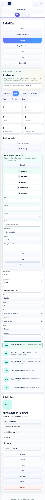

```json
{
  "horizontalOverflow": false,
  "domNodes": 1804,
  "heap": 7337789,
  "toolroomVisible": true,
  "rows": 6,
  "actionPanels": 1,
  "accountBadge": "0"
}
```

## GOOD - mobile-430 - assign

Assign flow.

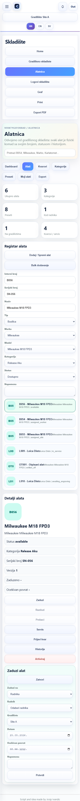

```json
{
  "horizontalOverflow": false,
  "domNodes": 1781,
  "heap": 7544138,
  "toolroomVisible": true,
  "rows": 6,
  "actionPanels": 1,
  "accountBadge": "0"
}
```

## GOOD - mobile-430 - return

Return flow.

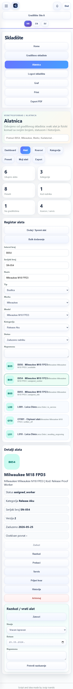

```json
{
  "horizontalOverflow": false,
  "domNodes": 1771,
  "heap": 7709593,
  "toolroomVisible": true,
  "rows": 6,
  "actionPanels": 1,
  "accountBadge": "0"
}
```

## GOOD - mobile-430 - transfer

Transfer flow.

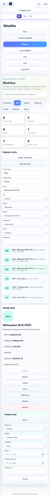

```json
{
  "horizontalOverflow": false,
  "domNodes": 1781,
  "heap": 7880817,
  "toolroomVisible": true,
  "rows": 6,
  "actionPanels": 1,
  "accountBadge": "0"
}
```

## GOOD - mobile-430 - fault-replacement

Fault queue with replacement suggestion.

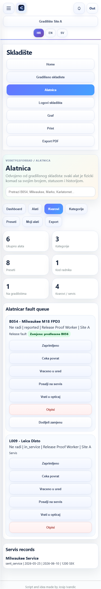

```json
{
  "horizontalOverflow": false,
  "domNodes": 1691,
  "heap": 8025896,
  "toolroomVisible": true,
  "rows": 0,
  "actionPanels": 0,
  "accountBadge": "0"
}
```

## GOOD - mobile-430 - service

Service form.

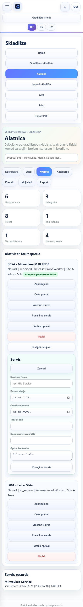

```json
{
  "horizontalOverflow": false,
  "domNodes": 1709,
  "heap": 8175385,
  "toolroomVisible": true,
  "rows": 0,
  "actionPanels": 1,
  "accountBadge": "0"
}
```

## GOOD - mobile-430 - history

History panel.

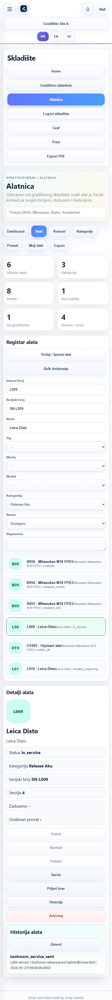

```json
{
  "horizontalOverflow": false,
  "domNodes": 1763,
  "heap": 7183082,
  "toolroomVisible": true,
  "rows": 6,
  "actionPanels": 1,
  "accountBadge": "0"
}
```

## GOOD - mobile-430 - export

Export filters.

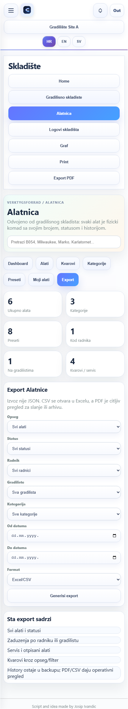

```json
{
  "horizontalOverflow": false,
  "domNodes": 1707,
  "heap": 7313199,
  "toolroomVisible": true,
  "rows": 0,
  "actionPanels": 0,
  "accountBadge": "0"
}
```

## GOOD - mobile-430 - backup-export-result

Backup/restore and export proof card.

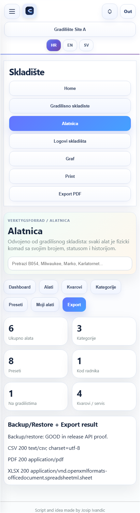

```json
{
  "horizontalOverflow": false,
  "domNodes": 1662,
  "heap": 7450202,
  "toolroomVisible": true,
  "rows": 0,
  "actionPanels": 0,
  "accountBadge": "0"
}
```

## GOOD - mobile-430 - mobile-my-tools

Worker My Tools cards.

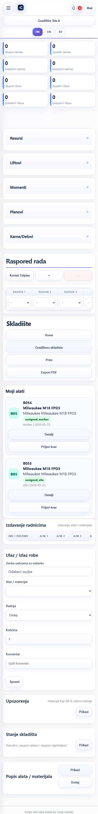

```json
{
  "horizontalOverflow": false,
  "domNodes": 1638,
  "heap": 6674396,
  "toolroomVisible": true,
  "rows": 0,
  "actionPanels": 0,
  "accountBadge": "1"
}
```

## GOOD - mobile-430 - permission-denied

Worker export denied.

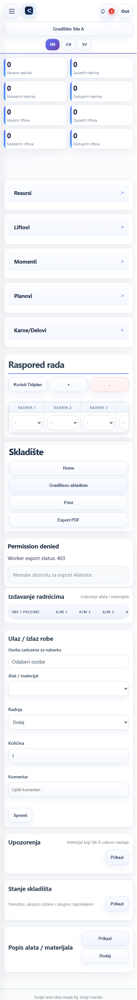

```json
{
  "horizontalOverflow": false,
  "domNodes": 1617,
  "heap": 6748367,
  "toolroomVisible": true,
  "rows": 0,
  "actionPanels": 0,
  "accountBadge": "1"
}
```
